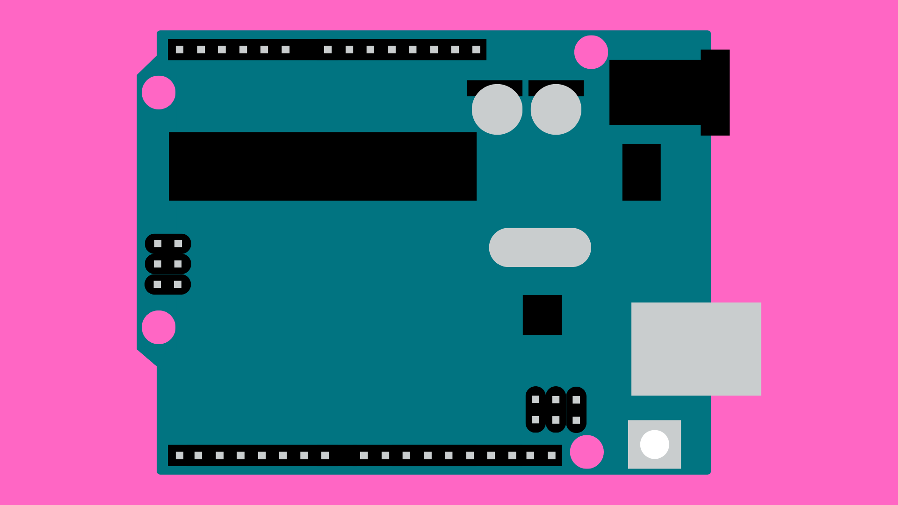
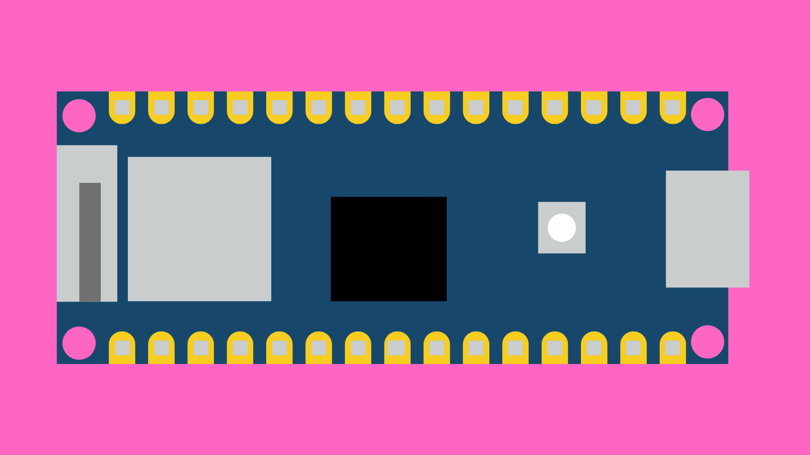

# Getting Started with Arduino

## Contents
- [Introduction](#introduction)
- [Hardware](#hardware)
    - [Popular Boards](#popular-boards)
        - [UNO](#arduino-uno-r3)
        - [Nano 33 IoT](#arduino-uno-r3)
        - [Mega](#arduino-mega-2560-r3)
    - [Pins](#pins)
- [Software](#software)
    - [IDE](#ide)
    - [Language](#language)
    - [Libraries](#libraries)
    - [Serial Monitor](#serial-monitor)
- [Useful Resources](#useful-resources)
    - [Tutorials/Help](#tutorialshelp)
    - [Video Series](#video-series)
    - [Existing Projects](#existing-projects)
    - [Buying Components](#buying-components)

## Introduction
From basic circuits up to commercially available products; Arduino can be used to create functional electronic projects, add interactive elements to your existing work, or simply as a way of getting into programming for beginners. But what exactly is Arduino?  

[The Arduino organisation](https://www.arduino.cc/) was set up in Italy in 2005 with a mission to:

> “…enable anyone to enhance their lives through accessible electronics and digital technologies.”

As part of this mission, Arduino created an electronics circuit board and dedicated programming software specifically for prototyping electronics projects. These boards quickly became very popular among beginners and experts alike due to its simplicity and open-source nature.

An Arduino board comes with an on-board microcontroller chip that can be thought of as a small computer that can run simple programs. Although starting as a single board, Arduino now produce several different types of board, each with a slightly different size, configuration and functionality. 

All Arduino boards can fundamentally be programmed to:

- turn on/off, or otherwise control electrical components.
- read sensor data - including buttons, dials, and switches.
- communicate with other devices.
 
Although this may not sound like a lot, it opens up the ability to create a wide range of electronics projects.

## Hardware
### Popular Boards
Arduino has a range of electronics prototyping different boards to choose from. Here are a couple of the most popular boards:

#### Arduino UNO R3

[The Arduino UNO](https://docs.arduino.cc/hardware/uno-rev3) is one of the most popular and widely used Arduino boards. UNO boards provide a reasonable number of programmable input and output pins in a convenient size. Although other Arduino boards have more pins or processing power, the design of the UNO boards make them easy to get started with. 

**Arduino UNO R3 Specs:**

| | |
| --------------------- | --------------- |
| **Dimensions**        | 53.4mm x 68.6mm |
| **Digital I/O Pins**  | 14              | 
| **Analog Input Pins** | 6               |
| **PWM Pins**          | 6               |
| **Operating Voltage** | 5V              |
| **Clock Speed**       | 16MHz           |
| **SRAM**              | 2KB             |
| **FLASH**             | 32KB            |

[Full Tech Specs](https://docs.arduino.cc/hardware/uno-rev3/#tech-specs)

### Arduino Nano 33 IoT

[Arduino Nano](https://docs.arduino.cc/hardware/nano) is a more compact family of boards. It's small size and number of pins make it useful for projects with strict size constraints. The Nano 33 IoT takes this further by including built-in Wi-Fi and Bluetooth modules, allowing you to create Smart devices that can connect to the internet or to other devices. 

**Arduino Nano 33 IoT Specs**

| | |
| --------------------- | --------------- |
| **Dimensions**        | 18mm x 45mm     |
| **Digital I/O Pins**  | 22              | 
| **Analog Input Pins** | 8               |
| **PWM Pins**          | 5               |
| **Operating Voltage** | 3.3V            |
| **Clock Speed**       | 48MHz           |
| **SRAM**              | 256KB           |
| **FLASH**             | 1MB             |

[Full Tech Specs](https://docs.arduino.cc/hardware/nano-33-iot/#tech-specs)

#### Arduino Mega 2560 R3

[Arduino Mega](https://docs.arduino.cc/hardware/mega-2560) is a larger and more powerful family of Arduino boards. The Mega is an option for projects that require higher computational capabilities or a large number of sensors and actuators. For these reasons, you will often find the Mega at the heart of open-source 3D printers. 

**Arduino Mega 2560 R3 Specs**

| | |
| --------------------- | ---------------- |
| **Dimensions**        | 53.3mm x 101.5mm |
| **Digital I/O Pins**  | 54               | 
| **Analog Input Pins** | 16               |
| **PWM Pins**          | 15               |
| **Operating Voltage** | 5V               |
| **Clock Speed**       | 16MHz            |
| **SRAM**              | 8KB              |
| **FLASH**             | 256KB            |

### Pins
Arduino boards can be used to read from and control various external components, such as LEDs, buttons, buzzers etc. To connect to these devices, Arduino boards have exposed metal "pins" that can be used as connection points to the Arduino. 

Some of these pins can be used send HIGH (5V or 3.3V depending on the board) or LOW (0V) signals to components like LEDs to turn them on or off. Some pins can also be used to read input signals coming from sensors and other connected devices. We can control how the pins on an Arduino board are used using code that we upload to the Arduino board.

On most Arduino boards, you will find that pins that fall into one of these categories:

1. **Power:** 5V and 3.3V pins provide a constant voltage to power components. These pins cannot be turned off using code. 
2. **GND:** GND pins are used to ground circuits. All electrical circuits must be connected to ground.
3. **Digital Pins:** these pins can be programmed to send or receive digital signals (on or off). 
4. **Analog Input:** these pins can be used to read analog voltages. An on-board Analog-to-Digital Converter (ADC) converts the voltage into a digital value (usually between 0-1023).

## Software
### IDE
To program Arduino boards, Arduino provides a piece of software called and Integrated Development Environment (IDE). The Arduino IDE can be [downloaded from the Arduino website](https://www.arduino.cc/en/software).

For an overview of the Arduino IDE and how to use it, [click here](/examples/Getting-Started/Arduino-IDE/README.md).

### Language
The Arduino programming language is based on a simplified version of C++, making it accessible to beginners without extensive programming knowledge. It uses a set of pre-written functions and libraries that handle many low-level tasks, allowing users to focus on their specific project requirements.

For an overview of the Arduino programming language and framework, [click here](/examples/Getting-Started/Programming-Language/README.md).

### Serial Monitor
The serial monitor allows us to send messages from the Arduino to the IDE (and vice versa) via a USB connection. It is an important tool for debugging and more generally understanding what is happening in our code. If you ever upload a sketch that doesn't appear to be behaving as you expect, getting the Arduino to send data at different points in your code will make debugging the problem much easier. 

For an overview of the serial monitor with code examples, [click here](/examples/Getting-Started/Serial-Monitor/README.md).

### Libraries
A code library refers to a collection of pre-written code that you can use in your Arduino projects to perform specific tasks. These libraries are often made available for free by members of the Arduino community. Published libraries can be installed via the Library Manager in the Arduino IDE, or installed from a .ZIP file.

For an overview of the Arduino libraries and how to install them, [click here](/examples/Getting-Started/Libraries/README.md).

## Useful Resources
These resources are listed in alphabetical order and not in order of precedence.

### Tutorials/Help
- The Arduino official:
    - [Website](https://www.arduino.cc/)
    - [Tutorials](https://www.hackster.io/arduino/projects)
    - [Docs](https://docs.arduino.cc/)
    - [Forum](https://forum.arduino.cc/)
- [ECA Digital Making Wiki (Internal UoE use only)](https://uoe.sharepoint.com/sites/ECADigitalMakingWiki/SitePages/Arduino__Home.aspx)
- [How To Mechatronics](https://howtomechatronics.com/category/tutorials/arduino/)
- [Programming Electronics Academy](https://www.programmingelectronics.com/lessons/)
- [Random Nerd Tutorials](https://randomnerdtutorials.com/projects-arduino/)

### Video Series
- [Arduino Course for Absolute Beginners - Programming Electronics Academy](https://www.youtube.com/watch?v=TItCq9deSr0&list=PLYutciIGBqC34bfijBdYch49oyU-B_ttH)
- [Arduino Workshop for Beginners - Core Electronics](https://www.youtube.com/watch?v=EdXQUEMOfgU&list=PLPK2l9Knytg5s2dk8V09thBmNl2g5pRSr)
- [New Arduino Tutorials - Paul McWhorter](https://www.youtube.com/watch?v=fJWR7dBuc18&list=PLGs0VKk2DiYw-L-RibttcvK-WBZm8WLEP)

### Existing Projects
- [Autodesk Instructables](https://www.instructables.com/search/?q=arduino&projects=all)
- [Hackster.io](https://www.hackster.io/arduino/projects)
- [Programming Electronics Academy - Member Projects](https://www.programmingelectronics.com/customer-project-gallery/)

### Buying Components
- [Mouser](https://www.mouser.co.uk/) 
- [Pi Hut](https://thepihut.com/)
- [Pimoroni](https://shop.pimoroni.com/)
- [RS](https://uk.rs-online.com/web/)
- [Switch Electronics](https://www.switchelectronics.co.uk/)