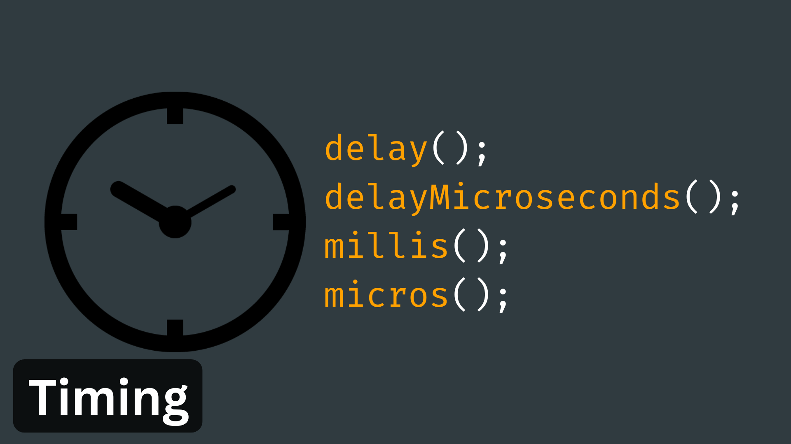
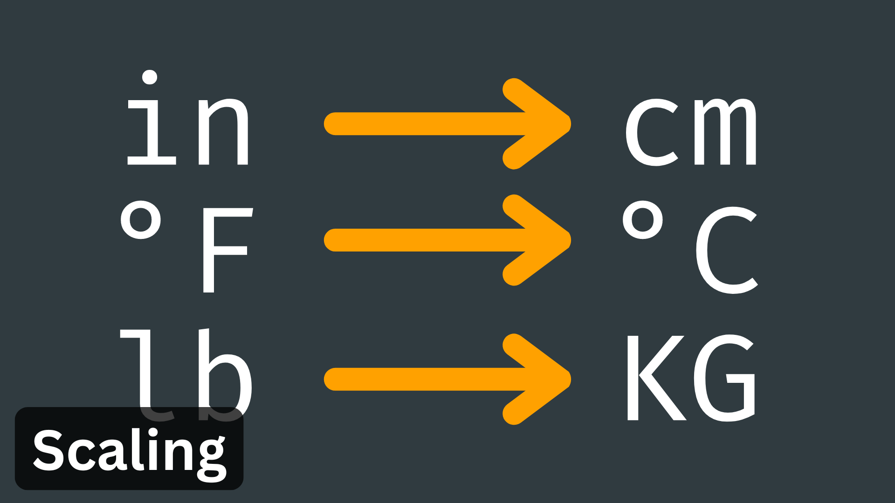
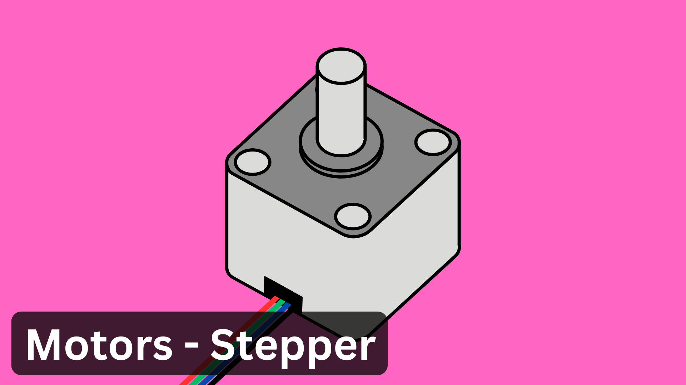

# Getting Started with Arduino

## Contents

- [Getting Started](#getting-started)
- [Arduino Programming Language](#arduino-programming-language)
- [Inputs](#inputs)
- [Outputs](#outputs)
- [Useful Resources](#useful-resources)

## Getting Started

## Arduino Programming Language

 

## Inputs

## Outputs

## Useful Resources

- Websites
  - [Arduino.cc](https://www.arduino.cc/)
  - [Arduino Docs](https://docs.arduino.cc/)
  - [Arduino Forum](https://forum.arduino.cc/)
  - [Arduino Tutorials](https://www.arduino.cc/en/Tutorial/HomePage)
  - [ECA Digital Making Wiki (Internal UoE use only)](https://uoe.sharepoint.com/sites/ECADigitalMakingWiki/SitePages/Arduino__Home.aspx)
  - [How To Mechatronics](https://howtomechatronics.com/category/tutorials/arduino/)
  - [Programming Electronics Academy](https://www.programmingelectronics.com/lessons/)
  - [Random Nerd Tutorials](https://randomnerdtutorials.com/projects-arduino/)
- Video Tutorials
  - [Arduino Course for Absolute Beginners - Programming Electronics Academy](https://www.youtube.com/watch?v=TItCq9deSr0&list=PLYutciIGBqC34bfijBdYch49oyU-B_ttH)
  - [New Arduino Tutorials - Paul McWhorter](https://www.youtube.com/watch?v=fJWR7dBuc18&list=PLGs0VKk2DiYw-L-RibttcvK-WBZm8WLEP)
  - [Arduino Workshop for Beginners - Core Electronics](https://www.youtube.com/watch?v=EdXQUEMOfgU&list=PLPK2l9Knytg5s2dk8V09thBmNl2g5pRSr)
- Existing Projects
  - [Autodesk Instructables](https://www.instructables.com/search/?q=arduino&projects=all)
  - [Hackster.io](https://www.hackster.io/arduino/projects)
  - [Programming Electronics Academy - Member Projects](https://www.programmingelectronics.com/customer-project-gallery/)
- Buying Components
  - [Mouser](https://www.mouser.co.uk/)
  - [Pi Hut](https://thepihut.com/)
  - [Pimoroni](https://shop.pimoroni.com/)
  - [RS](https://uk.rs-online.com/web/)
  - [Switch Electronics](https://www.switchelectronics.co.uk/)
