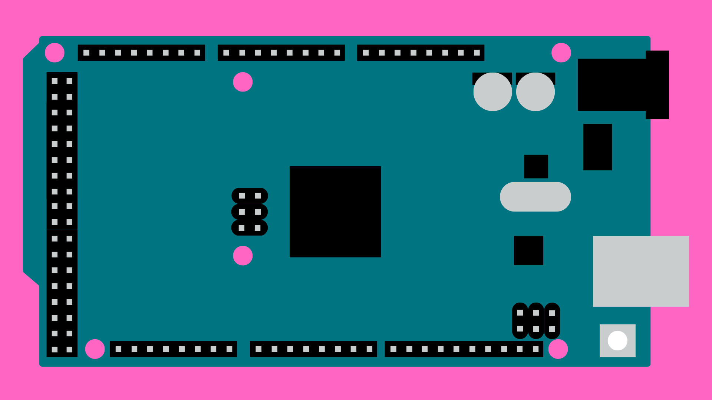

# Getting Started with Arduino
# Contents
- [Getting Started with Arduino](#getting-started-with-arduino)
    - [Contents](#contents)
    - [Introduction](#introduction)
    - [Boards](#boards)
    - [Useful Components](#useful-components)
    - [Programming](#programming)
        - [IDE](#ide)
        - [Language](#language)
        - [Upload Code](#upload-code) 
        - [Serial Monitor](#serial-monitor)
        - [Examples](#examples)
    - [Pins](#pins)
        - [Digital](#digital)
        - [PWM](#pwm)
        - [Analog Input](#analog-input)
    - [Outputs](#outputs)
        - [LEDs](#leds)
        - [Motors](#motors)
        - [Sound](#sound)
    - [Inputs](#sensors)
        - [Buttons and Dials](#buttons-and-dials)
        - [Weight](#weight)
        - [Light](#light)
        - [Distance](#distance)
        - [Kits](#sensor-kits)
    - [Troubleshooting](#troubleshooting)
    - [Useful Resources](#useful-resources)


# Introduction
From basic circuits up to commercially available products; Arduino can be used to create functional electronic projects, add interactive elements to your existing work, or simply as a way of getting into programming for beginners. But what exactly is Arduino?  

[Arduino](https://www.arduino.cc/) is an Italian company that designs and manufactures open-source hardware and software for the purposes of prototyping and creating interactive electronics. They are perhaps most well known for their line of development boards that allow users to receive and send data through programmable pins. In fact, most of the time when we talk about Arduino, we are referring to the physical boards themselves rather than the company.

The Arduino boards can be programmed from a computer using the [Arduino IDE](https://docs.arduino.cc/software/ide-v2/tutorials/getting-started-ide-v2) (Integrated Development Environment). Just connect the board to your computer via USB, and upload code that will then be run every time the Arduino board is powered on. 

All of Arduino's hardware and software is open-source, meaning everyone is completely free to use, modify and distribute projects using Arduino components. Arduino boards are used by everyone, from children to professionals, and are a great way to get into coding by making some fun and interactive projects.


# Boards
Arduino has a range of boards to choose from. Here are a couple of the most popular boards:

| Board | Dimensions  | Digital Pins | Analog Input Pins | PWM Pins |
| ----- | ----------- | ------------ | ----------------- | -------- |
| UNO   | 53x69mm     | 14           | 6                 | 6        |
| Nano  | 18x45mm     | 14           | 8                 | 6        |
| Mega  | 53x102mm    | 54           | 16                | 15       |

### UNO


[The Arduino UNO](https://docs.arduino.cc/hardware/uno-rev3) is probably the most popular board that Arduino produces. It houses 14 digital IO pins and 6 analog input pins. You can connect male jumper wires directly to the pins on the Arduino UNO, making quick and easy to prototype electrical circuits. 

[Arduino UNO Kits](https://bookit.eca.ed.ac.uk/av/wizard/resourcedetail.aspx?id=10148) are available to loan from ECA Bookit. This kit includes:
- Arduino Uno x 1
- USB to USB B cable x 1
- Breadboard x 1
- SD Card Shield x 1
- Jumper Wires x 10
- Ribbon Cable x 1
- Potentiometer x1
- Buttons x 2

### Nano


[The Arduino Nano](https://docs.arduino.cc/hardware/nano), as the name suggests, is a more compact Arduino board. It still houses 14 digital IO pins 8 analog input pins, but is designed for use on a breadboards. You will need to connect components via a breadboard or by directly soldering them to the Arduino. 

The Nano is useful for smaller electronic projects where an UNO might be too large, but it can also house some other components that the UNO doesn't have. Some available models house modules for WiFi, Bluetooth, IMU, microphone - although you will need to check the data sheet of the model you are planning to use.

### Mega


[The Arduino Mega](https://docs.arduino.cc/hardware/mega-2560) can be used for projects that require more I/O pins than other Arduino boards can provide. The Mega has a total of 54 digital IO pins and 16 analog input pins, which should be more than enough for all but the most extreme cases. 

Due to their size and number of IO pins, you can often find them as control boards for 3D printers.   


# Useful Components
Here are some components you will probably need for most Arduino projects: 

### Jumper Wires
Wires allow us to connect the pins on the Arduino board to the various components we might want to connect to. Most of the time it is useful to work with wires that have a single, solid pin that we can plug directly into the Arduino and breadboard ([see below](#breadboard)). Because of this, most wires we use for these circuits have ends crimped with Dupont Connectors.

These have a few variations that are good to be aware of:

Male to Male - useful for connecting Arduino pins to a breadboard.


Male to Female - for connecting to male pins, or extending the length of a Male to Male wire.


Ribbon Cable - useful for components that have lots of pins. Can have male or female ends.


### Breadboard

A breadboard (sometimes referred to as a solderless breadboard) is a useful tool for quickly prototyping small electrical circuits without the need for more permanent connections. It works by plugging jumper wires into pins on the breadboard, which are connected via metal pads below the surface.

It is important to understand how these pads are connected on a breadboard. As you can see below, there are two long rails on each side that extend all the way along the breadboard. These are called the power rails, and are often used to connect to the 5V and GND pins on the Arduino to supply a constant voltage for components that need to be powered.


Every pin on each row on the breadboard is connected to every other pin in that row, except for a break in the middle of the board. This gap allows for larger components, such as push buttons and ICs, to be placed on the breadboard without shorting any unwanted connections.    

### Resistors


Arduinos have an operating voltage of 5V. For some components, this may be too much and can damage or break them. Resistors restrict the flow of current in an electrical circuit and, by extension, also bring down the voltage. Resistance is measured in Ohms (Ω) and can be calculated using the formula Voltage = Current * Resistance, known as Ohm's law.

Resistors come in different shapes, sizes and resistances. Most commonly, 220Ω resistors are used in series with [LEDs](#dip) and 100kΩ resistors are used in [LDR](#ldrs) circuits.


# Programming
## IDE
To program the Arduino boards, Arduino provides a piece of software called and Integrated Development Environment (IDE). The Arduino IDE can be [downloaded from the Arduino website](https://www.arduino.cc/en/software). I would recommend installing the most recent version of the IDE as it has some nice features that versions pre 2.0 do not have.

### Layout
Arduino projects are saved as "sketches" and by default a sketch will open up once you have downloaded the IDE. These are some things to be aware of:


1. Text Editor: this is where you will write the code for the Arduino.
2. Console: any errors in your code will be flagged here when you verify/upload your code.
3. [Verify/Upload](#upload-code): the Verify (tick) button will check through your code for errors and report back via the console. The Upload (arrow) button will verify and upload your code *and* upload your code to the connected board.
4. [Board Select](#connect-to-a-device): you will select the board and USB port you are using from this dropdown menu.
5. [Serial Monitor](#serial-monitor): will open the serial monitor and plotter.
6. Sketches Folder: you can access any sketches you have saved to the default Arduino sketch folder. This is usually in Documents -> Arduino, although this can be changed in the Arduino IDE preferences.
7. Boards Manager: the boards manager allows you to download options for programming other development boards, both Arduino and non-Arduino.
8. Library Manager: often we will need pre-written code to control specific components. This code is stored in "libraries" that we can download from the Library Manager.

## Language
The Arduino programming language is based on a simplified version of C++, making it accessible to beginners without extensive programming knowledge. It uses a set of pre-written functions and libraries that handle many low-level tasks, allowing users to focus on their specific project requirements.

The Arduino framework provides a structure for organizing your code into three main areas:

1. Setup Function: The <code>setup()</code> function runs once when the Arduino board is powered on or reset. Its purpose is to perform any necessary initializations and configurations before your main program starts running. 

2. Loop Function: The <code>loop()</code> function is the heart of your Arduino program. After the <code>setup()</code> function finishes running, the <code>loop()</code> function starts and continues to run repeatedly as long as the Arduino board is powered on.

3. Global Scope: This is the area outside of the <code>setup()</code> and <code>loop()</code> functions. Anything declared here is accessible in both the <code>setup()</code> and <code>loop()</code> functions.

## Upload Code
Once you have created a sketch, you will need to upload it to your Arduino.

### Connect to a Device
You must ensure the Arduino is connected to your computer via a USB connection. If you are connected, a USB icon will appear next to the board name at the top of the IDE. This icon will *not* appear if you are not connected. 


Most Arduino boards will be automatically detected by the IDE, but if not, you can specify which board and USB port you are using by opening the dropdown menu and selecting the right one.


If your Arduino still doesn't appear here, select *Select other board and port* for more options.


Here you can search for the right board and select the correct port (usually the one with *(USB)* next to it).

### Upload
To upload your sketch, simply click the Upload icon at the top left of the IDE.


Before uploading, the IDE will check your code for any errors. If there are any errors in your code it will inform you via the console and will not proceed. 

The error messages the IDE provides can be a little opaque and tricky to understand, but they will do their best to explain exactly what the error is.

### Verify
You might choose to verify your code without uploading it. To do this, click the Verify icon at the top left of the IDE.


This will check over your code and report any errors to the console.

## Serial Monitor
The serial monitor allows us to send messages from the Arduino to the IDE via the USB connection. It is a massively important resource for debugging and more generally understanding what is happening in our code. If you ever upload a sketch that doesn't appear to be behaving as you expect, getting the Arduino to send data at different points in your code will make deciphering the problem much easier. 

### Setup
To initialize the serial monitor, we can use the <code>Serial.begin()</code> method inside the <code>setup()</code> function.

```cpp
void setup() {
    Serial.begin(9600);
}
```

You will need to pass in one argument to the begin() method (here I've used 9600). This is the **baud rate**; the speed at which the Arduino is communicating with your computer. You will need to take a note of this for later. 

### Reading
Once initialized, you can send messages to the serial monitor anywhere in your code using the <code>Serial.print()</code> method. For example, if you are reading from a input and wanted to know what the value being returned is, you could use the following code:

```cpp
// read from input device
inputData = analogRead(pin);

// send to serial monitor
Serial.print(inputData);
```

After uploading the code to the Arduino, you can read from the serial monitor by opening the icon at the top right of the IDE.


This should open a tab at the bottom of the IDE. Messages from the Arduino should now print out here. 

**Important**: You must ensure that the baud rate declared in your code is the same as the baud rate specified in the serial monitor window. There is a dropdown menu in the serial monitor that gives you options for baud rates you can use.

## Examples
### Built-in
If you navigate to:

- Win: File -> Examples
- Mac: Arduino -> Examples

you will find example sketch that you can open, look at, edit and upload. These examples are a great way to learn about the functionality of Arduino code. 

When you install a new library, it will often come with example code that you can use to understand how best to implement the code from that library.

### More Examples
I have included some more examples in the [example-code section of the GitHub repo](example-code/).


# Pins
Arduinos can be used to read from and control various external components, such as LEDs, buttons, buzzers etc. These devices can be connected via the pins on the ARduino board. 

These pins can be separated into four main catagories:

1. Power: 5V and 3.3V pins provide a constant voltage to power components. These pins cannot be turned off using code. 
2. Ground: GND pins are used to ground circuits. All electrical circuits must be connected to ground.
3. Digital Pins: these pins can be programmed to send or receive digital signals (on or off). 
4. Analog Input: these pins can be used to read analog voltages. An on-board Analog-to-Digital Converter (ADC) converts the voltage into a readable value (usually between 0-1023).

Here is a diagram of where these pins are located on an Arduino UNO:


### Setup
All pins must be declared using <code>pinMode()</code> inside the <code>setup()</code> function.

```cpp
// Setup pin 2 as an input
pinMode(2, INPUT);

// Setup pin 3 as an output
pinMode(3, OUTPUT);

// Setup A0 as an analog input
pinMode(A0, INPUT);
```

## Digital
Digital pins can be programmed to behave in different ways.

### Input
We can send a receive a digital signal (1 or 0) from components such as buttons or switches using the <code>digitalRead()</code> function.

```cpp
// Receive input data from pin 2
inputData = digitalRead(2);
```

### Output
We can send a digital signal of 5V (1 or HIGH) or 0V (0 or LOW) out of the digital pins using the <code>digitalWrite()</code> function.

```cpp
// Send 5V signal from pin 3
digitalWrite(3, HIGH);

// Wait for 1 second (1000 milliseconds)
delay(1000);

// Turn it off again
digitalWrite(3, LOW);
```

## Analog
### Input
To read analog signals (signals with many possible values that are not just HIGH or LOW), we must use the analog input pins on the Arduino. These are usually marked as A0, A1, A2 etc.

We can then use the <code>analogRead()</code> function.

```cpp
// Read analog signal from pin A0
inputData = analogRead(A0);
```

### Output
If we want to send a signal between 0-5V, we can approximate an analog signal using Pulse Width Modulation (PWM). The PWM pins are marked on an Arduino with the ~ symbol.

It is important to not that this is just an approximation of an analog signal using duty cycles of HIGH and LOW digital signals to approximate different voltages.


To make use of PWM pins in out code, we can use the <code>analogWrite()</code> function. Instead of passing in HIGH or LOW as arguments, we can use an integer value between 0-255 (0 = 0V, 255 = 5V).

```cpp
// Send 2.5V signal from pin 3
// 2.5 is 5/2, so we use 255/2 as our argument
analogWrite(3, 255/2);
```

# Outputs
## LEDs
Light Emitting Diodes (LEDs) paired with Arduino offer an exciting combination for countless creative and practical projects. Arduinos can control how much voltage is passed through a connected LED and thus turn it fully on, fully off or somewhere in between. 

### DIP
Dual In-line Package (DIP) LEDs are a very common component in beginner Arduino projects. They can be plugged into a breadboard or even directly into an Arduino.

In most cases, a 220Ω resistor needs to be connected to the circuit to bring down the voltage to a useable level. Although, you may want to check the most suitable voltage for the LED you are using and calculate the respective resistance needed for the circuit.

DIP LEDs have two legs. The longer leg (Anode) must be connected to the positive side of the circuit, while the short leg (Cathode) must be connected to ground. An LED will not work unless it is oriented this way.

You can program an Arduino to control a connected DIP LED using the <code>digitalWrite()</code> and <code>analogWrite()</code> functions ([see here](#pins))

#### Single colour


DIP LEDs are most commonly sold in single colours as 5mm or 3mm units.

#### RGB


RGB LEDs contain a red, green and blue LED. Some are manufactured with a shared anode (+ve terminal), whilst others share a cathode (-ve terminal). Make sure you know which type you have before wiring it into a circuit. For best impact, use the <code>analogWrite()</code> function to blend the colours together.

### Strip


LED strips make it easy to expand the number of LEDs in your project without using up more pins on the Arduino.

Although for some lengths of LED strips an Arduino will not need external power, for larger lengths an Arduino will not be able to supply enough current and an external power supply is recommended.

LED strips come in two main types:

- Non-addressable.
- Addressable.

On non-addressable strips, each colour (RGB) is connected to a pin on the Arduino and controlled using the <code>analogWrite()</code> function. This means the every RGB LED can only be lit the same colour.

On addressable strips, each LED on the strip also has a small IC that can control the colour of the LED using a data signal. This allows for control of each individual LED, allowing for more complex animations. You will need to install a library, such as the FastLED library, to be able to use this type. [See here](example-code/FastLED/) for some example sketches.

Make sure you know what type you need before purchasing.

### NeoPixel


NeoPixel is a line of products manufactured by Adafruit. They make use of addressable ws2812 LEDs and come in various sized rings, strips, bars, matrices etc.

Adafruit also provides it's own library for controlling NeoPixels, and has extensive documentation and support online. This makes them very easy to start programming with.

You will need to install this library if you want to program NeoPixel products. [See here](example-code/NeoPixel/) for some example sketches.

## Motors
### Servo


Servo motors are designed to provide precise control over angular or linear position, velocity, and acceleration.  They are known for their high torque, fast response times, and excellent positional accuracy.

To control a servo with Arduino, you will need to make use of the Servo library. [See here](example-code/Motors/ServoMotor/ServoMotor.ino) for an example sketch.

### Stepper


Stepper motors are a type of electric motor commonly used in various applications that require precise control over position and movement. They are known for their high torque, open-loop control, and ability to hold their position even when not powered

To control a stepper motor with Arduino, you will need a separate power supply and driver module to send the precise signals needed to properly control the motor. Not every stepper driver will control every stepper motor, so make sure you have the correct driver for your motor. 

[See here](example-code/Motors/SparkfunEasyDriver_Stepper/SparkfunEasyDriver_Stepper.ino) for an example sketch for using the [Sparkfun Easy Driver](https://learn.sparkfun.com/tutorials/easy-driver-hook-up-guide/all) with a NEMA 16 stepper motor.

### DC


Direct Current (DC) motors, are widely used in various applications due to their simplicity and versatility. They convert electrical energy into mechanical motion by utilizing the magnetic field created by direct current.By controlling the voltage applied to the motor, the speed and direction of rotation can be adjusted.

To control a DC motor with Arduino, you will need a DC motor driver module and a separate 5V power supply module. Do *not* try to control a DC motor with the digital pins on your Arduino. The motor will draw too much current from the Arduino and can potentially damage the pin or even the whole board.

## Sound
### Buzzers


Buzzers  come in two main types: active and passive.

### Passive
A passive buzzer is a simple type of buzzer that requires an external signal to generate sound. A passive buzzer does not have built-in electronics to generate sound on its own and relies on an external circuit to produce the necessary oscillating signal. In practice, this means we can control the frequency of the buzzer from the code.

[See here](example-code/Sound/PassiveBuzzer/PassiveBuzzer.ino) for an example sketch that controls an passive buzzer with an Arduino.

### Active
An active buzzer is a self-contained sound-generating device. It incorporates a built-in oscillator and driver circuitry, allowing it to generate sound without needing an external signal. When power is applied to an active buzzer, it emits a continuous tone or various predefined sounds, depending on its design. Active buzzers are generally easier to use since they do not require additional circuitry to generate sound.

[See here](example-code/Sound/ActiveBuzzer/ActiveBuzzer.ino) for an example sketch that controls an active buzzer with an Arduino.

# Sensors
## Buttons and Dials
For a lot of beginner projects, buttons and dials are a great way to add controls to your projects. They are reasonably simple to connect to a circuit and allows us to understand digital and analog signals better in our code.

### Buttons


Buttons are commonly used with Arduino to provide user input and trigger actions in electronic projects. When a button is connected to an Arduino, it can be programmed to detect button presses or releases, allowing you to respond to user interactions and control various aspects of your project, such as toggling LEDs, navigating menus, or initiating specific functions.

[See here](example-code/StarterCode/ButtonLED/ButtonLED.ino) for an example sketch using a button.

### Potentiometers


Potentiometers, also known as pots, are frequently used with Arduino to provide analog input and enable user-controlled variable resistance. When a potentiometer is connected to an Arduino, it can be used to measure the position of the potentiometer's adjustable knob or slider. This analog input can be used to control parameters like volume, brightness, or speed, allowing users to interact with Arduino-based projects and adjust settings in a smooth and continuous manner.

[See here](example-code/StarterCode/ButtonLED/ButtonLED.ino) for an example sketch using a potentiometer.

## Light
### LDRs 


Light-Dependent Resistors (LDRs) are commonly used with Arduino to detect and respond to changes in light intensity. When an LDR is connected to an Arduino, it acts as a variable resistor that changes its resistance based on the amount of light falling on it. By reading the analog voltage from the LDR using an analog input pin on the Arduino, you can determine the level of ambient light. This information can be used to create light-sensitive projects, such as automatic lighting systems, brightness control, or even light-based interactive installations.

[See here](example-code/Sensors/LDR/LDR.ino) for an example sketch using an LDR.

## Distance
### SR04 Ultra Sonic Sensor


When working with distance sensing, the HC-SR04 ultrasonic sensor is a popular choice for Arduino projects. The HC-SR04 sensor uses ultrasonic waves to measure distance by sending out a sound pulse and calculating the time it takes for the pulse to bounce back after hitting an object. When connected to an Arduino, the HC-SR04 sensor provides accurate distance measurements that can be used in various applications such as obstacle detection, object tracking, and proximity sensing. 

[See here](example-code/Sensors/SR04_UltraSonic/SR04_UltraSonic.ino) for an example sketch using an SR04.

## Weight
### Load Cells


Load cells are commonly used with Arduino to measure and monitor weight or force in various applications. When a load cell is connected to an Arduino, it can provide precise measurements of the applied force or weight. By using an analog input pin on the Arduino, the load cell's electrical output can be read and processed to determine the weight or force being applied. Load cells are commonly used in projects such as scales, force measurement devices, and industrial automation systems that require accurate weight sensing and monitoring.

When working with load cells and Arduino, the HX711 module is often used as an interface to amplify and digitize the analog output of the load cell. 

[See here](example-code/Sensors/LoadCell/) for example sketches using a load cell and HX711.

## Sensor kits
There are nearly endless types of sensors that we can make use of with Arduino. Sensor kits can be a great way to explore some of the different options out there.

You can loan a grove sensor kit from ECA Bookit ([see here](https://bookit.eca.ed.ac.uk/av/wizard/resourcedetail.aspx?id=5255)). This kit includes:
- Temperature sensor
- Sound sensor
- Digital light sensor
- Air quality sensor
- Temperature & humidity sensor
- Ultrasonic ranger

# Troubleshooting
## Error Messages
### Syntax Errors:
- **"expected ';' before..."** - Indicates a missing semicolon or other punctuation, often closing brackets. Make sure that lines that should close with a semicolon do, and that any open bracket have a matching closing bracket. 

- **"expected unqualified-id before..."** - Indicates a misspelled or undefined identifier. Make sure all variables are given a type (e.g. int, float, string etc.) when declared.
 
- **"missing terminating ' character"** - Indicates an unterminated string. This means you have not closed the quotation marks for a string in your code. Make sure that when you start a string with a ", you close it again with another ".

### Variable Errors:
- **"undeclared identifier"** - Indicates that a variable is being used before it is declared. To avoid this, try declaring variables at the top of the sketch.

- **"was not declared in this scope"** - Indicates a variable is being accessed outside of its scope. This might happen if you define a variable in the <code>setup()</code> function, and try to access it in the <code>loop()</code> function.To avoid this, again, try declaring variables at the top of the sketch in the global space.

### Function Errors:
- **"no matching function for call to..."** - Indicates that the function is called with incorrect arguments or the function is not defined. Make sure you have passed the correct number of arguments into the function.

- **"conflicting declaration"** - Indicates multiple conflicting function declarations. Make sure there are no two functions with the same name.

### Library Errors:
- **"no such file or directory"** - Indicates that the required library is not found or included. You can install the required library form the library manager.

- **"multiple definition of..."** - Indicates that a library function is defined in multiple locations. You should only include each library once per file.

# Useful Resources
- [The Arduino website](https://www.arduino.cc/), as well as the [documentation](https://docs.arduino.cc/) and [forum](https://forum.arduino.cc/), are a good port of call for learning more about Arduino and answering questions you may have.

- There is a [Arduino Coding Basics](https://media.ed.ac.uk/playlist/dedicated/1_9kek9y97/) video tutorial series on the Digital Development ECA Media Hopper channel.

- If you need to purchase components, [Pimoroni](https://shop.pimoroni.com/), [Pi Hut](https://thepihut.com/), [RS](https://uk.rs-online.com/web/) and [Mouser](https://www.mouser.co.uk/) are some sites you may want to look at.
