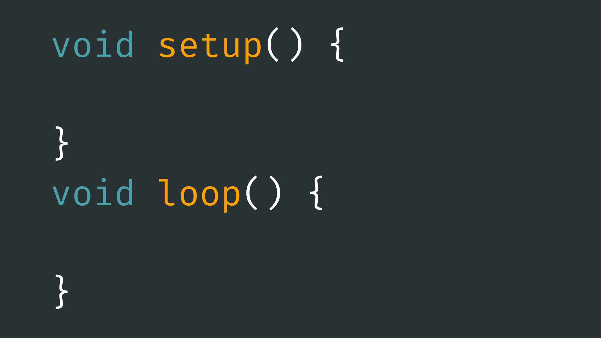
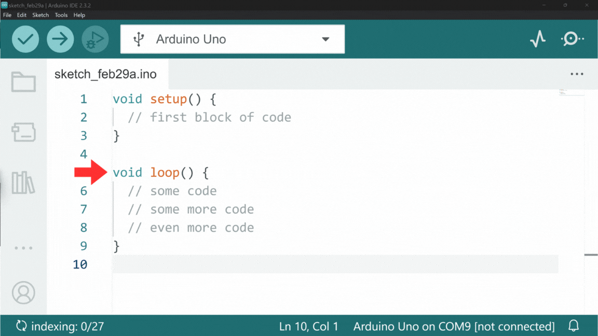

# Arduino Programming Language



## Contents

- [Introduction](#introduction)
- [Basic Rules](#basic-rules)
    - [Execution Flow](#execution-flow)
    - [Statement Terminators](#statement-terminators)
    - [Comments](#comments)
    - [Spelling and Capital Letters](#spellingcapital-letters)
    - [Spaces and Indentations](#spaces-and-indentations)
- [Arduino Framework](#the-arduino-framework)
    - [Setup](#setup)
    - [Loop](#loop)

## Introduction
You can upload instructions to your Arduino board in a number of ways. The Arduino board itself (or rather the microcontroller IC chip on the board) only understands machine language, a binary code level set of instructions that most computers run on. 

It would be very difficult for us to write instructions for the Arduino using machine language, so instead Arduino have developed a language and toolchain for compiling human-readable code into machine language for the Arduino.

The Arduino programming language is a variant of another programming language,  C++, with some additional functionality to make programming the Arduino easier. This means we will need to learn some C++ basics if we want to program our Arduino boards.

## Basic Rules
### Execution Flow

The most basic thing to remember in programming is that each line of code is just an instruction for the computer you are coding for. Each line of code you write in your Arduino sketches, tells the Arduino to do something.

These lines of code are executed one line at a time, from the top of the page to the bottom - unless we explicitly state otherwise. To change the order in which lines of code are executed, we would usually need to use [control flow statements](../4-ControlFlow/README.md). 

### Statement Terminators

To tell the compiler that we have finished with a line of code, we need to add a semicolon (;) to the end of each line of code we write. There are exceptions to this, for example:

- After a preprocessor statement (any line of code that starts with a #).
- Start/end of a code block (defined by curly brackets {}).
- After [control flow statements](../4-ControlFlow/README.md).

However, for most lines of code we write we need to use a semicolon as a ‘statement terminator’ to say that we have finished with that line and are ready to move to the next one.

Here are some examples of where to use statement terminators:

``` cpp
#include <Servo.h> // Don't need one here (preprocessor)
​
int myInt = 0; // <--- Need one here
​
void setup() { // Don't need one here (start of code block)
  
  Serial.begin(9600); // <--- Need one here
  
  myInt++; // <--- Need one here
  
} // Don't need one here (end of code block).
```

### Comments

As you may have seen in previous examples, or example code, we can include comments in our code that don't affect the code itself. The are, quite usefully, referred to as ‘comments’ and are completely ignored by the compiler when we go to verify/upload our code. They can be placed in sketches to describe certain actions, justify decisions, and remind yourself of what your code does.

There are a few ways of using comments in our code. The most simple way is to create two forward slashes, and anything after the forward slashes will be ignored by the compiler.

``` cpp
// This is a comment
```

You can also create block comments by using a forward slash and asterisk, then close it by using and asterisk followed by a forward slash. This allows you to write comments over multiple lines, like so:

``` cpp
/*
This is a block comment
​
I can write more lines that will be ignored
​
This is useful for explaining things in more depth
*/
```

### Spelling/Capital Letters

One thing you will have to bear in mind is that a compiler won't associate two words that are spelled differently as the same thing, no matter how close in spelling they are. This means you will need to be particularly vigilant when it comes to spelling in your code.

The same goes for using capital letters. Confusingly, the Arduino compiler thinks that <code>pinMode()</code> and <code>pinmode()</code> are two entirely different things. Make sure all spelling and capitalisation in your code is consistent.

### Spaces and Indentations

Unlike some other programming languages, like Python, spaces and indentation generally don't matter in C++ in order for the code to run. That is not to say it doesn't matter at all, as laying out your code in a clear and consistent way makes reading and understanding your code a lot easier.

You should also make sure not to include spaces in the middle of function or variable names. For example, <code>pinMode()</code> should not be written as <code>pinMode()</code>.

## The Arduino Framework

When you open a new sketch in the IDE (*File → New Sketch*) you should see that some code has already been written for us before we start. It should look something like this:

``` cpp
void setup() {
  // put your setup code here, to run once:
​
}
​
void loop() {
  // put your main code here, to run repeatedly:
​
}
```

This is the Arduino framework that we need to first understand before writing any code. The framework consists of two function definitions: <code>setup()</code> and <code>loop()</code>. Next to each are some curly brackets <code>{}</code> that we can write code inside of. 

Which function we write our code in will depend on when we want the code to be executed in the Arduino's runtime (the time between starting the Arduino and it stopping).

### Setup

Any code we place inside the <code>setup()</code> function will be run once at the start of runtime (after each powerup or reset of the Arduino board). The fact that this code is only run once makes it a good place to setup things that will happen later - hence the name <code>setup()</code>.

For example, to send messages from the Arduino to the serial monitor, a line of code is required to start serial communication. We need to start serial communication before sending any messages and we don't need to start it more than once, so we place it in the <code>setup()</code> function. 

``` cpp
void setup() {
  Serial.begin(9600);
}
```

### Loop

Any code we place inside the <code>loop()</code> function will be run on repeat after the <code>setup()</code> function has finished being executed.  The <code> loop()</code> function will run on repeat until the Arduino is powered off or breaks, so this is where the bulk of actions will take place in our code for things like:

- Sensor reading.
- Outputting signals.
- Communicating with other devices.
etc.

Once all of the lines of code within the <code>loop()</code> have been executed, the program pointer will jump back to the start of the function and run it all again.

