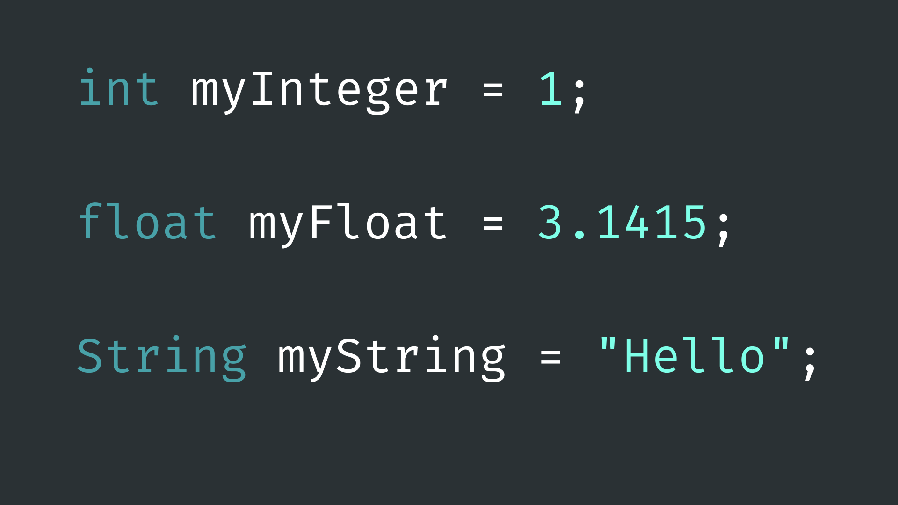
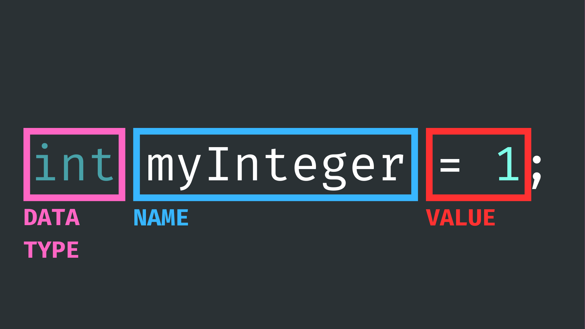

# Variables



## Contents

- [Introduction](#introduction)
- [Using Variables](#using-variables)
    - [Variable Declaration](#variable-declaration)
    - [Addressing Variables](#addressing-variables)
    - [Scope](#scope)
- [Data Types](#data-types)
    - [Integers](#int---integer)
    - [Floating Point](#float---floating-point)
    - [Strings](#string---character-string)
    - [Boolean](#bool---boolean)
- [Variable Qualifiers](#variable-qualifiers)
    - [Const](#const---constant)
    - [Unsigned](#unsigned)

## Introduction

A variable is a tool given to us by practically all programming languages as a way to store a piece of data. Variables can be given a data type, a name, and a value. This means - among other things - we can give useful names to pieces of data in our code to help us remember what they are for.

For example, if you want to store the pin number of a digital pin connected to an LED, you can store it in a variable, give it a useful name like <code>pinNumber</code>, and use it in multiple places in your code - i.e. <code>pinMode()</code>,<code> digitalWrite()</code> etc. The advantage of doing this is that if you then want to change the pin number, you only have to change the code in one place, rather than remembering everywhere you have used the pin number.

For these reasons, and others, variables are a fundamental concept in programming. They can be used to make our code more readable and to help us perform certain tasks that we might not otherwise be able to.

## Using Variables

### Variable Declaration
As previously stated, variables have three components:

- **a data type** - what format/shape the data takes.
- **a name** - to address it by (can be anything you choose).
- **a value** - to store.



When setting up a variable, we have to define each of these things in what is known as a “declaration”. For example:

``` cpp
int pinNumber = 4;
```

…here we are setting up a variable called <code>pinNumber</code> with the data type <code>int</code> as we want to store an integer (number with no fractional component). We can then use the equals operator to assign it the value <code>4</code>. 

### Addressing Variables

Once a variable has been declared, we can use various [operators](../2-Operators/README.md) to address the data being stored in the variable. It is important to remember that when we do this, we no longer need to define the data type. For example: 

``` cpp
int counter = 4;
counter = 10;
```

…here we have declared a variable called <code>counter</code> and initialised it with a value of <code>4</code>. After that, we have used the equals operator to reassign the value <code>10</code> to <code>counter</code>.

If we were to then print <code>counter</code> to the [serial monitor](../../Getting-Started/Serial-Monitor/README.md) afterward, it would print the number <code>10</code>.

We can also use [arithmetic and assignment operators](../2-Operators/README.md) to modify the value stored in a variable: 

``` cpp
int a = 1;
int b = 2;
​
int c = a + b; // c == 3
​
c += 9; // c == 12
 ```

### Scope

The term “scope” refers to the lifetime of a variable, and it is dependent on where the variable is declared versus where it is being addressed. A common example of this is that variables declared in the <code>setup()</code> function are only accessible within the <code>setup()</code> function. This is because variables only exists with in the block of code (scope) that they are declared in. 

For example, lets look at this variable that is declared inside of a block of code (inside a set of curly brackets <code>{}</code>):

``` cpp
{
  int counter = 0;
}
```

…this code block could be a function definition, or <code>if()</code> statement, or really any use of curly brackets <code>{}</code>. If we try to address this variable inside the code block, we can do so without any issues:

``` cpp
{
  int counter = 0;
  counter += 1;
}
```

As soon as we try to address is from outside the code block…

``` cpp
{
  int counter = 0;
  counter += 1;
}
​
counter = 10;
```

…we will get an error message when we go to [upload the code](../../Getting-Started/Arduino-IDE/README.md). It should look something like this:


``` 
exit status 1
'counter' was not declared in this scope
```

It is for this reason that it is sensible for most variable declarations in our code to happen at the top of the sketch, above the <code>setup()</code> and <code>loop()</code> functions.

``` cpp
int counter = 0;
​
void setup() {
  Serial.begin(9600);
}
​
void loop() {
  counter += 1;
  Serial.println(counter);
  delay(1000);
}
```

## Data Types

A data type is the format/shape that a variable takes. It is essentially an attribute associated with a variable that tells a computer how to interpret its value. 

We have already used the data type <code>int</code> in previous examples. This data type can only store integer values and cannot store any value with a fractional part. If you were to try to assign a fractional value to an <code>int</code> variable, it would simply discard the fractional component (<code>6.5</code> would become <code>6</code>). 

There are several data types we can use in the Arduino programming language, but for this tutorial we will look at some of the most common types you will likely come across in Arduino projects…

### int - Integer

The <code>int</code> data type - as previously mentioned - can only store integer values. This makes them useful for indexing or counting things in our code. It is important to remember that they cannot store fractional components, even if added to/multiplied by non-integer numbers.

``` cpp
int myInt = 5;
​
myInt += 2; // myInt == 7
​
myInt = myInt / 2; // myInt == 3 (not 3.5!)
```

### float - Floating Point

The <code>float</code> data type can store non-integer numbers - i.e. number with a fractional component. This makes them useful for scaling operations and more precise measurements in our code.

You can also denote the fact that you want a whole number to behave like a float by adding a decimal point at the end (e.g. <code>2.0</code> instead of <code>2</code>). This may be useful in certain calculations in your code.

``` cpp
float myFloat = 3.14;
​
myFloat = myFloat / 2.0; // myFloat == 1.57
 ```

### String - Character String

The <code>String</code> data type can store text data. Text data can be defined in code using quotation marks “”. 

<code>String</code> variables can also be “concatenated” which means they can be added together to make longer text.

The <code>String</code> data type is slightly different to <code>int</code> and <code>float</code> variables as it is not a basic data type, but is a class given to us by Arduino to make working with text easier. It contains special methods that we can use to modify the text data stored in the variable. This is not important for getting started with variables, but you can find out more about <code>String</code> operations [here](../10-StringMethods/README.md).

``` cpp
String myString = "Hello World";
​
myString += "!!!"; // myString == "Hello World!!!"
```

There are some limitations to using <code>String</code> variables in Arduino code. Due to the large amount of memory that they can take up, excessive use of Strings can lead to memory fragmentation and program crashes. It is best to use them sparingly.

### bool - Boolean

The <code>bool</code> data type can store <code>true</code> or <code>false</code> data. In the Arduino programming language, a value is considered <code>false</code> if it is equal to <code>0</code>, and considered <code>true</code> if equal to anything else (usually <code>1</code>, although can be any value other than <code>0</code>).

Boolean variables can store a <code>true</code> or <code>false</code> value, usually for use with [conditional statements](../4-ControlFlow/README.md).

``` cpp
bool myBool = true; // myBool == 1 (true)
​
myBool = 1 > 10; // myBool == 0 (false)
​
myBool = !myBool; // myBool == 1 (true)
myBool = !myBool; // myBool == 0 (false)
```

## Variable Qualifiers
As well as seeing the data type in a variable declaration, you may also see other keywords being used. These “qualifiers” can give variables other/extended behaviours beyond that of their data type. 

Here are a few you might see being used in Arduino projects…

### const - Constant

The <code>const</code> keyword can be used when we don't want the value we assign the variable with to ever change. This can be useful for things like pin numbers or defining the length of an array, when changing this number during runtime could cause issues. 

Of course, we can simply try to avoid modifying the value stored in a variable ourselves, however, <code>const</code> gives us the assurance that if the value is ever in danger of being modified somewhere in our code, the sketch will not build and will instead throw an error.  

``` cpp
const int pinNumber = 6;
​
// ** This line of code will throw and error if built **
// We cannot reassign a value to const variable
pinNumber = 5; 
```
```
 error: assignment of read-only variable 
 ```

### unsigned

The unsigned keyword ensures that the value stored in a numeric variable is always positive. The word “unsigned” comes from the fact that it remove the + or - sign from the start of a variable.

This can be useful for representing quantities that are always non-negative, such as array indices or sensor readings. The removal of the +/- sign at the start of the variable also gives the numeric part of the variable more space in computer memory. This means that unsigned variables can store larger values than signed variables.

``` cpp
unsigned int myInt = 3;
​
// - myInt cannot be negative.
// - 3 - 4 will wrap around to largest value it
//   is possible to store in an unsigned int.
// - myInt == 65535
myInt -= 4; 
```