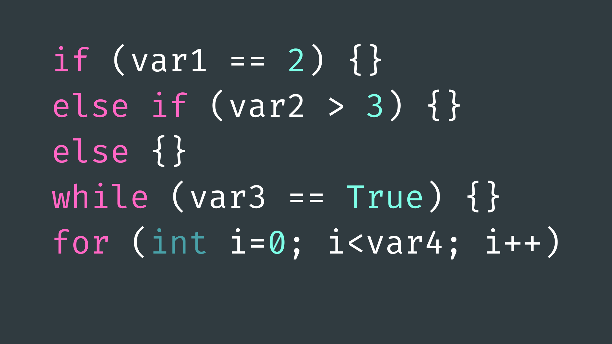
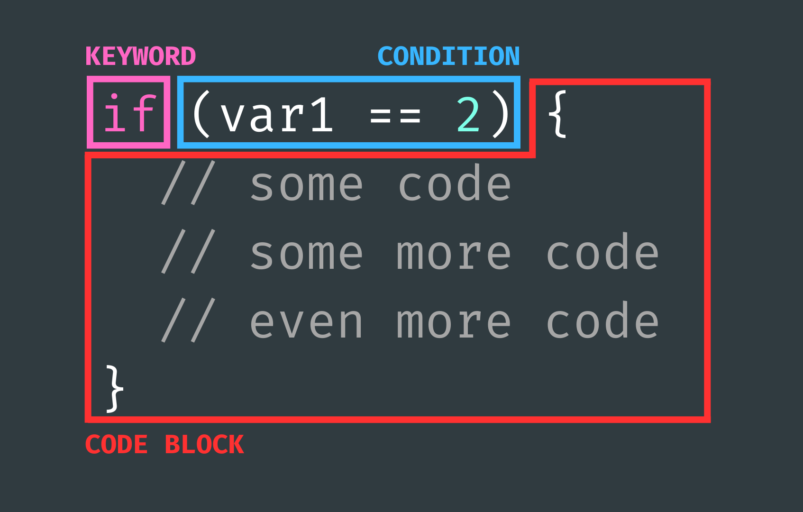

# Control Flow Statements



## Contents

- [Introduction](#introduction)
- [Using Control Flow Statements](#using-control-flow-statements)
    - [Structure](#structure)
    - [Conditions](#conditions)
- [If Statements](#if-if-else-and-else)
    - [if()](#if)
    - [else()](#else)
    - [else if()](#else-if)
- [Switch Statements](#switch-case)
    - [switch()](#switch-case)
    - [break](#break)
    - [default](#default)
- [While Loops](#while-and-dowhile)
    - [while()](#while)
    - [do...while()](#dowhile)
- [For Loops](#for)

## Introduction

The “program counter” is the part of computer memory that tells the Arduino which line of code to execute. Typically, the program counter executes lines of code one at a time, from the top of the script to the bottom. The order in which the program counter executes lines of code is known as the [“execution flow”](../1-Overview/README.md#execution-flow).

Control flow statements allow us to change the order in which blocks of code are executed based on input conditions. For example, we can instruct our code only to run a block of code if a button is pressed, or repeat a block of code a set number of times.

These types of statement provide the means to create logic, make decisions, iterate through data, handle errors, and respond to various events, allowing you to create complex and interactive projects. 

## Using Control Flow Statements

### Structure
Most control flow statements consist of three components:

- **a keyword** - <code>if</code>, <code>else</code>, <code>while</code> etc.
- **a condition(s)** - usually a boolean expression (<code>true</code> or <code>false</code>).
- **a code block** - defined by curly brackets <code>{}</code>, to be executed if the condition is true.



The keyword will tell the program counter how to behave if the condition is <code>true</code>, the condition will then be evaluated as <code>true</code> or <code>false</code>, and the program counter will run the block of code if the condition is <code>true</code>, or skip the code block if the condition is <code>false</code>.

Loops (<code>while()</code> and <code>for()</code> loops) will run the block of code if the condition is <code>true</code> and then evaluate the condition again potentially running it multiple times if the condition remains <code>true</code>.

### Conditions

A condition is any line of code that evaluates to either <code>true</code> or <code>false</code>. This could be a boolean variable or conditional statement using relational operators.

We can use a range of different relational operators to create these conditions:

- <code>(a == b)</code> - equal to.
- <code>(a < b)</code> - less than.
- <code>(a > b)</code> - greater than.
- <code>(a <= b)</code> - less than or equal to.
- <code>(a >= b)</code> - greater than or equal to.
- <code>(a != b)</code> - not equal to.

For example: <code>(1 < 2)</code> would evaluate to <code>true</code>, and <code>(2 + 2 == 5)</code> would evaluate to <code>false</code>.

We can also use logical operators to combine conditional statements. These logical operators include:

- <code>&&</code> - logical AND.
- <code>||</code> - logical OR.
- <code>!</code> - logical NOT.

For example: <code>(1 < 2 && 1 > 0)</code> would evaluate to <code>true</code> as <code>1</code> is less than <code>2</code> and <code>1</code> is greater than <code>0</code>.

## if(), if else() and else

### if()

The <code>if()</code> statement will check a condition and execute the following code block if the condition is <code>true</code>. If activated, the program counter will run the defined block of code one time before continuing onto the next available line of code.

``` cpp
int a = 5;
​
if (a < 10) {
  // run this code if true
}
 ```

### else

An <code>else</code> statement can be added to the end of an <code>if()</code> statement to define a code block to run if the original condition is not <code>true</code>.

An <code>else</code> statement can only be used after an <code>if()</code> and cannot be used on its own.

``` cpp
int a = 100;
​
if (a < 10) {
  // run this code if true
}
else {
  // otherwise run this
}
 ```

### else if()

An <code>else if()</code> statement - as the name suggests - is a combination of an <code>if()</code> and <code>else</code> statement. It gives you an opportunity to check another condition if the previous condition was <code>false</code>.

You can use multiple else <code>if()</code> statements if you want to check multiple things. Bear in mind however, and these statements will only be executed if all the previous <code>if()</code> and <code>else if()</code> conditions evaluate to <code>false</code>. If any of them evaluate to <code>true</code>, the following <code>else if()</code> and <code>else</code> statements will be ignored.

``` cpp
int a = 100;
​
if (a < 10) {
  // run this code if true
}
else if (a < 50) {
  // run this code if the previous condition
  // is false and if this condition was true 
}
else {
  // otherwise run this
}
```

## switch()... case

<code>switch()…case</code> statements are similar to a series of <code>if()…else if()</code> statements in that they can direct the program counter to a specified point in the code. Where they differ, however, is that <code>switch()</code> takes an <code>int variable as an argument, and not a <code>true</code>/<code>false</code> condition. It then matches the <code>int</code> variable to the corresponding <code>case</code> statement and executes the code block there.

``` cpp
int myInt = 1;
​
switch (myInt) {
  case 1:
    // do something if myInt == 1
    break;
  case 2:
    // do something if myInt == 2
    break;
} 
```

As you can see, the code block is no longer defined by curly brackets and is instead placed after a colon <code>:</code> and before a <code>break</code> keyword. 

### break

The <code>break</code> keyword can be used to exit the <code>switch()</code> statement, and is typically used at the end of each <code>case</code>. Without a <code>break</code>, the <code>switch()</code> statement will continue executing the following expressions (a behavior known as "falling through") until a <code>break</code>, or the end of the <code>switch()</code> statement is reached.

You may choose to emit the <code>break</code> statement if you want the program counter to execute the lines of code after the initial case statement. For example:

``` cpp
int myInt = 2;
​
switch (myInt) {
  case 1:
    // some code
  case 2:
    // some code
  case 3:
    // some code
    break;
  case 4:
    // some code
}  
```

…in this code:

- <code>myInt</code> contains the value <code>2</code>, so when the <code>switch()</code> statement evaluates <code>myInt</code>, it will jump to <code>case 2</code> on *line 6*. It will then execute the code on *line 7*. 
- As there is no break statement after <code>case 2</code>, the program counter proceeds to <code>case 3</code>, where it will then execute the code on *line 9*. 
- The program counter comes to a <code>break</code> on *line 10*, and so exits the <code>switch()</code> statement, skipping <code>case 4</code> entirely.
 

### default

<code>switch()…case</code> statements also give us the option to specify code for if the input doesn't match any of the case statements. You can think of this like an <code>else</code> statement: only running if none of the previous conditions/options are met. We have to define this code using the keyword <code>default</code>.

``` cpp
int myInt = 2;
​
switch (myInt) {
  case 1:
    // run this if myInt == 1
    break;
  case 2:
    // run this if myInt == 2
    break;
  default:
    // run this if myInt != 1 AND myInt != 2
    break;
} 
```

## while() and do...while()

### while()

A <code>while()</code> loop operates similarly to an <code>if()</code> statement: first checking the condition, then executing the code block if the condition is <code>true</code>. Where it differs is when it reaches the end of the code block where it checks the condition again and will run the code block again if it remains <code>true</code>. It will do this - potentially infinitely - until the condition becomes <code>false</code>.

This can be useful for when you don't know in advance how many times the loop will need to execute or if you need to wait until another task has finished before proceeding.

``` cpp
bool flag = true;
​
while (flag) {
  // run this code until flag == false 
}
​
while (!flag) {
  // run this code until flag == true
}
 ```

### do…while()

A <code>do…while()</code> loop is almost exactly the same as a <code>while()</code> loop with one key difference: the condition is only checked after the code block has been executed at least one time. 

This can be used in situations where you want the code block to always be run at least once, with the possibility of it repeating it afterwards. 

``` cpp
int a = 5;
​
do {
  // run this code
  // then check the condition
} while (a < 10); // repeat as long as (a < 10) remains true
```

## for()

A <code>for()</code> loop is another looping control flow statement. It can run a block of code a set amount of times and is usually used with an increment counter that keeps track of how many times the code block has been executed. 

The <code>for()</code> loop is a useful tool for repeating any tasks in our code and for iterating through arrays.

The statement takes slightly different arguments to <code>while()</code> and <code>if()</code> statements. It requires three components:

- **an initialisation** - the number the counter starts at.
- **a condition** - to check whether to run the code block again.
- **an increment amount** - how much the counter increases by after each loop iteration.

For example: <code>for (int i = 0; i < 10; i++) {}</code> would create a loop that starts at <code>i = 0</code>, repeats until <code>i</code> is less than <code>10</code>, and where <code>i</code> increases by one after each loop iteration. In the C++ programming language (which Arduino is based on), <code>i++</code> is shorthand for <code>i += 1</code> which itself is shorthand for <code>i = i + 1</code>.

While the <code>for()</code> loop is active, you can also use the counter <code>i</code> inside the code block. It is simply convention to use the name <code>i</code> for the increment counter in <code>for()</code> loops, and as such, you may see it called various things in other projects. 

``` cpp
int maxCount = 100;
​
// Use a for() loop to print out numbers from 0-100
for (int i = 0; i < maxCount; i++) {
  Serial.println(i);
}
```