# Libraries

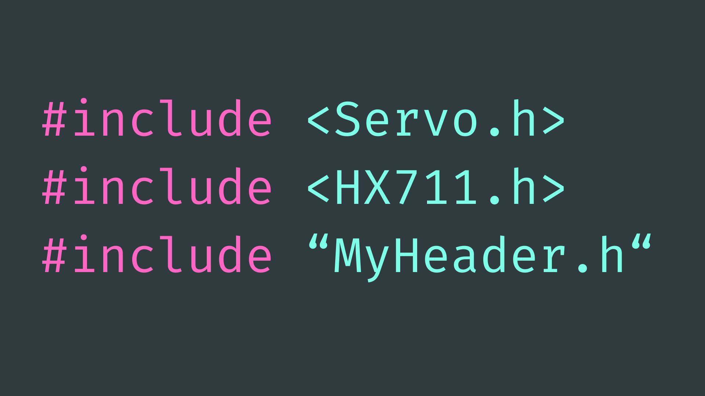

## Contents

- [Introduction](#introduction)
- [Installing Libraries](#installing-libraries)
    - [Via the Arduino IDE](#ide-libraries-manager)
    - [Via ZIP File](#add-zip-library)
- [Usage](#usage)
    - [Include Library in Sketch](#including-libraries-in-sketches)
    - [Library Examples](#library-examples)
- [Header Files](#header-files)
    - [Creating Header Files](#create-header-file)
    - [Including Header Files in Sketch](#include-header-file-in-sketch)
    - [Sharing Header Files](#sharing-header-files)

## Introduction

A code library refers to a collection of pre-written code that you can use in your Arduino projects to perform specific tasks. These libraries are created to simplify programming by providing ready-made [functions](../5-Functions/README.md) and [classes](../6-Classes/README.md) for common tasks, such as controlling sensors, displays, communication modules, among other things.

These libraries are often made for free by members of the Arduino community. Published libraries can be installed via the Library Manager in the [Arduino IDE](../../Getting-Started/Arduino-IDE/README.md), or installed from a .ZIP file.

We can also create our own files containing pre-written code. This can be useful if we want to save code in a file to use across multiple projects, but it can also be useful for cleaning up our code and making it more readable.  

## Installing Libraries

### IDE Libraries Manager

The easiest way to install an Arduino code library is through the Library Manager tab in the Arduino IDE. You can open this tab by navigating to *Sketch → Include Library → Manage Libraries…* or with the shortcut <code>Ctrl/Cmd + Shift + I</code>.


Alternatively, you can open the Library Manager by selecting the library icon on the left side of the IDE:


Once there, you can search for, select versions of, and install the library of your choice.

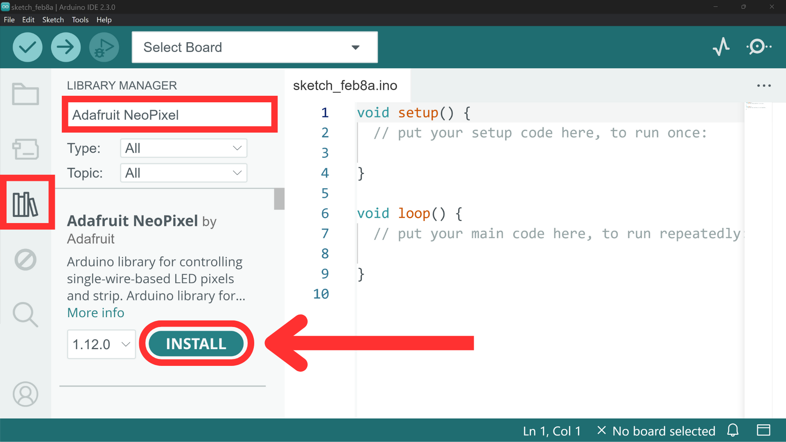

### Add .ZIP Library

Some libraries are not available through the Library Manager and instead have to be downloaded as a .ZIP file and uploaded to the Arduino Libraries directory.

You will first need to download the library as a .ZIP file. If the library is available on GitHub, you can do this by navigating to *<> Code → Download ZIP*: 

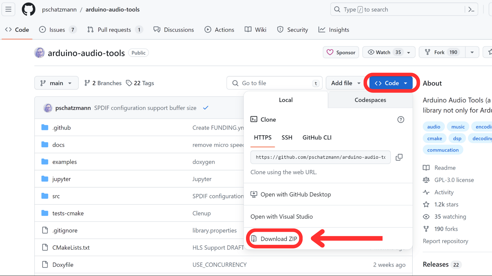

Then in the Arduino IDE, navigate to *Sketch → Include Library → Add .ZIP Library…*

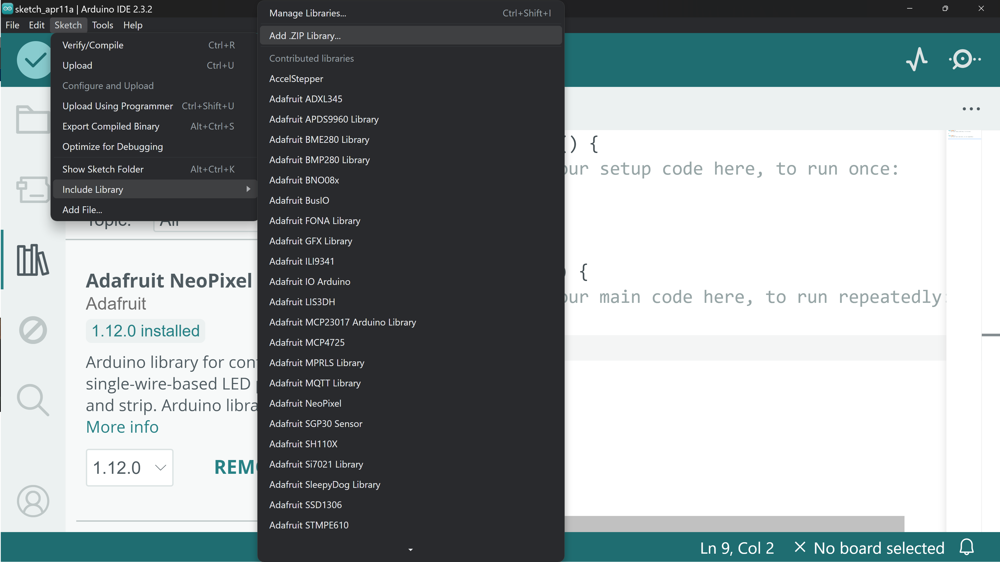

This should open up your file explorer. From here, find and select the downloaded .ZIP file (from your downloads folder) and select *Open*. This should install the .ZIP library into the Arduino Libraries directory.

## Usage

### Including Libraries in Sketches

Once you have installed a library, you can start to include it in your sketches. To do this, you need to tell the sketch that you are using a specific library so it knows to include it when you go to build the sketch. If you attempt to use code from a library without including that library, the code will throw an error and fail.

The syntax for this is quite straightforward. At the very top of the sketch, write <code>#include <LibraryName.h></code>, replacing <code>LibraryName</code> with the actual name of the library. 

For example, to include the Arduino [servo](../../Output-Devices/Motor-Servo/README.md) library, we would include this statement at the top of the sketch:

``` cpp
#include <Servo.h>
```

### Library Examples

All well-written Arduino libraries should include a handful of example sketches for us to better understand how to use the library in our own sketches. It is worth exploring these examples when you install a new library to get a feel for how it works.

To access these examples, simply navigate to *File → Examples* where you can scroll to find the library you are looking for. From there, you should be able to click to open a couple of example sketches.

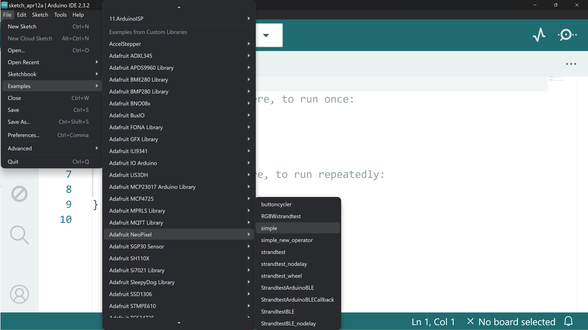

A good example sketch should include some useful comments to explain how the code works.

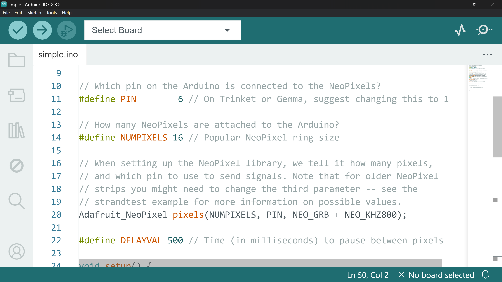

## Header Files

Sometimes you may want to create your own code "library" to save some useful code to a file so that you can include it in multiple projects. You may also want to split your code across multiple files for readability or privacy reasons. Using header files is a simple way to do this.

Header files (files with the file extension .h) can be created from the Arduino IDE and can contain Arduino code. We can then use an <code>#include</code> statement to include the code from the header file in our sketch.

Let's look at how to do this…

### Create Header File

You can create a new project file from the Arduino IDE by navigating to the three dots in the upper-right corner and selecting *New Tab*.

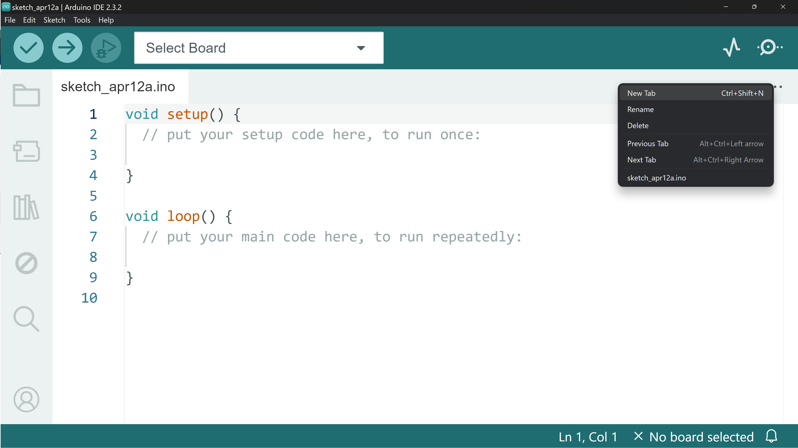

You will then be prompted to give the new file a name. You can call this whatever you like, just make sure to give it the file extension <code>.h</code>.

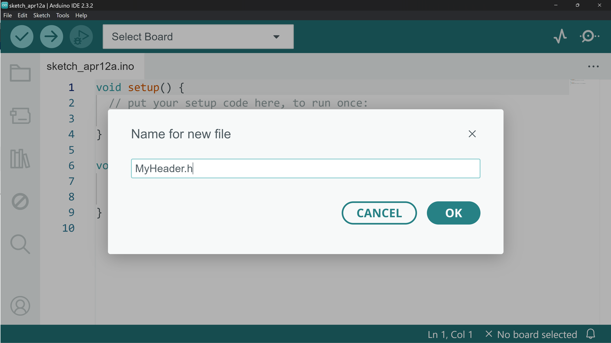

This should create a new tab within the project window that contains an empty file. You can start populating this file with the Arduino code that you want in your header file. 

Header files are commonly used for storing functions and classes. It's important to note that while possible, using the header file to declare variables may lead to the unintentional creation of multiple variables in your project with the same name.

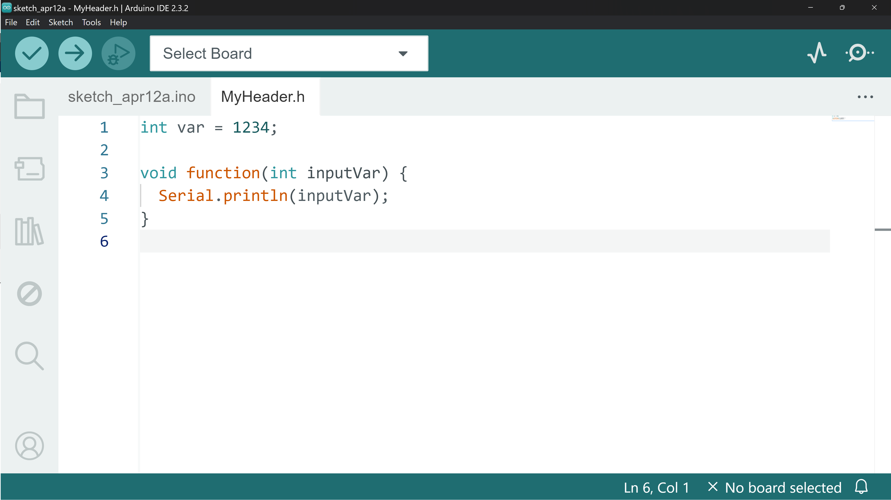

### Include Header File in Sketch

To include the header file in your sketch, we simply use a <code>#include</code> statement - much like we do to include a library. However, instead of wrapping the file name in angled brackets, we generally use quotation marks, like so:

``` cpp
#include "MyHeader.h"
```

This is so the compiler can differentiate between files in the project folder <code>""</code> and files stored in the Arduino Libraries directory <code><></code>.

After including the header file at the top of the sketch, we can use the functions, classes, and variables defined in the header file.

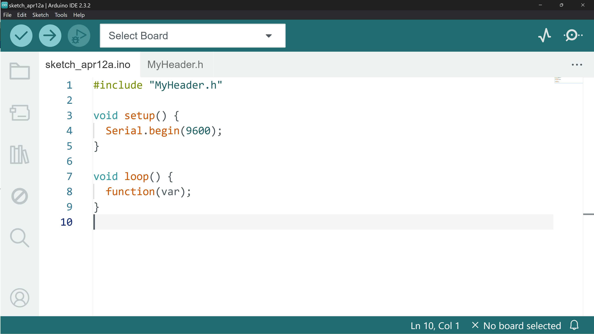

### Sharing Header Files

As previously mentioned, header files are useful for storing code that we want to use in multiple sketches. To copy a header file to another sketch, we simply need to copy the file and paste it into another project folder.

To find the sketch folder, you can navigate to *Sketch → Show Sketch Folder*. This should open the sketch folder in your file explorer.

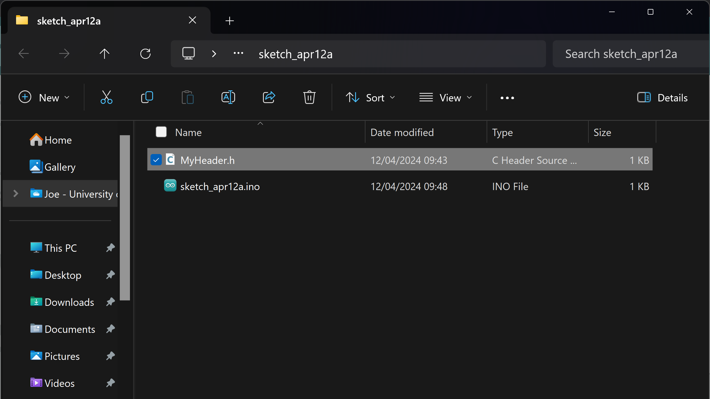

Now you can copy this header file and paste it into another sketch folder to use it in that sketch. Make sure you use a <code>#include</code> statement to include it in the new sketch.