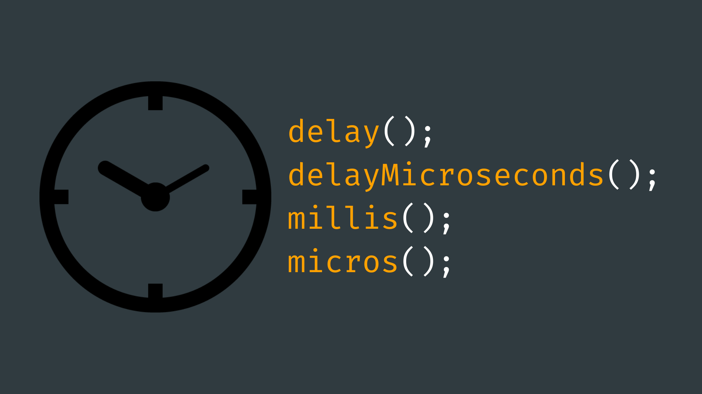

# Timing



## Contents

- [Introduction](#introduction)
- [Synchronous Timing](#synchronous-timing)
    - [delay()](#delay)
    - [delayMicroseconds()](#delay-microseconds)
- [Asynchronous Timing](#asynchronous-timing)
    - [millis()](#millis)
    - [micros()](#micros)

## Introduction

Timing functions are important as they give us the option to offset, coordinate, synchronize and control the timing of events in our projects.  

When it comes to timing functions in Arduino, there are two categories of function we can choose from: “synchronous” and “asynchronous” - also known as “blocking” and “non-blocking” functions. 

You will have likely already come across the <code>delay()</code> function, which pauses the program for a specified number of milliseconds. This can be considered a synchronous (or blocking) function, as while it is delaying the program, the Arduino cannot do anything else other than wait for the time to elapse.

Asynchronous (non-blocking) timing allows the Arduino to complete other tasks whilst periodically “checking” to see how much time has passed. This can be useful when there are multiple events in your code that require their own timing.

## Synchronous Timing

### delay()

As previously mentioned, the <code>delay()</code> function is a synchronous timing function that pauses the program for a set period of time. We can change the size of the delay by passing in the number of milliseconds we want the program to wait as an argument.

``` cpp
int delayTimeMS = 500;
​
delay(delayTimeMS);
```

It's important to remember that this function takes its argument in milliseconds. Any time in seconds or minute will have to be calculated. For example:

``` cpp
int delayTimeHours = 1;
int delayTimeMins = 60 * delayTimeHours; // convert hr to min
int delayTimeSeconds = 60 * delayTimeMins; // convert min to s   
int delayTimeMS = 1000 * delayTimeSeconds; // convert s to ms
​
delay(delayTimeMS);
```

### delayMicroseconds()

As the name implies, the <code>delayMicroseconds()</code> function pauses the program in the same way as the <code>delay()</code> function, except it takes an argument in terms of microseconds. This is useful for applications that require incredibly short delays as there are one million microseconds in a second. 

However, it's worth noting that according to the [reference page](https://www.arduino.cc/reference/en/language/functions/time/delaymicroseconds/) for <code>delayMicroseconds()</code>, this function is currently only accurate up to 16383 microseconds. For larger delays, it's recommended to use the <code>delay()</code> function.

``` cpp
int delayTimeMicroseconds = 1234;
​
delayMicroseconds(delayTimeMicroseconds);
```

## Asynchronous Timing

### millis()

The <code>millis()</code> function returns the number of milliseconds passed since the beginning of the program runtime. This is essentially a clock that we can refer to, to check how much time has passed since the Arduino was last powered on.

You can think of this method of timing as similar to using a clock. For example, if I know that something happened at 2 o'clock, and it is now 3 o'clock, I can determine that 1 hour has passed. The maths behind this is very simple:

```
time now - time then = time elapsed

e.g. 3pm - 2pm = 1 hour
```

The <code>millis()</code> function can be used in a similar way to calculate time elapsed by storing a snapshot of the time and comparing it to the current time. Here's a simplified example to illustrate the concept:

``` cpp
unsigned long time = millis();
​
while (millis() - time < 1000) {
  // this code will run until 1000 milliseconds have elapsed     
}
​
// this code will run after 1000 milliseconds have elapsed
```

As you can see, we need to use the [data type](../3-Variables/README.md#data-types) <code>long</code> with the <code>unsigned</code> keyword to make this a long integer that has no <code>+</code> or <code>-</code> sign. This is because we need very large data type to keep count of how many milliseconds have passed. An <code>unsigned</code> long can keep track of a maximum of 18,446,744,073,709,551,615 milliseconds. This number will only overflow (go back to zero), after approximately 50 days!

You may also see that this method of timing allows us to run other lines of code while timing is happening - hence the name “asynchronous”.

Another advantage of using <code>millis()</code> for timing is that it allows us to repeat different events at different intervals without them affecting each other. Unlike the <code>delay()</code> function, which would pause the entire program, using <code>millis()</code> allows other lines of code to run concurrently.

``` cpp
unsigned long time1;
unsigned long interval1 = 1000;
​
unsigned long time2;
unsigned long interval2 = 700;
​
void setup() {
  time1 = millis();
  time2 = millis();
}
​
void loop() {
  if (millis() - time1 > interval1) {
    time1 = millis(); // reset time1
    
    // do something every 1000 milliseconds
  }
  
  if (millis() - time2 > interval2) {
    time2 = millis(); // reset timer
    
    // do something every 700 milliseconds
  }
}
```

As you can see in this example, we can set up multiple variables and <code>if()</code> statements to keep track of different time intervals. Once one of the <code>if()</code> statements are triggered, we can use <code>millis()</code> again to assign the time variable a new start time.

### micros()

Similarly to <code>delay()</code> and <code>delayMicroseconds()</code>, Arduino gives us a function called <code>micros()</code> that returns the number of microseconds that have passed since the start of runtime. This can be used the exact same way as <code>millis()</code> except for applications that require much more precise timing. 

Due to the size of number required to store a time in microseconds, the <code>micros()</code> function will overflow and reset to 0 after approximately 70 minutes. It should also be noted that most Arduino boards will only have a resolution of four microseconds (i.e. the value returned is always a multiple of four).

``` cpp
unsigned long time = micros();
​
while (millis() - time < 1000) {
  // this code will run until 1000 microseconds have elapsed     
}
​
// this code will run after 1000 microseconds have elapsed
```