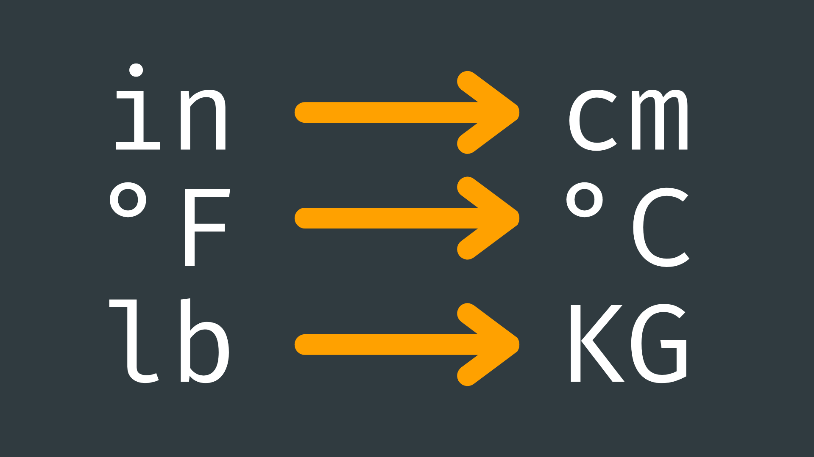

# Scaling



## Contents

- [Introduction](#introduction)
- [Basic Conversions](#basic-conversions)
    - [Time](#timing)
    - [Distance](#distance)
    - [Temperature](#temperature)
- [map()](#map)

## Introduction

Value scaling is a fundamental concept in programming, especially when working with physical sensors, actuators, or other hardware components. It involves converting a value from one range to another, typically to match the requirements of a specific sensor and output device.

Consider a scenario where you have a sensor that provides readings in a certain range, let's say from 0 to 1023, but you need to translate these readings to control an actuator with a different range, for example, from 0 to 255. This is where value scaling becomes essential.

We can use [arithmetic operations](../2-Operators/README.md#arithmetic-operators) to carry out basic conversions, but Arduino also gives us the function <code>map()</code> to more easily map a value from one range to another. We will look at both methods in this page.

## Basic Conversions

We can carry out basic conversion using a line of maths. For example, when converting from inches to centimeters, a quick google search tells us that there are 2.54 centimeters in an inch.

If we have a variable in our code that needs to be converted from inches to centimeters, we can simply multiply it by 2.54:

``` cpp
float lengthInInches = 14.5;
float lengthInCentimeters = lengthInInches * 2.54; 
​
// 14.5in == 36.83cm
```

A common use case of this in Arduino is converting to milliseconds for [timing](../8-Timing/README.md) operations. If we want a delay of 20 minutes, we would need to first convert it into milliseconds. 

Here are some common conversions that you may come across…

### Timing 

- 1 second = 1000 millisecond
- 1 second = 1000000 microsecond

| Seconds  	        | Milliseconds	| Microseconds  |
|-------------------|---------------|---------------|
| 1	                | 1,000	        | 1,000,000     |
| 60 (1 Minute)	    | 60,000	    | 60,000,000    |
| 3,600 (1 Hour)   	| 3,600,000	    | 3,600,000,000 |
| 86,400 (1 Day)   	| 86,400,000	| 86,400,000,000| 

### Distance

- 1 cm = 0.3937 in
- 1 in = 2.54 cm

|Millimeters	|Centimeters	|Meters	|Inches|
|---------------|---------------|-------|------|
|1	            |0.1	        |0.001	|0.03937|
|10	            |1	            |0.01	|0.3937|
|1000	        |100	        |1	    |39.37|
|25.4	        |2.54	        |0.0254	|1|
 
### Temperature

- 0 °C = 32 °F
- 0 °F = -17.78 °C

| Celsius (°C)	|Fahrenheit (°F) |
|---------------|----------------|
| 0	            |32              |
| 100	        |212             |

## map()

The <code>map()</code> function in Arduino is a powerful tool for value scaling. It takes an input value and scales it from one range to another.

This can be incredibly useful if - to pick a common example - the sensor you are using reads a value between 0-1023, and the output device you want it to control requires an input value of 0-255. 

The <code>map()</code> function requires five arguments:

- **input value** - value to be mapped/scaled.
- **input minimum** - the minimum value of the input range.
- **input maximum** - the maximum value of the input range.
- **output minimum** - the minimum value of the output range.
- **output maximum** - the maximum value of the output range. 
 
For example:

``` cpp
int readValue = 100;  // Assuming readValue is an integer
​
// Scale readValue from 0-1023 to 0-255
int scaledValue = map(readValue, 0, 1023, 0, 255);
​
// scaledValue == 62
```
​
It is important to note that the <code>map()</code> function returns a value of type <code>long</code>. This is an integer value so cannot output fractional numbers.

You can also use <code>map()</code> to invert ranges. For example, you might want a number to fall between 255-0 instead of 0-255. This would mean a value of 0 would be scaled to equal 255, and vice versa.

To do this, simply set the output minimum argument to be larger than the output maximum argument:

``` cpp
int readValue = 100; // Assuming readValue is an integer
​
// Scale readValue from 0-1023 to 0-255
int scaledValue = map(readValue, 0, 1023, 255, 0);
​
// scaledValue == 193
```