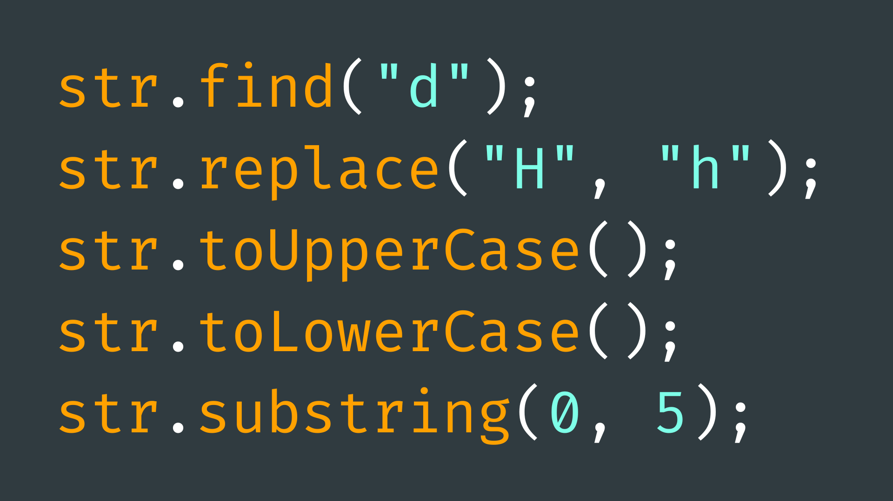

# String Methods



## Contents

- [Introduction](#introduction)
- [Useful String Methods](#useful-string-methods)
    - [concat()](#concat)
    - [indexOf()](#indexof)
    - [length()](#length)
    - [remove()](#remove)
    - [replace()](#replace)
    - [substring()](#substring)
    - [toInt()](#toint)
    - [toLowerCase()](#tolowercase)

## Introduction
The <code>String</code> data type is a user-defined type (or [class](../6-Classes/README.md)), and thus essentially a class definition. The <code>String</code> class was designed to simplify working with text data compared to the C programming language.

Without the <code>String</code> class, we would typically use <code>char</code> (character) arrays for string operations. This approach involves manual manipulation functions, requires careful memory management, and is prone to errors.

The <code>String</code> class offers helpful methods for searching, replacing, splitting, and formatting strings, streamlining complex tasks, improving code readability, and facilitating <code>String</code> variable usage.

You can find a comprehensive list of Arduino string methods [here](https://www.arduino.cc/reference/en/language/variables/data-types/stringobject/). However, on this page, we will look at a couple of particularly useful methods and example of how to use them.

## Useful String Methods
### concat()

(Concatenate)

Appends data to the end of the string (adds it to the end).

``` cpp
String str = "Hello World";
​
str.concat(2);    // str == "Hello World2"
str.concat("!!"); // str == "Hello World2!!"
```

Bear in mind, you can also concatenate another <code>String</code> variable by using the plus <code>+</code> operator.

``` cpp
String str = "Hello World";
String str2 = "!!";
​
String str3 = str + str2; // str3 == "Hello World!!"
```

### indexOf()

Find the index of a character or string within the string. 

This method can take two arguments:

- **character(s) to find** - to look for within the string.
- **from index**  - (optional) look for character(s) after this index.
 

If there are multiple instances of the character(s) in the string, this method will return the index of the one that appears first. If you are looking for the last instance of a character(s), you can use the <code>lastIndexOf()</code> method.

This method will return <code>-1</code> if character/string argument is not found. 

``` cpp
String str = "Hello World";
​
int indexOfW = str.indexOf("W"); // indexOfW == 6
```

### length()

Returns the length of the string (number of characters in string).

``` cpp
String str = "Hello World";
​
int lengthOfStr = str.length(); // lengthOfStr == 11
```

### remove()

Remove characters from the string.

This method can take one argument:

- **index** - index of single character you want to remove from string. 
 
…or two arguments:

- **index** - starting index of characters you want to remove from string.
- **count** - number of characters to remove.

``` cpp
String str = "Hello World";
​
str.remove(0);    // str == "ello World"
str.remove(5, 2); // str == "ello rld"
```

### replace()

Replace characters in the string.

This method requires two arguments:

- **old string** - the substring currently in your string that you want to replace.
- **new string**  - the string you want to replace the old string with. 

``` cpp
String str = "Hello World";
​
str.replace("World", "You"); // str == "Hello You"
```

### substring()

Create and return a new string from the current string.

This method requires two arguments:

- **from index** - index of the first character of the substring.
- **to index** - (optional) the index of the end to the substring. If left out, the substring will continue to the end of the string.

``` cpp
String str = "Hello World";
​
String str2 = str.substring(6);    // str2 == "World"
String str3 = str.substring(1, 5); // str3 == "ello"
```

### toInt()

Convert string to <code>int</code>. 

Similarly, <code>toFloat()</code> will convert a string to type <code>float</code>. 

``` cpp
String str = "11";
​
String str2 = str + "1";     // str2 == "111"
int myInt = str.toInt() + 1; // myInt == 12
```

### toLowerCase()

Convert all characters in string to lower case.

Similarly, <code>toUpperCase()</code> will convert all characters in the string to upper case.

``` cpp
String str = "Hello World";
​
str.toLowerCase(); // str == "hello world"
str.toUpperCase(); // str == "HELLO WORLD"
```