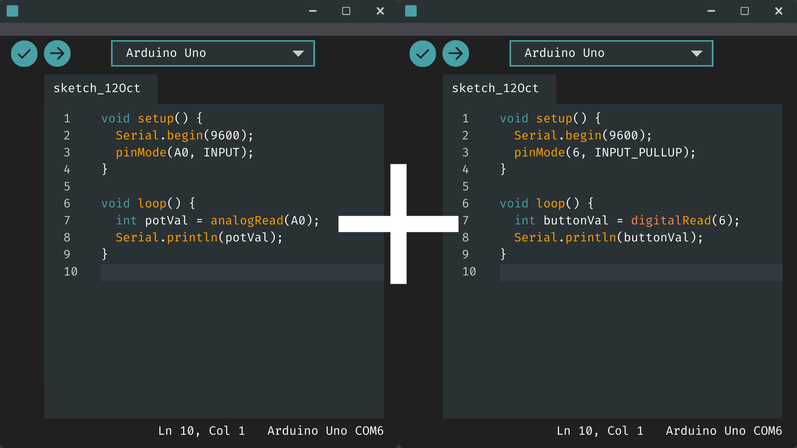
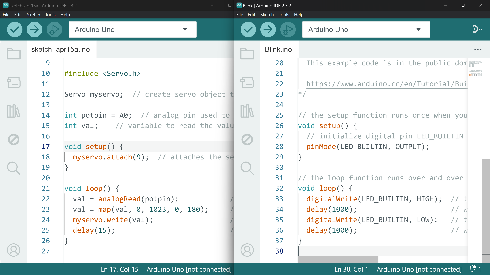
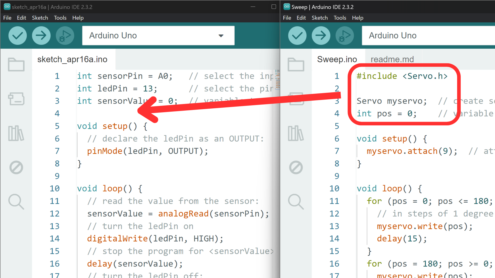

# Merging Sketches



## Contents

- [Introduction](#introduction)
- [Merging Process](#merging-process)
    - [1. Create a new sketch](#1-create-a-new-sketch)
    - [2. Global space](#2-check-global-space)
    - [3. setup() function](#3-check-setup-function)
    - [4. loop() function](#4-check-loop-function)
    - [5. Potential modifications](#5-potential-code-modifications)

## Introduction

An Arduino board can only be uploaded with one sketch at a time. If you want an Arduino board to do multiple things, you will need to create a sketch that instructs it to do those things.

There are also times when creating Arduino projects that you will want to combine the code from one sketch, with one or more other sketches. For example, if you have a sketch that reads from a [potentiometer](../../Input-Devices/Potentiometers/README.md), and another that controls a [servo motor](../../Output-Devices/Motor-Servo/README.md), you may want to combine them into one sketch that uses a potentiometer to control a servo.

To do something like this, you would need to combine the code from one sketch, with the code from another in a process called “merging”. Being able to merge sketches successfully will give you the ability to take existing code from multiple sources and turn it into something fit for your particular needs.

## Merging Process

The merging process is - in theory - quite simple: we need to copy code from one sketch into another while avoiding any conflicts. In practice, however, there are a few things that can cause us issues when we try to do this. As such, there is a process we should follow when merging sketches to make it less prone to failures.

### 1. Create a New Sketch

It is important to start with a new sketch so that we do not overwrite an existing one. As such, the first thing we should do is create a new sketch by navigating to *File → New Sketch*. 

You should then copy and paste the code from the first sketch you want to use, into the new sketch. This can be done with a few keyboard shortcuts:

1. <code>Ctrl + A/Cmd + A</code> - select all text.
2. <code>Ctrl + C/Cmd + C</code> - copy the selected text.
3. <code>Ctrl + V/Cmd + V</code> - paste the copied text (into new sketch).

The following steps are made easier if you can see both sketches you want to merge simultaneously. Place them side-by-side on your screen, or if you have a second monitor, you can place one sketch on each monitor.



### 2. Check Global Space 

You should start merging sketches from the global space in each sketch. This is the space above the <code>setup()</code> function where we generally include libraries and setup global variables.

Looking at the global space of the second sketch, copy and paste any lines of code across into the new sketch that do not cause conflicts. Conflicts here can be caused by a couple of things:

- more than one variable/function/class with the same name.
- both sketches using the same pins for different purposes.
- more than one inclusion of a library.
 
If a conflict appears, you will need to modify the code to resolve it (e.g. change the pin number in one sketch before copying into the new sketch).



It is worth also using the **Verify** button in the IDE to check the code for errors at this point before moving on. 

### 3. Check setup() Function

Once you have finished merging the code from the global spaces, you can move onto the code inside the <code>setup()</code> functions. 

Again, you can copy the code from the second sketch into the new sketch, making sure to avoid any conflicts or repeated code. A common conflict in the <code>setup()</code> function is having duplicate instances of <code>Serial.begin()</code> in both sketches. You only need one instance of this line.

Again, you should use the **Verify** button to check the code for errors here before moving on. 

### 4. Check loop() Function

Once you have merged the code from the <code>setup()</code> functions, you can move onto the <code>loop()</code> functions.

Similarly to the previous two steps, we want to copy code from the second sketch into the first while avoiding conflicts. Conflicts here can include the use of the <code>delay()</code> function. It is important to think about what order the lines of code are written in the <code>loop()</code> function and when <code>delay()</code> is necessary. For example, if there is a delay at the end of both <code>loop()</code> functions, does it there need to be two delays in the merged sketch, or can they be combined into one <code>delay()</code>?

The format of the merged sketch should now look something like this (potentially with a few alterations if you had to resolve conflicts):

``` cpp
// SKETCH 1 VARIABLES
// SKETCH 2 VARIABLES
 
void setup() {
  // SKETCH 1 SETUP CODE
  // SKETCH 2 SETUP CODE
}
 
void loop() {
  // SKETCH 1 LOOP CODE
  // SKETCH 2 LOOP CODE
}
```

Again, use the **Verify** button to check the code for errors.

### 5. Potential Code Modifications

There is a chance that once you have followed these steps, that you do not need to make any more changes to the code. The best way to know if you need to make any changed is to upload the sketch to your Arduino board and see if it runs how you expect it to.

If it does: great! You have successfully merged your sketches. 

If it doesn't: this is not a problem as most sketches will need some sort of modifications after merging. What these changes are and where to make them will vary depending on the project, so this is where you will need to know a bit more about what each line of code in your sketch does.

Here are a few things to look out for:

- Issues often arise with the conflicting uses of [delays and timing](../8-Timing/README.md) in your code, so make sure you are using a method of timing that suits the project.
- If your Arduino performs actions in the wrong order, you will need to reorder the lines of code to change this. It may be useful to run through each line of the <code>loop()</code> function to figure out what line/block of code need to happen before the other.
- You may want the readings from one sketch to control the output of the other, you will need to code this yourself, making sure that the sensor readings are [scaled](../9-Scaling/README.md) to fit the range of the output. You may also need to setup an [<code>if()</code> statement](../4-ControlFlow/README.md#if-if-else-and-else) to execute different blocks of code depending on the sensor reading.
 
Make sure to keep the code well structured and commented for readability, and upload the code regularly to check for errors and bugs. This step may take a bit of problem solving, but you will get better at it the more you do it, so stick with it!