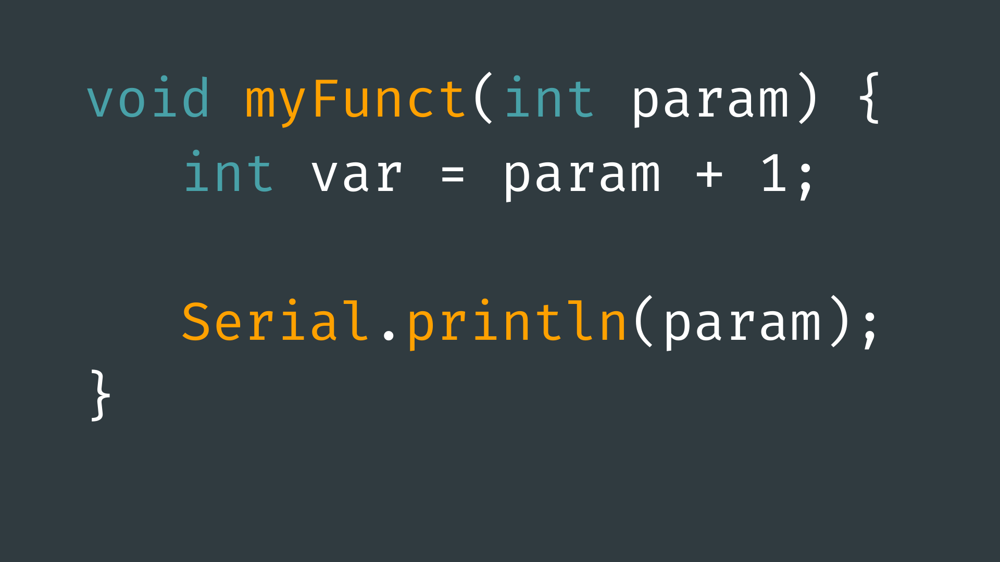

# Functions



## Contents

- [Introduction](#introduction)
- [Arduino Functions](#arduino-functions)
- [Function Definitions](#function-definitions)
    - [Structure](#basic-structure)
    - [Return Types](#return-types)
    - [Input Parameters](#input-parameters)

## Introduction

A function is a series of commands or block of code that has been encapsulated and given a name. This name can then be “called” elsewhere in the code to run said commands. Essentially, it is way of condensing code blocks into single, executable lines of code.

Splitting up code into functions enables programmers to create modular chunks of code that can be repeated without the need to rewrite it over and over again. A common example of this would be if we have a block of code that we know will be repeated many times in our sketch. 

Functions are recognisable by their use of parenthesis <code>()</code> after a function name. Functions like <code>delay()</code>, <code>pinMode()</code>, and <code>digitalWrite()</code> may already be familiar to you and are provided to us by the Arduino programming language. 

We can also create our own functions to encapsulate repeating tasks into callable and repeatable commands. 

## Arduino Functions

The Arduino programming language provides many useful functions for us to use in our code. These functions have been designed to make working with Arduino easier to do and to understand. 

Here are a few examples of some useful functions given to use by Arduino:

- [**analogRead()**](https://www.arduino.cc/reference/en/language/functions/analog-io/analogread/) - read the value of an analog pin.
- [**analogWrite()**](https://www.arduino.cc/reference/en/language/functions/analog-io/analogwrite/ ) - output an (approximated) analog signal from a PWM pin.
- [**delay()**](https://www.arduino.cc/reference/en/language/functions/time/delay/) - pause program for a set number of milliseconds.
- [**digitalRead()**](https://www.arduino.cc/reference/en/language/functions/digital-io/digitalread/) - read the input value of a digital pin.
- [**digitalWrite()**](https://www.arduino.cc/reference/en/language/functions/digital-io/digitalwrite/) - output a digital signal from one of the digital pins.
- [**map()**](https://www.arduino.cc/reference/en/language/functions/math/map/) - re-maps a number from one range to another.
- [**pinMode()**](https://www.arduino.cc/reference/en/language/functions/digital-io/pinmode/) - initialise a pin on the Arduino as <code>INPUT</code> or <code>OUTPUT</code>.
- [**pow()**](https://www.arduino.cc/reference/en/language/functions/math/pow/) - calculates the value of a number raised to a power.
- [**sin()**](https://www.arduino.cc/reference/en/language/functions/trigonometry/sin/), [**cos()**](https://www.arduino.cc/reference/en/language/functions/trigonometry/cos/), [**tan()**](https://www.arduino.cc/reference/en/language/functions/trigonometry/tan/) - trigonometry functions. 
- [**sq()**](https://www.arduino.cc/reference/en/language/functions/math/sq/) - calculates the square value of a number.
- [**sqrt()**](https://www.arduino.cc/reference/en/language/functions/math/sqrt/) - calculates the square root of a number.
 
If you want to see a list of all Arduino functions, you can do so on the [Arduino Reference page](https://www.arduino.cc/reference/en/).

## Function Definitions

The Arduino programming language also gives us the ability to create our own functions. This can be useful for taking a block of code that we know is likely to be repeated in our sketch, encapsulating it, and giving it a name so we can use it wherever we like.

This can both structure our code better - making it easier to read - and allow us to repeat a sequence of code without having to write the code over again.

To do this, we need to create our own function definitions outside of the <code>setup()</code> and <code>loop()</code>.

### Basic Structure

Function definitions require four components:

- **a return type** - the data type of the function's output (void if no output).
- **a name** - to address it by (can be anything you choose).
parameter(s) - although this can be left empty if there are no parameters.
- **a body** - a block of code to be executed when the function is called.

This function can then be called elsewhere within the same sketch. 

For example, lets look at this function that will simply print <code>“Hello World!”</code> to the serial monitor. This function will not need any parameters, so we leave the parenthesis <code>()</code> empty. It also does not output/return any information (we will look at this in the next section) so we give it the return type void: 

``` cpp
void helloWorld() {
  Serial.print("Hello World");
}
​
void setup() {
  Serial.begin(9600);
}
​
void loop() {
  helloWorld();
}
```

By this point, you may have noticed that the <code>setup()</code> and <code>loop()</code> given to us as part of the Arduino coding framework are themselves function definitions that we provide with a body of code. This is done to separate the code to be called at the start of runtime and the code to be repeated throughout runtime.
 
### Return Types

Sometimes, we want a function to output data. For example, the <code>digitalRead()</code> function takes a pin number as an input parameter (see next section) and “returns” the read value of that pin (<code>1</code> or <code>0</code>). 

If we want one of our functions to return data when called, we need to define:

- **the return type** - the data type of the data we want the function to output.
- **the data we want to return** - using the <code>return</code> keyword.
 
For example, if we were to create a function that outputs a random integer between 1-10, we would need to specify the return type as int. We would then need to use the <code>return</code> keyword in the function body to output the data:

``` cpp
int random10() {
  int output = random(10);
  return output;
}
​
void setup() {
  Serial.begin(9600);
}
​
void loop() {
  int randomNumber = random10();
  Serial.println(randomNumber);
}
```

It is important to note that when the program counter reaches the <code>return</code> statement, it will exit the function. Any code written after a <code>return</code> statement will therefore not be executed, so make sure everything in your function takes place before <code>return</code>.

It is also important to note that if your function definition has a return type, it must contain a <code>return</code> statement that returns data of the same type. If not, the code will throw an error and will not run. If your function does not return anything, you must instead use the return type <code>void</code>. 

### Input Parameters

As well as outputting data, functions can also take data as an input or set of inputs. This can be defined within the parenthesis <code>()</code> of the function definition.

Each input parameter must be defined with a name and a data type within the function definition parenthesis. They can then be used like a standard variable within the body of the function, like so:

``` cpp
int add(int a, int b) {
  return a + b;
}
```

This <code>add()</code> function takes parameters - <code>int a</code> and <code>int b</code> - and returns their sum. Notice how if we want more than one parameter, we can separate them using commas <code>,</code>.

To call this function, you would simply call include the parameters within the function's parenthesis, in the same order as they were defined. It is important that they are input in the same order that the are defined, or the compiler will try to use them in the wrong order which may result in errors or bugs.

``` cpp
int add(int a, int b) {
  return a + b;
}
​
void setup() {
  Serial.begin(9600);
}
​
void loop() {
  int sum = add(10, 12);
  Serial.println(sum);
}
```