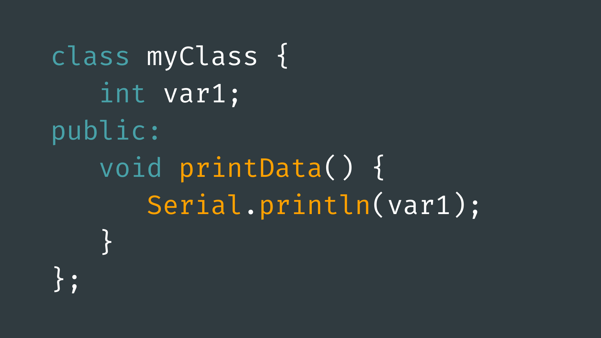

# Classes



## Contents

- [Introduction](#introduction)
- [Usage](#usage)
    - [Class Instances](#creating-an-instance)
    - [Constructor Arguments](#constructor-arguments)
    - [Class Methods](#accessing-class-methods)
- [Class Definitions](#class-definitions)
    - [Creating Class Definitions](#class-definitions)
    - [Class Methods](#class-methods)
    - [Class Constructor](#constructor)
- [Structs](#structs)

## Introduction

Classes and structures are two ways of grouping [variables](../3-Variables/README.md) to create “user-defined data types”. Both can also contain [functions](../5-Functions/README.md), known as methods, for modifying the member variables of the class/struct. These methods can also perform other specific tasks.

You can think of user-defined data types as blueprints for a data type. We can create instances of them in our code the same way as we create variables with basic data types; however, we can define how to use them and how they behave in the class/struct definition.

A common example of a user-defined data type, given to us by the Arduino programming language, is <code>String</code>. Strings are used much like basic data types, but also contain class methods for modifying and returning information based on the text data stored in the variable.

Classes and [structures](#structs) are very similar to each other, with only one key difference - which we will cover later. However, in general, classes are used to group variables and methods, while structures usually just group variables (although not exclusively). We will mainly focus on classes on this page.

## Usage

There is a good chance you have already used a user-defined data type in your code. Arduino provides a handful of useful classes straight out of the gate, and if you have made use of a library, you almost certainly will have used a class in your code. 

Let's take a look at how to use some commonly used classes in the Arduino programming language.

### Creating an Instance

As previously mentioned, classes can be instantiated in code much in the same way as other variables. We usually only need to define:

- **a type** - the class name.
- **a name** - to refer to it by.
 
For example, to make use of a [servo motor](../../Output-Devices/Motor-Servo/README.md) in an Arduino sketch, we need to create an instance of the <code>Servo</code> class from the <code>Servo.h</code> library.

``` cpp
#include <Servo.h>
​
Servo myServo;
```

These class instances are often referred to as class “objects”.

### Constructor Arguments

Sometimes you may have to provide a class instance with some initial arguments. These are known as “constructor arguments”.

For example, when using the [Adafruit NeoPixel](../../Output-Devices/LED-NeoPixel/README.md) library, we must create an instance of the <code>Adafruit_NeoPixel</code> class and provide it with:

- a variable name
- the number of pixels you are using.
- the pin number the NeoPixel is connected to.
- the NeoPixel “mode” (usually NEO_GRB + NEO_KHZ800).

``` cpp
#include <Adafruit_NeoPixel.h>
​
#define NUM_PIXELS 12
#define PIXEL_PIN 6
​
Adafruit_NeoPixel pixels(NUM_PIXELS, PIXEL_PIN, NEO_GRB + NEO_KHZ800);
``` 

### Accessing Class Methods

Once an object has been created, we can access its public variables and methods. Most class member variables are private - meaning they can only be accessed from within the class definition - but we will look at this in a later section.

To access public methods in a class object, we simply use a period  . after the object name. You will likely already be familiar with this if you have ever used the [serial monitor](../../Getting-Started/Serial-Monitor/README.md):

``` cpp
void setup() {
  Serial.begin(9600);
  Serial.print("Hello World");
}
```

As you can see, the <code>Serial</code> object contains the class methods <code>begin()</code> and <code>print(),</code> as well as some other methods you may be familiar with.

## Class Definitions

We can create our own classes by creating a class definition. This will look something like this:

``` cpp
class MyClass {
​
public:
  // Public variables/methods go here
  
private:
  // Private variables/methods go here
};
```

The idea of private and public class attributes was mentioned briefly earlier on this page. Private variables/methods can only be accessed by other class methods and cannot be accessed via a class instance. For example:

``` cpp
class MyClass {
​
public:
  int publicVariable = 0;
  
private:
  int privateVariable = 0;
};
​
MyClass classObject;
​
classObject.publicVariable = 10;  // ✔ This line is ok
classObject.privateVariable = 10; // × This line will throw an error
```

…in this code, the variable <code>publicVariable</code> is public and can be accessed via the <code>classObject</code> instance. However, <code>privateVariable</code> is private so therefore cannot be accessed by <code>classObject</code>.

It is important to note that anything written in a class definition is private by default. We have to use the <code>public</code> keyword to denote everything afterwards as publicly accessible.

Typically, class member variables are created as private attributes and are only accessed via public methods. This allows us to have complete control over which member variables are accessible and how they are accessed.

``` cpp
class MyClass {
​
public:
  void setVar(int newValue) {
    privateVariable = newValue;      
  }
  
private:
  int privateVariable = 0;
};
​
//================================
​
MyClass classObject;
​
classObject.setVar(10);
```

### Class Methods

Class methods - as previously mentioned - are simply functions that belong to a class. They are often used to modify and/or return class variables, but they can also perform other tasks.

Like class variables, class methods can be created as private or public - meaning they can be only accessible to other class methods, or accessible via class instances. 

Two typical uses of class methods is to assign a new value to a class variable (setter method) and to return the value of class member variables (getter method). You will also likely need a function to perform some modification/calculation using the class variables. These are often referred to as “process” methods.

``` cpp
class MyClass {
​
public:
  void setVar(int newValue) {
    privateVariable = newValue;      
  }
  
  int getVar() {
    return privateVariable;
  }
  
  void process() {
    privateVariable +=1;
  }
  
private:
  int privateVariable = 0;
};
​
//================================
​
MyClass classObject;
​
classObject.setVar(10);
classObject.getVar(10);
```

### Constructor

When you create a class instance, you may need some initial values to be set, or you may need some action to take place. We can create a special class method called a “constructor” to carry out these actions for us when the class instance is created.

It is important to remember that this is completely optional.

The constructor can be created in a similar way to class methods, except we give it the same name as the class:

``` cpp
class MyClass {
​
public:
  MyClass() {
    Serial.println("Class instance created");
  }
  
private:
  int privateVariable = 0;
};
```

We can also give the constructor input parameters. These parameters can be set when the class is instantiated:

``` cpp
class MyClass {
​
public:
  MyClass(int var) {
    Serial.println("Class instance created");
    privateVariable = var;
  }
  
private:
  int privateVariable = 0;
};
​
//================================
​
MyClass classObject(10); // set privateVariable to 10
```

## Structs

Structures, or <code>struct</code> as they are written in code, operate very similarly to classes. They are a way to group variables and functions into a single object that we can instantiate in our code. 

Structs and classes have one key difference between them: while methods and variables are private by default in classes, they are public by default in structs. This means we don't have to use the <code>public</code> keyword to denote a struct attribute as public. We do, however, have to specify any private attributes using the <code>private</code> keyword:

``` cpp
struct MyStruct {
  int var1;
  float var2;
  String var3;
};
​
//================================
​
MyStruct structObject;
​
structObject.var1 = 10;
structObject.var2 = 3.14;
structObject.var3 = "Hello";
```

This makes struct useful for simply grouping variables together. Generally structs are used in this way and are not used to create more complicated object, like classes are.

This being said, structs can contain methods and constructors in the same way classes can: 

``` cpp
struct MyStruct {
  
  MyStruct() {
    Serial.print("Struct created");
  }
  
  int var1;
  float var2;
  String var3;
};
​
//================================
​
MyStruct structObject;
​
structObject.var1 = 10;
structObject.var2 = 3.14;
structObject.var3 = "Hello";
```