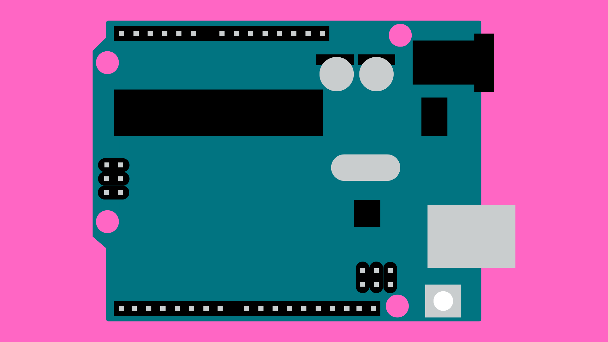
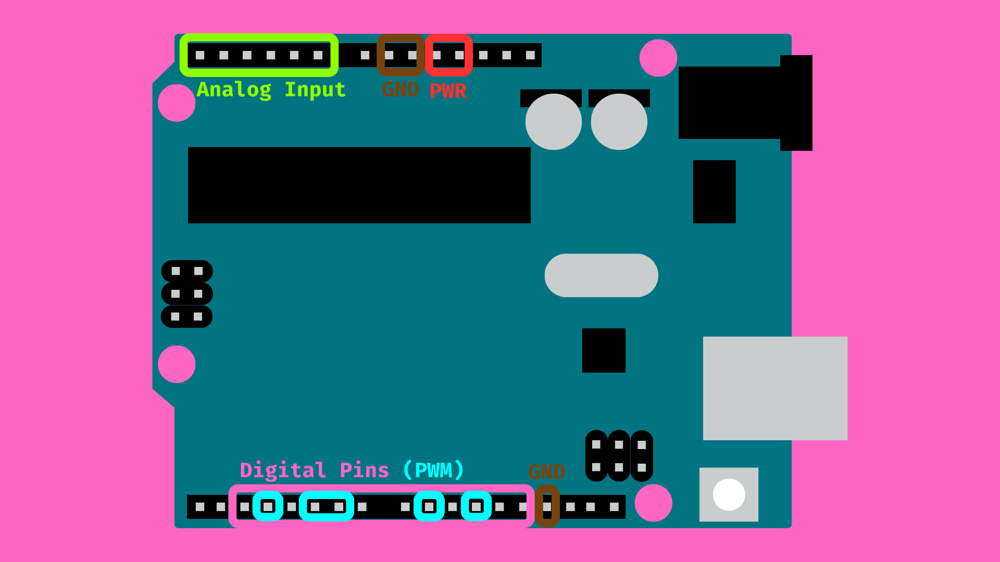
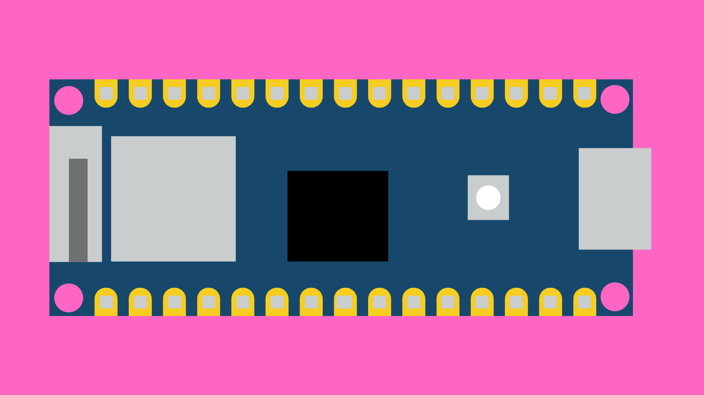
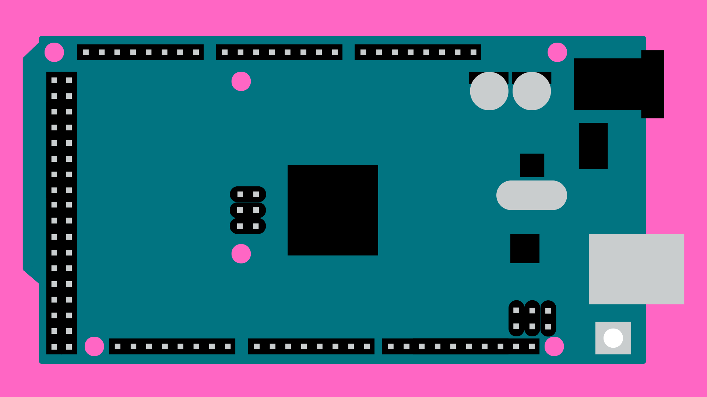

# Arduino Boards

## Contents

- [Introduction](#introduction)
- [Popular Arduino Boards](#popular-arduino-boards)
    - [Arduino UNO R3](#arduino-uno-r3)
    - [Arduino Nano 33 IoT](#arduino-nano-33-iot)
    - [Arduino Mega 2560 R3](#arduino-mega-2560-r3)

## Introduction

Arduino produce a number of different electronic development boards of varying sizes and functionality. Every board contains a programmable microcontroller chip and various other electrical and electronic components that allow us to quickly prototype electronic ideas and devices.

Some boards contain components for connecting to Wi-Fi, or communicating via Bluetooth. Other boards have chips that allow them to act as USB devices, like a keyboard or mouse. What all Arduino boards have in common is their input and output (I/O) pins that allow us to connect various sensors and actuators to the Arduino in order to control them using code.

Some of these pins can be used send HIGH (5V or 3.3V depending on the board) or LOW (0V) signals to components like LEDs to turn them on or off. Some pins can also be used to read input signals coming from sensors and other connected devices. We can control how the pins on an Arduino board are used using code that we upload to the Arduino board.

On most Arduino boards, you will find that pins that fall into one of these categories:

1. **Power:** 5V and 3.3V pins provide a constant voltage to power components. These pins cannot be turned off using code. 
2. **GND:** GND pins are used to ground circuits. All electrical circuits must be connected to ground.
3. **Digital Pins:** these pins can be programmed to send or receive digital signals (on or off). 
4. **Analog Input:** these pins can be used to read analog voltages. An on-board Analog-to-Digital Converter (ADC) converts the voltage into a digital value (usually between 0-1023).

## Popular Arduino Boards

Arduino has a range of electronics prototyping boards to choose from. Here are a couple of the most popular boards:

### Arduino UNO R3

[The Arduino UNO](https://docs.arduino.cc/hardware/uno-rev3) is one of the most popular and widely used Arduino boards. UNO boards provide a reasonable number of programmable input and output pins in a convenient size. Although other Arduino boards have more pins or processing power, the design of the UNO boards make them easy to get started with. 

**Arduino UNO R3 Specs:**

| | |
| --------------------- | --------------- |
| **Dimensions**        | 53.4mm x 68.6mm |
| **Digital I/O Pins**  | 14              | 
| **Analog Input Pins** | 6               |
| **PWM Pins**          | 6               |
| **Operating Voltage** | 5V              |
| **Clock Speed**       | 16MHz           |
| **SRAM**              | 2KB             |
| **FLASH**             | 32KB            |

### Arduino Nano 33 IoT

[Arduino Nano](https://docs.arduino.cc/hardware/nano) is a more compact family of boards. It's small size and number of pins make it useful for projects with strict size constraints. The Nano 33 IoT takes this further by including built-in Wi-Fi and Bluetooth modules, allowing you to create Smart devices that can connect to the internet or to other devices. 

**Arduino Nano 33 IoT Specs**

| | |
| --------------------- | --------------- |
| **Dimensions**        | 18mm x 45mm     |
| **Digital I/O Pins**  | 22              | 
| **Analog Input Pins** | 8               |
| **PWM Pins**          | 5               |
| **Operating Voltage** | 3.3V            |
| **Clock Speed**       | 48MHz           |
| **SRAM**              | 256KB           |
| **FLASH**             | 1MB             |

### Arduino Mega 2560 R3

[Arduino Mega](https://docs.arduino.cc/hardware/mega-2560) is a larger and more powerful family of Arduino boards. The Mega is an option for projects that require higher computational capabilities or a large number of sensors and actuators. For these reasons, you will often find the Mega at the heart of open-source 3D printers. 

**Arduino Mega 2560 R3 Specs**

| | |
| --------------------- | ---------------- |
| **Dimensions**        | 53.3mm x 101.5mm |
| **Digital I/O Pins**  | 54               | 
| **Analog Input Pins** | 16               |
| **PWM Pins**          | 15               |
| **Operating Voltage** | 5V               |
| **Clock Speed**       | 16MHz            |
| **SRAM**              | 8KB              |
| **FLASH**             | 256KB            |