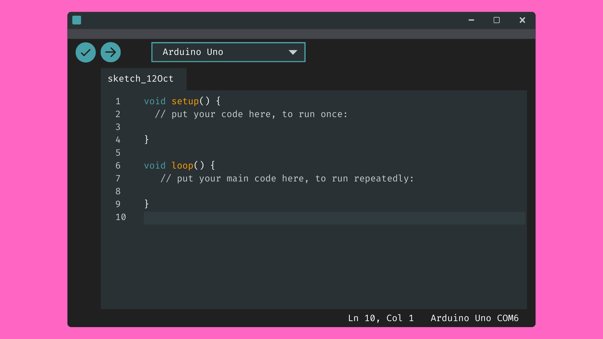
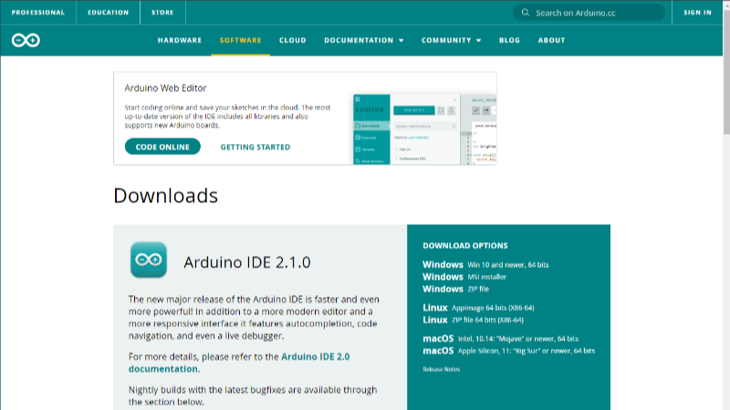
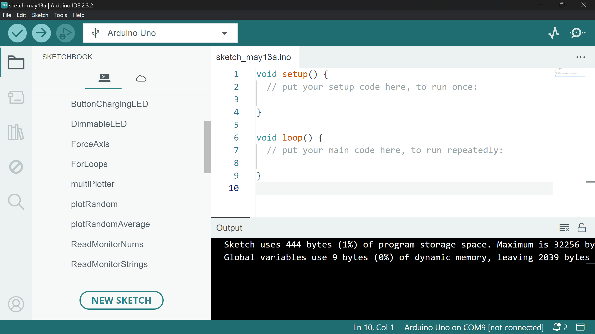
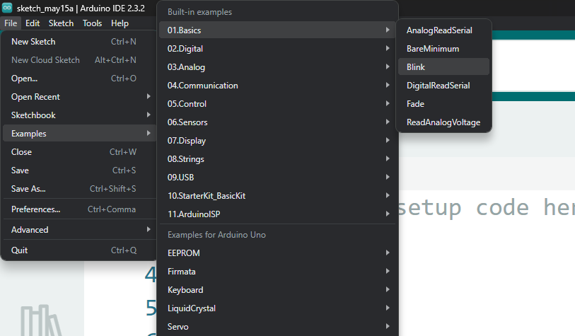
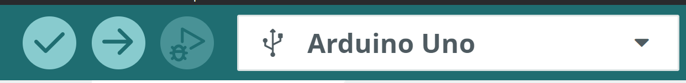
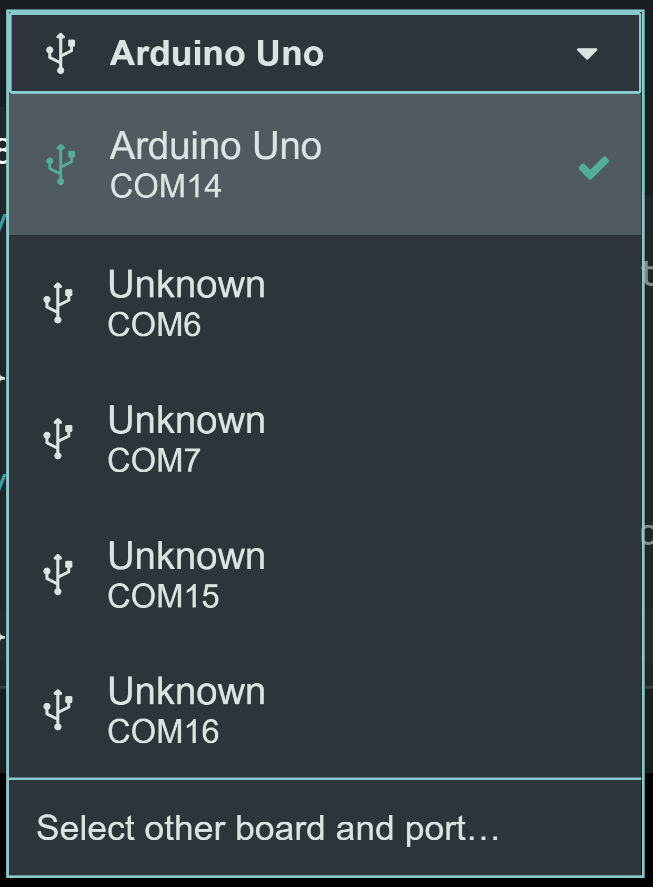
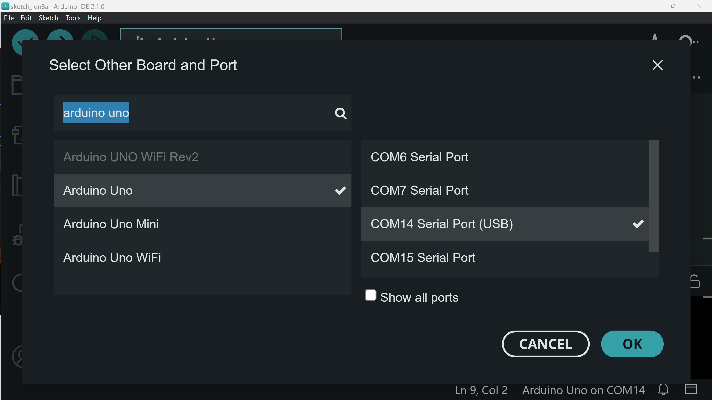
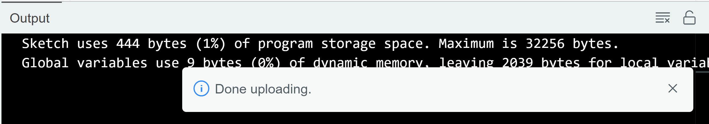
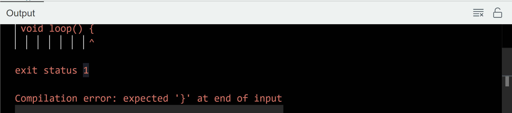

# The Arduino IDE

## Contents

- [Introduction](#introduction)
- [Software](#software)
    - [System Requirements](#system-requirements)
    - [Download](#download)
- [Layout](#layout)
    - [Sketches](#sketches)
    - [Sketchbook](#sketchbook)
    - [Examples](#examples)
- [Uploading Code](#uploading-code)
    - [Connect your Device](#1-connect-to-your-arduino-board)
    - [Upload](#2-upload)

## Introduction
An Integrated Development Environment (IDE) is a software application with tools for writing and managing code. Most IDEs function as text editors - allowing you to make changes to code - as well as being able to build and run your code. Many IDEs will have also other tools for making programming an easier experience.

As an open-source platform, Arduino has developed a free-to-use IDE for writing and uploading code to Arduino boards. Without it, uploading instructions to the Arduino would be a more laborious task with several more steps and toolchains required. The Arduino IDE combines all of these tools into one user-friendly application. 

This means you can write code, compile it into instructions that the Arduino will understand, and upload it to an Arduino board of your choice, all within the same application.

## Software
### System Requirements
To install and run the Arduino IDE 2.x (newest version), it is suggested that you use a computer that runs:

- Windows 10 or newer.
- macOS 10.15 “Catalina” or newer.

At least 2GB of RAM is recommended, and the download (plus packages/libraries) requires about 400MB of storage space.

If you computer does not meet these requirements, you install an older version of the IDE (1.x) [from their website](https://docs.arduino.cc/software/ide-v1/tutorials/Environment/). This will give you all of the functionality you need, with a slightly less polished user interface.

**Important:** Mac users do NOT need to install Xcode in order to use the Arduino IDE. You may be prompted to download it, however it is a very large download and not necessary.

### Download

You can install the Arduino IDE from [the software page on their website](https://www.arduino.cc/en/software). From there, you will need to select the correct download for your computer's operating system (i.e. Windows 10/MacOS/etc) and follow the download instructions.

The download is free, but you may be prompted to donate to Arduino. If you don't want to do this, simply click Just Download to proceed without donating. You may also be prompted to sign up for the Arduino newsletter. Again, you can skip this step by clicking Just Download.

## Layout
### Sketches
Arduino project files are saved as "sketches". Every project will consist of a primary .ino file - the main Arduino sketch file with the .ino extension - which is stored within a project folder with the same name.

The main .ino file **must** be stored in a folder with the same name for the IDE to access it. However, the Arduino IDE will do this for you whenever you create a new sketch. You can do this by navigating to:

**Windows:** *File -> New Sketch*
**Mac:** *Arduino -> New Sketch*

When you save your new sketch (*File -> Save*/*Arduino -> Save*), you will be asked where you want to save the new sketch. I would highly recommend storing all of your sketches in the dedicated *Arduino* folder in your *Documents*. This will not only keep your projects in one accessible place, but it will allow you to access your projects from the sketchbook tab in the IDE.

### Sketchbook
When it comes to saving a sketch, you should ideally do so in the default *Arduino* folder, which should be located on your computer in your computer's *Documents* directory.

By default, any projects that are saved in this folder will appear in the “Sketchbook” tab located on the sidebar in the IDE (this will look like a file icon): 

From here you can scroll through and select previous projects to open them.

### Examples
The Arduino IDE also gives us a plethora of example sketches that are ready to be uploaded. You can find these examples by navigating to *File → Examples* (Win) or *Arduino -> Examples* (Mac). From here, you can scroll through and open example sketches.

## Uploading Code
To program your Arduino board, you will need to know how to upload a sketch to it. Let's walk through the steps required for uploading a sketch to your Arduino board…

### 1. Connect to your Arduino Board
Firstly, you must make sure your Arduino is connected to your computer via USB. You will also need to tell the IDE what Arduino board and USB port you are using. Failure to do this will mean that the IDE won't be able to upload your sketch to your chosen Arduino board. 

A way of checking if you are connected is by looking at the dropdown menu in the toolbar. If the name of the board you are using is in bold, then you are ready to go.

Not connected:

Connected:

If not, we will need to select the board and port from this dropdown menu.

Opening this dropdown menu will give you a list of available ports. You will need to select the USB port connected to your Arduino board. Most Arduino board will automatically be detected and should appear here. Simply click on the port with the name of your board and you should be ready to go.

If your Arduino still doesn't appear here, select *Select other board and port...* for more options. Here you can search for the right board and select the correct port (usually the one with (USB) next to it).

Again, the name of your Arduino board should appear in bold once you are connected and have selected the correct USB port. You should now be ready to upload code to your Arduino board.

### 2. Upload
To upload your sketch to your selected Arduino board, simply click the *Upload* icon at the top left of the IDE.

This will cause the IDE to first compile the code, and then upload it to the selected board.

If successful, the IDE will tell you that it has uploaded the code successfully:

If there are any errors in the code, or the IDE cannot recognise the Arduino board, or any other issues that prevent the code from being uploaded successfully, an error message will appear in the output console. 

Although sometimes seemingly cryptic, these error messages will do their best to tell you what the problem is and are a invaluable tool for debugging code.

For example, the above message is telling us that our code is missing a curly bracket. Hopefully it will also try to tell you where it is so you can fix it and try uploading again.

Errors are a fundamental part of the programming process and it is completely normal for code not to work on the first few times of asking. Simply use the error messages to figure out what is wrong and try again.