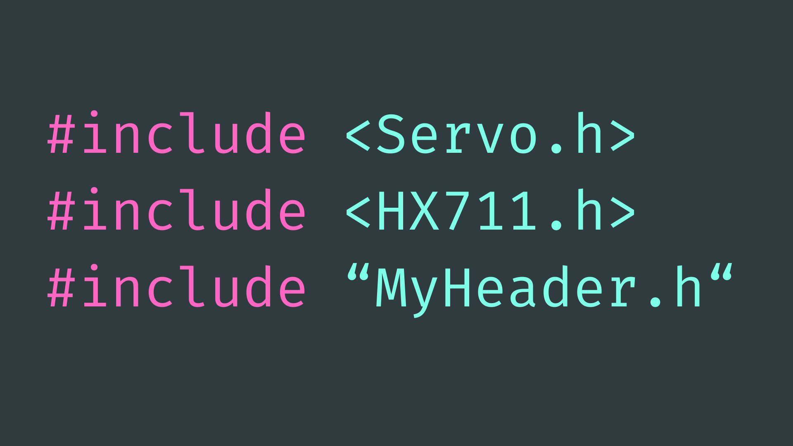
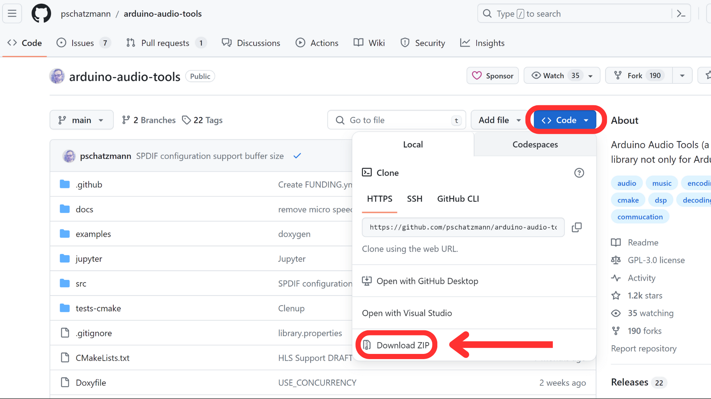
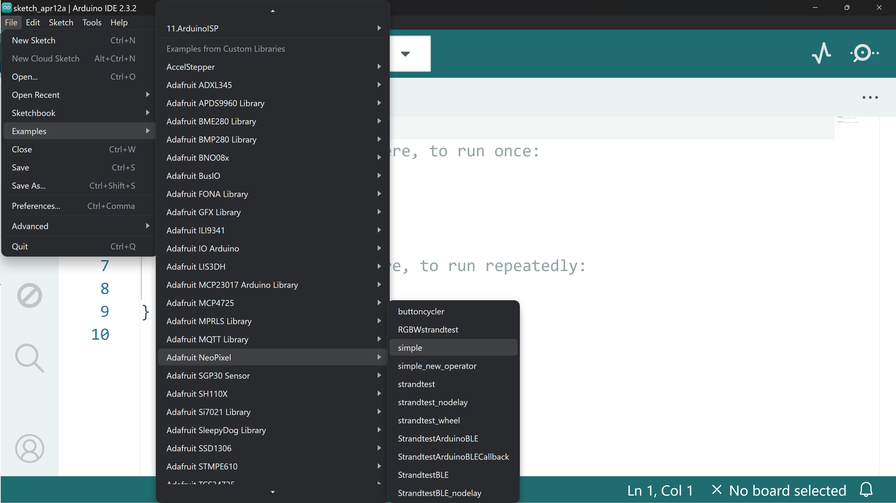

# Arduino Libraries



## Contents

- [Introduction](#introduction)
- [Installing Libraries](#installing-libraries)
    - [Library Manager](#library-manager)
    - [.ZIP Libraries](#add-zip-library)
- [Using Libraries](#using-libraries)
    - [Include Library](#include-library-in-sketch)
    - [Library Examples](#library-examples)

## Introduction
A code library refers to a collection of pre-written code that you can use in your Arduino projects to perform specific tasks. These libraries are created to simplify programming by providing ready-made functions and classes for common tasks, such as controlling sensors, displays, communication modules, among other things.

These libraries are often made for free by members of the Arduino community. Published libraries can be installed via the Library Manager in the Arduino IDE, or installed from a .ZIP file.

## Installing Libraries
### Library Manager
The easiest way to install an Arduino code library is through the **Library Manager** tab in the Arduino IDE. You can open this tab by navigating to *Sketch → Include Library → Manage Libraries…* or with the shortcut *Ctrl/Cmd + Shift + I*.

Alternatively, you can open the Library Manager by selecting the library icon on the left side of the IDE:


Once there, you can search for, select versions of, and install the library of your choice. 


### Add .ZIP Library
Some libraries are not available through the Library Manager and instead have to be **downloaded as a .ZIP file** and uploaded to the Arduino Libraries directory.

You will first need to download the library as a .ZIP file. If the library is available on GitHub, you can do this by navigating to *Code -> Download ZIP*: 



Then in the Arduino IDE, navigate to *Sketch -> Include Library -> Add .ZIP Library…*


This should open up your file explorer. From here, find and select the downloaded .ZIP file (from your downloads folder) and select Open. This should install the .ZIP library into the Arduino Libraries directory.

## Using Libraries
### Include Library in Sketch
Once you have installed a library, you can start to include it in your sketches. To do this, you need to tell the sketch that you are using a specific library so it knows to include it when you go to build the sketch. If you attempt to use code from a library without including that library, the code will throw an error and fail.

The syntax for this is quite straightforward. At the very top of the sketch, write <code>#include <LibraryName.h></code>, replacing <code>LibraryName</code> with the actual name of the library.

For example, to include the Arduino servo library, we would include this statement at the top of the sketch:

``` cpp
#include <Servo.h>
```

### Library Examples
All well-written Arduino libraries should include a handful of example sketches for us to better understand how to use the library in our own sketches. It is worth exploring these examples when you install a new library to get a feel for how it works.

To access these examples, simply navigate to *File -> Examples* where you can scroll to find the library you are looking for. From there, you should be able to click to open a couple of example sketches.



A good example sketch should include some useful comments to explain how the code works.

