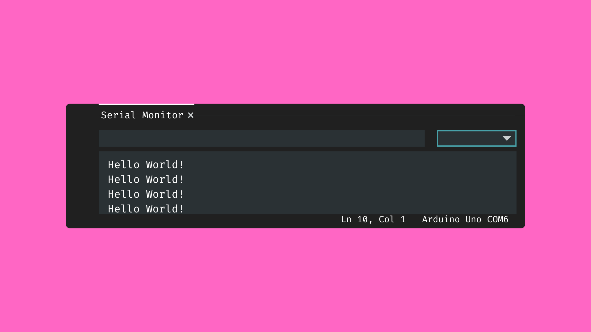
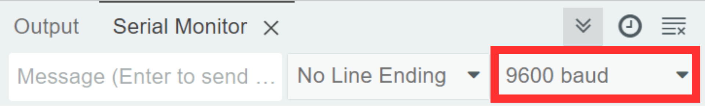
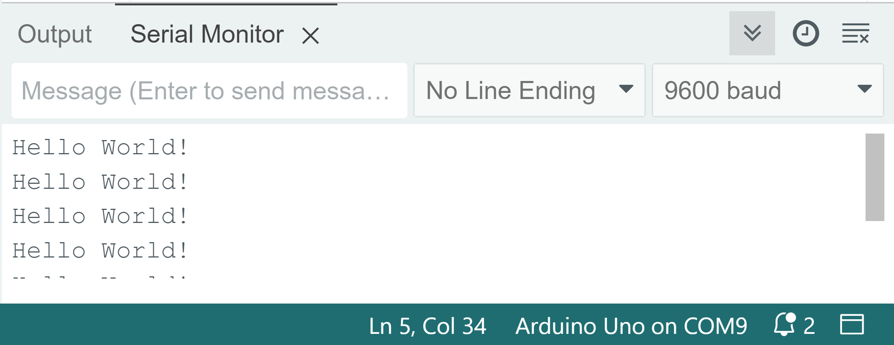
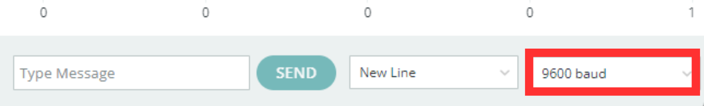
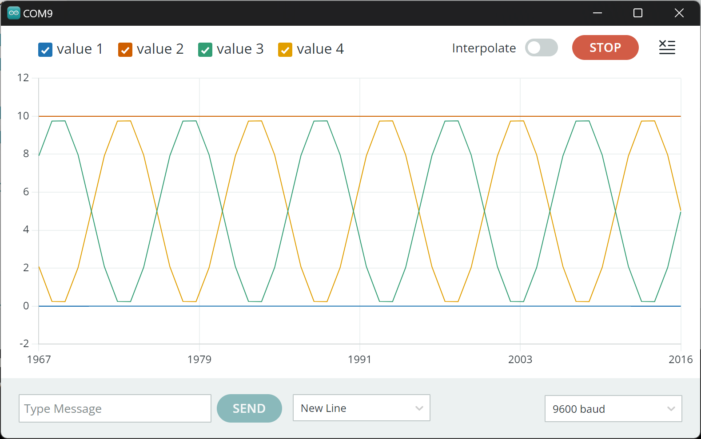
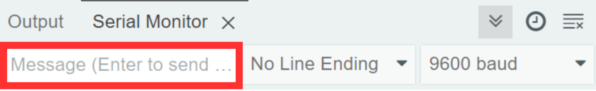

# Serial Monitor



## Contents

- [Introduction](#introduction)
- [Usage](#usage)
    - [Set the Baud Rate](#set-the-baud-rate)
    - [Arduino -> Serial Monitor (IDE)](#arduino---serial-monitor-ide)
        - [Code](#code)
        - [Open Serial Monitor](#open-serial-monitor)
    - [Arduino -> Serial Plotter (IDE)](#arduino---serial-plotter-ide)
        - [Code](#code-1)
        - [Open Serial Monitor](#open-serial-plotter)
    - [Serial Monitor (IDE) -> Arduino](#serial-monitor-ide---arduino)
        - [Code](#code-2)
        - [Send Serial Messages from IDE](#send-serial-messages-from-ide)
    

## Introduction
The serial monitor is a valuable tool that allows you to communicate with your Arduino board from the Arduino IDE. This information is transmitted using the USB cable, so as long as the Arduino board is connected to your computer, you can send and receive information to and from the board. 

This can be useful for a number of applications, including:

- Debugging.
- Monitoring.
- Data visualisation.
- Interactive input from the IDE.
- Sending serial data to other applications.

In this page, we will look at a couple of ways you might want to use the serial monitor in your own projects.

## Usage
### Set the Baud Rate
To make use of serial communication in an Arduino sketch, you will first need to initialise the <code>Serial</code> class inside the <code>setup()</code> function.

This can be done using the method <code>Serial.begin()</code>. We will need to pass the **baud rate** as an input argument. The baud rate is the the speed of data transmission between the Arduino and your computer. This is typically set to <code>9600</code> for Arduino boards, although it is not the only option.

We will need to remember what value we have used for the baud rate for a later step.

``` cpp
void setup() {
    Serial.begin(9600);
    ...
```

### Arduino -> Serial Monitor (IDE)
Probably the most common way you will be using the serial monitor is to send messages from the Arduino to the IDE. This is very useful for monitoring your sketches after uploading them to see if they are behaving as expected.

#### Code
For a full example sketch, [click here](SerialMonitor_Basic/SerialMonitor_Basic.ino).

After setting the baud rate in the <code>setup()</code> function, we can simply use the methods <code>Serial.print()</code> and <code>Serial.println()</code> to send serial messages.

- <code>Serial.print()</code> will simply send the data we put in the brackets.
- <code>Serial.println()</code> will send the data we specify in the brackets, but will also create a new line charachter at the end of the message. This means any messages sent afterwards will be printed on a new line.

``` cpp
Serial.print("Hello");      // print "Hello"
Serial.println(" World!");  // print " World!"  on same line

Serial.print("Ahoy!"); // will be printed on a new line
```

#### Open Serial Monitor
Once you have uploaded your code, open the serial monitor by clicking the serial monitor icon in the top right corner of the IDE:


You will then need to take note of the baud rate set in the code. We will need to tell the IDE what the baud rate is in order to communicate properly with the Arduino. We can do that in the top right corner of the serial monitor.



You should then be able to read the incoming messages.



### Arduino -> Serial Plotter (IDE)
The Arduino IDE also gives us the option to plot incoming data on a live graph called the serial plotter. The serial plotter is a useful tool for visualizing data from sensors, analog inputs, or any other data that you send to the serial monitor in real-time.

#### Code
For a full example sketch, [click here](SerialMonitor_Plotter/SerialMonitor_Plotter.ino.ino).

After setting the baud rate in the <code>setup()</code> function, we can again use the methods <code>Serial.print()</code> and <code>Serial.println()</code> to send serial messages.

This time, each piece of data we want to send to the serial plotter must be separated by a comma, like so:

``` cpp
Serial.print(",");
```

This will allow the serial plotter to tell our data apart from one another. Each separate data point will create a new line on the plotter. Then, to end the current round of data, we can create a new line using the <code>Serial.println()</code> function.

``` cpp
// Create a plot with three separate data lines
Serial.print(dataStream1); // data line 1
Serial.print(",");
Serial.print(dataStream2); // data line 2
Serial.print(",");
Serial.print(dataStream3); // data line 3

Serial.println(); // end of data
```

#### Open Serial Plotter
Once you have uploaded your code, open the serial plotter by clicking the serial plotter icon in the top right corner of the IDE:


You will then need to take note of the baud rate set in the code. We will need to tell the IDE what the baud rate is in order to communicate properly with the Arduino. We can do that in the bottom right corner of the serial plotter window.



You should then be able to see the incoming messages represented as a line graph.



### Serial Monitor (IDE) -> Arduino
As well as being able to send serial message from the Arduino to the serial monitor, we can also send messages from the serial monitor to the Arduino. This gives us the option of controlling tasks on the Arduino from the IDE, essentially making it a custom controller for the Arduino.

#### Code
For a full example sketch, [click here](SerialMonitor_Receive/SerialMonitor_Receive.ino).

After setting the baud rate in the <code>setup()</code> function, we will place the code for reading incoming serial messages in the <code>loop()</code> function. This way we can continually monitor any incoming messages.

Instead of using <code>print()</code> statements, we will need to use a function that tells us if the Arduino has received any serial messages. This function is called <code>Serial.available()</code> and it will give us the number of messages that have been sent since we last checked.

We can put this inside an <code>if()</code> statement to see if the number of messages received is greater than 0. This means it will only execute this block of code if we have received a message. If not, the Arduino will do nothing. 

``` cpp
if (Serial.available() > 0) { ... }
```

We then need to store the incoming message. We will need to decide what type of data we want to receive. If it is:

- an integer value, we will use <code>Serial.parseInt()</code> to parse the message as type <code>int</code>.
- a float value, we will use <code>Serial.parseFloat()</code> to parse the message as type <code>float</code>.
- a String, we will use <code>Serial.readString()</code> to parse the message as type <code>String</code>.

``` cpp
if (Serial.available() > 0) { 
    int incomingMsg = Serial.parseInt();
    ...
```

### Send Serial Messages from IDE
Once you have uploaded your code, open the serial monitor by clicking the serial monitor icon in the top right corner of the IDE:


You will then need to take note of the baud rate set in the code. We will need to tell the IDE what the baud rate is in order to communicate properly with the Arduino. We can do that in the top right corner of the serial monitor.


You can now send messages to the Arduino from the text box in the serial monitor.

