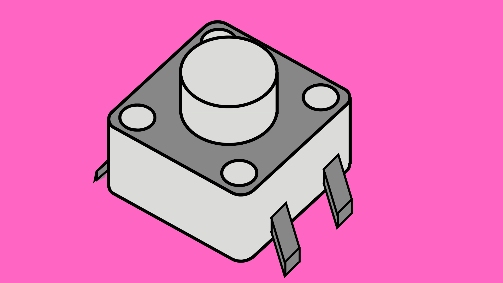
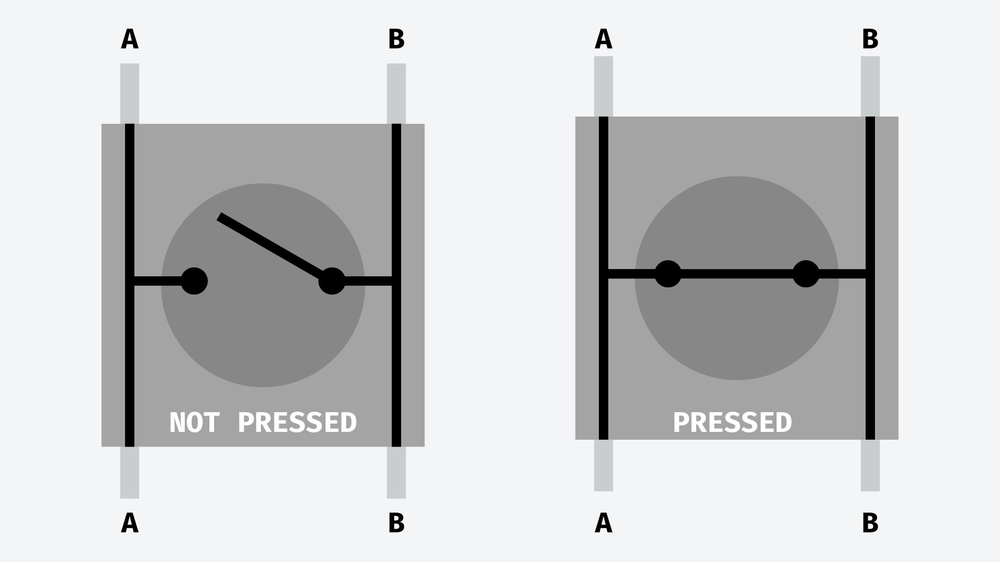
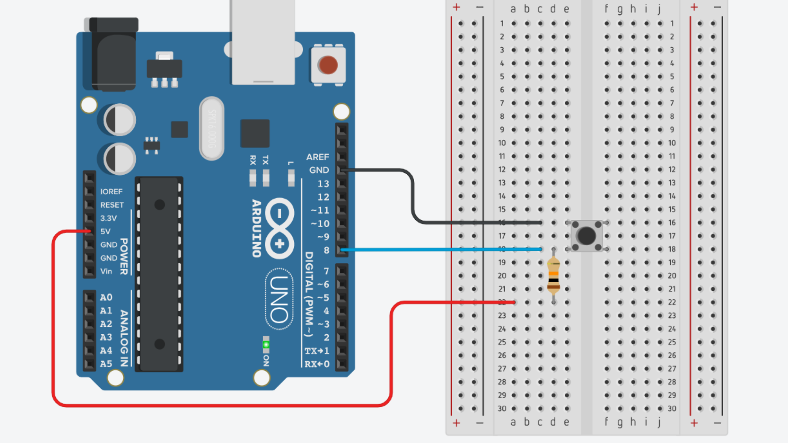
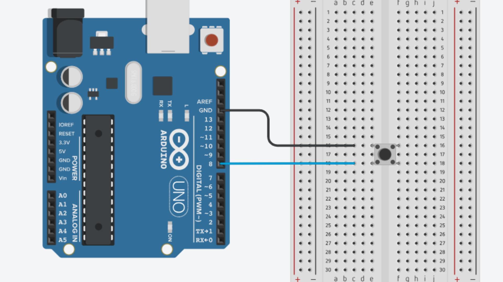

# Buttons



## Contents

- [Introduction](#introduction)
- [Button Wiring](#button-wiring)
    - [Internal Connections](#internal-connections)
    - [Pullup Resistors](#pullup-resistors)
- [Usage](#usage)
    - [Basic Read](#basic-button-read)
    - [Edge Detection](#edge-detection)
        - [What is it?](#what-is-edge-detection)
        - [Code](#code)

## Introduction
Buttons - sometimes known as tactile switches - are commonly used in electronics projects as they are relatively inexpensive and easy to use. With Arduino, you can use buttons to get basic input from users and trigger events. 

Buttons have two states: pressed or not pressed, which makes them great for turning things on or off, starting a process, or triggering some kind of counter in your code. 

When you wire a button in a circuit, it interrupts the flow of electricity until it is pressed. If you connect the button to one of the digital pins on an Arduino, the Arduino can detect whether the circuit is complete or not using the <code>digitalWrite()</code> function.

When you connect a button to an Arduino, you can create code that detects when the button is pressed, released, or how long it's held down. Before we can do this, we need to understand how to create a circuit and code to read button presses.

## Button Wiring
### Internal Connections
The buttons - or tactile switches - used in electronics usually consist of a square button with four legs. The reason they have four legs is so that they can sit more securely onto a breadboard or PCB. 

Inside these tactile switches is an internal circuit that is open when the button isn't pressed, and is subsequently completed when the button is pressed. This looks something like this:



As you can see, the legs (or terminals) on opposite sides of the button are permanently connected, even when the button is not pushed. The terminals on the same side of the button, and those diagonally opposite, are only connected when the button is pressed. 

This will be important to remember when wiring your button circuits.

### Pullup Resistors
When thinking about how we wire a button circuit to an Arduino, you may (understandably) think to connect one side of the button to 5V and the other side to a digital pin. This would make sense as when the button is not pressed, the circuit is broken and digital pin should read 0V (<code>LOW</code>) and when it is pressed, the circuit will complete and the digital pin should read 5V (<code>HIGH</code>). Unfortunately, it's not quite this simple.  

The issue with simply connecting one side of the button to 5V and the other side to a digital read pin is that when the button is not pressed, the digital read pin is not connected to anything. When the digital pin is in this state it is known as a ‘floating pin' and can pick up electromagnetic background noise. This will in turn cause the Arduino to get sporadic readings from the digital pin.

The way to deal with this is to make sure the digital read pin is always connected to something in the circuit (i.e. ground or 5V) both when the button is pressed or is not. A ‘pullup’ resistor does what you might imagine and pulls the digital pin up to 5V when the button is not pressed, registering a <code>HIGH</code> signal. When the button is pressed, the 5V signal is directed to ground and the digital pin reads a <code>LOW</code> signal.

On a breadboard, it would look like this:



Bear in mind that the digital pin will now read <code>LOW</code> when the button is pressed and <code>HIGH</code> when the button is not pressed.

This setup can become a bit messy on a breadboard, especially when we start including more buttons. Luckily, with Arduino there is a way to use an internal pullup resistor so we only need to connect the button to ground and to a digital read pin, like so:



We need to define this in the code however. To do this, make sure when you call the <code>pinMode()</code> function, you declare the pin as <code>INPUT_PULLUP</code>. We will look at how to do this in the following examples.

## Usage
As previously mentioned, we will need to declare the button pin as <code>INPUT_PULLUP</code> in the <code>setup()</code> function before reading from the button.

``` cpp
int buttonPin = 3;

void setup() {
    pinMode(buttonPin, INPUT_PULLUP);
}
```

### Basic Button Read
For a full example sketch, [click here](Buttons_Read/Buttons_Read.ino).

To read the current state of the button, we can use <code>digitalRead()</code> and pass the pin number as an input argument.

If we are using a pullup resistor in the circuit or code, this function will return <code>LOW</code> (0) when the button is pressed and <code>HIGH</code> (1) when it is not. Knowing this, we can use an <code>if()</code> statement to run a block of code if the button is pressed.

``` cpp
if (digitalRead(buttonPin) == LOW) {
    // do something if the button is pressed
}
else {
    // do something if the button is NOT pressed
}
```

### Edge Detection
Using a simple button read, we can run some code when the button is pressed and run a different block of code if not. This may work for some applications but what if we need a way to use the button as a switch that flicks between two or more states? For example, pressing a button once to turn an LED on, and pressing it again to turn it off.

For these sorts of applications we need to make use of "edge detection" in our code. This means we keep track of the button value only when the button goes from not pressed to pressed, or vice versa. We can do this using some checks in our code. 

#### What is Edge Detection?
If you imagine the <code>digitalRead()</code> function inside the <code>loop()</code> function reading the button value over and over again, when the button is not pressed, the <code>digitalRead()</code> function will keep returning the value 1.

At some point after we press the button, the <code>digitalRead()</code> function will start returning the value 0. That means at one point, there is a change from reading 1 to reading 0. This change happens in reverse when we release the button.

Since this change only happens once when we press the button, and once when we release it, we can use some code to determine when the button value has changed and only run a block of code when this happens.

Inside this block of code we can change a boolean variable from <code>false</code> to <code>true</code> (or vice versa), increment a counter, or do anything else that we only want to happen once when the button is pressed or released.

#### Code
For a full example sketch, [click here](Buttons_EdgeDetection/Buttons_EdgeDetection.ino).

To do this in code, we need to store a variable to remember what the previous read value was. That way we can compare the previous button read value to the current one and determine if it has changed.

``` cpp
bool lastReadValue;
```

Inside the <code>loop()</code> function, we can compare the two values in an <code>if()</code> statement. We can then update the previous read value for next time after comparing it to the current one.

``` cpp
bool currentReadValue = digitalRead(buttonPin); // get current value

if (lastReadValue != currentReadValue) { // compare to previous value
    lastReadValue = currentReadValue; // update previous value for next time.
    ...
```

We also need to check if the button has gone from not pressed to pressed (1 -> 0 aka falling edge), or pressed to not pressed (0 -> 1 aka rising edge). If it is a falling edge, then the current value must now be 0 (pressed). As such we can use another <code>if()</code> to run a block of code for the rising edge.

We can then use this if statement to flip a boolean, which we can use later in the code.

``` cpp
bool currentReadValue = digitalRead(buttonPin); // get current value

if (lastReadValue != currentReadValue) { // compare to previous value
    lastReadValue = currentReadValue; // update previous value for next time.

    if (currentValue == LOW) {
        // Run some code for falling edge
        // i.e. when button is pressed
        lightIsOn = !lightIsOn; // turn from true to false, or vice versa
    }
    else {
        // Run some code for rising edge
        // i.e. when button is released
    }
}
```