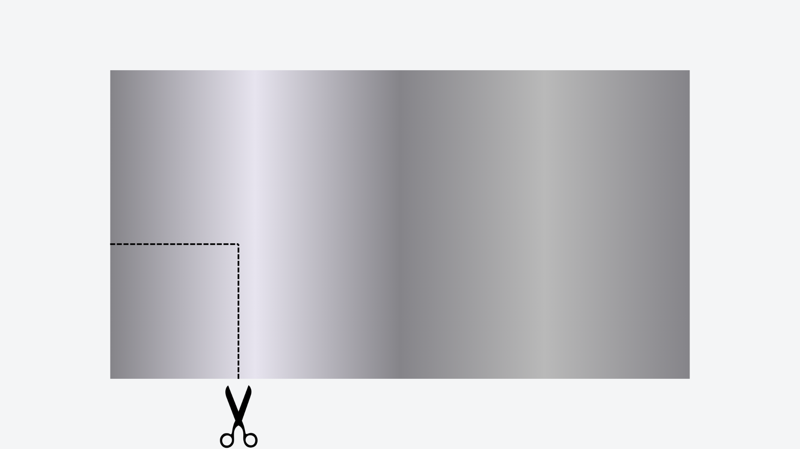
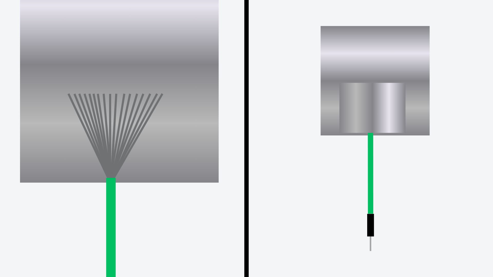
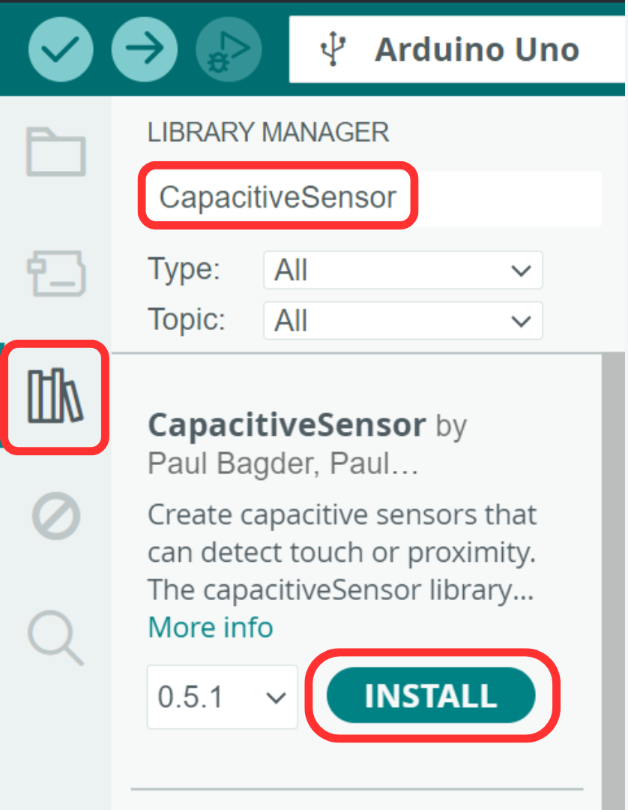
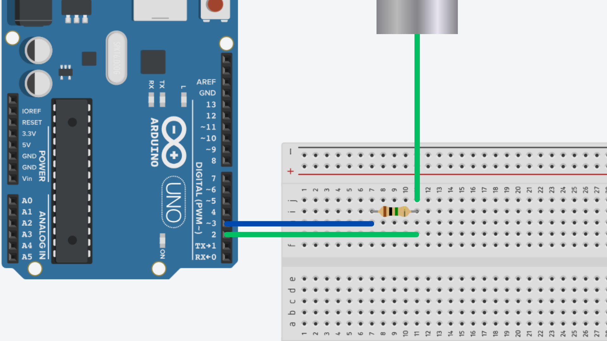
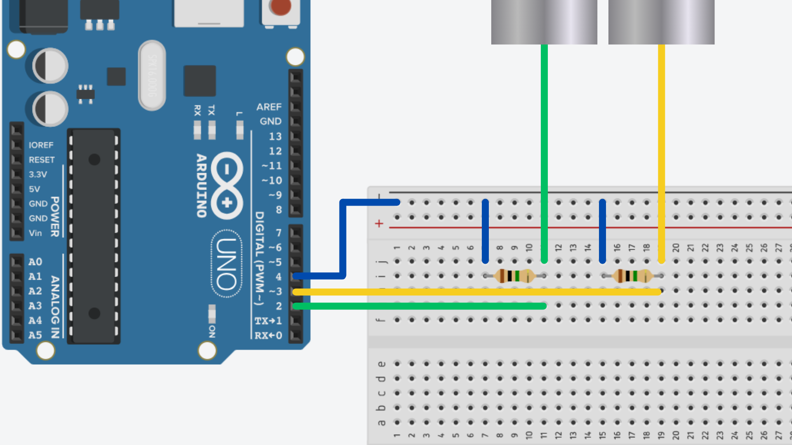

# Capacitive Sensing


## Contents
- [Introduction](#introduction)
- [Materials](#materials)
- [Usage](#usage)
    - [Preparing the Sensor](#preparing-the-sensor)
    - [Wiring](#wiring)
    - [Code](#code)

## Introduction
Capacitive sensing is a technique that detects changes in capacitance when an object (like a human finger) comes into close proximity to a material. This technology is widely used in touchscreens, buttons, and other interactive devices due to its non-contact and durable nature. Capacitive sensors rely on the principle that the presence of a conductive object alters the electric field and, consequently, the capacitance of a conductive material.

Capacitive touch sensors are particularly effective because they can detect touch without requiring physical movement or mechanical parts. We can even make our own capacitive touch sensors out of conductive materials - like kitchen foil, metal wire, or conductive paints.

## Materials
Capacitive touch sensors can be constructed from a variety of materials, depending on the application and desired flexibility. Some commonly used materials for this include:

- Aluminium Foil.
- Copper Wire/Tape.
- Conductive Ink.
- Conductive Fabric.
- Pencil Graphite.

As long as you can find a way to electrically connect your material to an Arduino, you can choose any conductive material you want.

Aluminium kitchen foil is an excellent choice for DIY capacitive sensors due to its wide availability, low cost, and high conductivity. We can even cut and fold it to a required size. For this guide, we will look at using kitchen foil to create capacitive sensors, however, you should bear in mind that you can replace it with a conductive material of your choice.

## Setup
### Preparing the Sensor
#### 1. Prepare the Material
Cut foil to your desired size and shape. If using a different conductive material, similarly prepare it by cutting to size or bending into shape.



#### 2. Attach Jumper Wire 
Secure a jumper wire to your conductive material. This can be done using aluminium or copper foil tape, however you can also secure it using non-conductive tape.



### Install Library
To get readings from our capacitive sensors more easily, we can use the [CapacitiveSensor Arduino Library](https://github.com/PaulStoffregen/CapacitiveSensor)  by Paul Bagder and Paul Stoffregen. This will give us access to functions for gathering capacitive touch data. You will need to install this in the Arduino IDE's library manager.



If you are unsure how to install a library, you can read more on [this page](/examples/Code/7-Libraries/README.md).

## Usage
### Wiring
In order to read the capacitance from our conductive material using Arduino, we need to connect it to 2 pins:

- **Sensor Pin** - a digital pin connected directly to the material.
- **Reference Pin** - a digital pin connected to the material via a resistor.

You can use any of the digital pins on the Arduino (we will set them in the code later) however the value of the resistor can vary. By varying the resistor value, we can change how "sensitive" the readings we get are - the greater the resitance, the more sensitive the sensor becomes. 

You might want to try out a few different resistors but a **1MΩ** resistor is the one we will use in this guide.

On a breadboard, this looks like this:



If we want to connect more than one capacitive sensor, we can do so by connecting the sensor pin to another digital pin on the Arduino, however the reference pin can be shared by all of the sensors.

This should look something like this:



### Code
We will first need to include the `CapacitiveSensor.h` library at the top of the sketch. This will give us access to the necessary [classes](/examples/Code/6-Classes/README.md) and [functions](/examples/Code/5-Functions/README.md) for reading data from our sensor(s).

``` cpp
#include <CapacitiveSensor.h>
```

For each sensor we have connected to the Arduino, we will need to create a seperate instance of the `CapacitiveSensor` class. The class constructor takes two arguments:

1. **Reference Pin Number**
2. **Sensor Pin Number**

These are the pins we established in the [previous section](#wiring). It is important that we input them in this order so the class knows which pin is the reference pin.

``` cpp
// RefPin=3, SensorPin=2
CapacitiveSensor sensor = CapacitiveSensor(3, 2);

// We can create another instance for each sensor we have connected...
// CapacitiveSensor sensor2 = CapacitiveSensor(3, 4);
```

To read the capacitance value, all we need to do is call the `capacitiveSensor()` method. This method takes one argument: the number of sample points.

This method will take x number of samples and find an average value. The higher the number of samples, the higher the accuracy (in theory) but it will also take the Arduino longer to calculate.

The value this method outputs can be quite large, so we can use an `unsigned int` to store its output.

``` cpp
// Get average of 30 data points...
unsigned int capSensorValue = sensor.capacitiveSensor(30); 

// unsigned int capSensorValue2 = sensor2.capacitiveSensor(30);
```