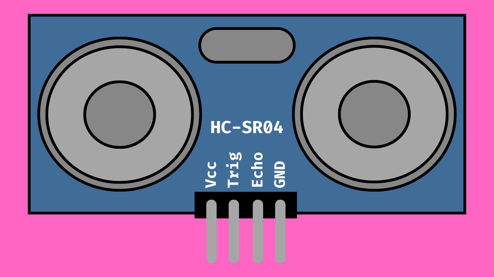
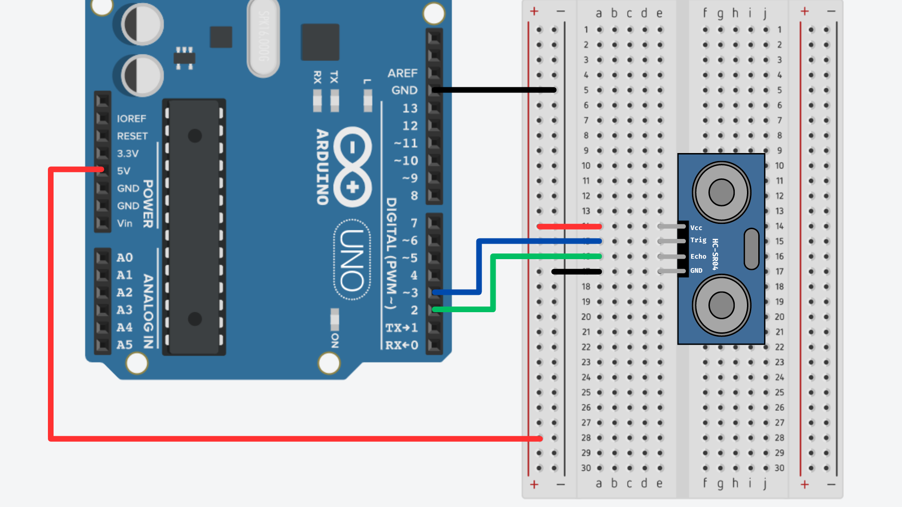

# SR04 Ultrasonic Distance Sensors



## Contents
- [Introduction](#introduction)
- [How it Works](#how-it-works)
- [Usage](#usage)
    - [Wiring](#wiring)
    - [Code](#code)

## Introduction
The SR04 ultrasonic distance sensor is a popular choice for measuring distance in Arduino projects due to its low cost and relative simplicity. 

The SR04 measures distance by sending and receiving a pulse of ultrasonic sound. By measuring the time taken between sending and receiving the pulse, we can calculate the distance between the SR04 and any objects placed in front of it. This works in a similar way to SONAR systems found on submarines.

The SR04 has a maximum range of around 400cm, although this can vary from device to device. The raw data readings gathered from one of these sensors can sometimes be irregular, however this can be negated by taking multiple readings and averaging the results.

In this page, we will look at how to set up an SR04 and read data from it using an Arduino board.

## How it Works
You will notice that the SR04 has four pins:

- **GND** - ground connection.
- **VCC** - 5V connection.
- **TRIG**- will send an ultrasonic pulse from the SR04.
- **ECHO** - will listen for the reflected sound.

When instructed by the Arduino, the trigger pin will send a short pulse of ultrasonic sound. If there are any nearby objects in front of the sensor, this pulse will then be reflected back at the sensor. The ECHO pin will listen for this reflected sound and send a signal to Arduino when it detects it.

By using the time taken between the pulse and response, we can calculate how far the sound has traveled. This will give us our distance reading.

## Usage
### Wiring
You will need to wire the SR04 to the Arduino ensuring the following connections:

| SR04 | Arduino     |
| ---- | ----------- |
| GND  | GND         |
| 5V   | 5V          |
| Echo | Digital I/O |
| Trig | Digital I/0 |

You can use any of the digital I/0 pins on your Arduino board for the <code>Echo</code> and <code>Trig</code> connections.



### Code
For a full example sketch, [click here](SR04_ReadDistance/SR04_ReadDistance.ino).

As mentioned, to gather a distance reading, we will need to:

1. Send a short pulse of ultrasonic sound (via the Trig pin).
2. Measure the time taken for the sound to return (Echo pin).
3. Calculate the distance traveled.

To send a pluse of ultrasonic sound, we can send a <code>HIGH</code> signal to the Trig pin for a short amount of time.

``` cpp
digitalWrite(trigPin, HIGH);
delayMicroseconds(10);
digitalWrite(trigPin, LOW);
```

We can then using a function called <code>pulseIn()</code> that will give us the time (in microseconds) taken for the Echo pin to receive the incoming pulse. We will store that in a new variable to use later.

``` cpp
float duration = pulseIn(echoPin, HIGH);
```

Now we have the time taken for the sound to be sent out and reflected back to the SR04 (duration), and we also know the speed of sound is 343m/s. We can simply use the following equation to calculate the distance traveled by the pulse:

```
distance = time * speed

distance in cm = time * 0.034 cm per second
distance in inches = time * 0.0135 inches per second
``` 

We also need to remember that this value is the distance traveled to and from the object. To get the distance to the object, we will need to divide this value by 2:

``` cpp
float cm = (duration * 0.034) / 2.0;
float inches = (duration * 0.0135) / 2.0;
```