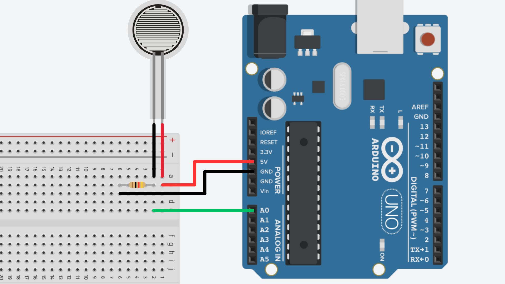

# Force Sensitive Resistors


## Contents
- [Introduction](#introduction)
- [Usage](#usage)
    - [Wiring](#wiring)
    - [Code](#code)

## Introduction
Force Sensitive Resistors (FSRs) are a type of sensor commonly used in electronics projects to detect physical pressure, such as the force applied to a surface. FSRs are available in different shapes and sizes, making them versatile for different applications.

Unlike typical resistors, which have fixed resistance values, the resistance of an FSR decreases as the pressure applied to it increases. By using an Arduino's [analog input pins](/examples/Input-Devices/Input-Types/Analog/README.md) we can measure this change in resistance and thus the change in pressure being applied to the FSR.

It is important to consider that FSRs are not as inexpensive as [buttons](/examples/Input-Devices/Buttons/) and should ideally only be used for applications in which buttons are not suitable. If you only require simple pressed/not pressed detection, consider using a button instead.

## Usage
### Wiring
To use an FSR with an Arduino, you typically wire it as part of a voltage divider circuit. The FSR will be one part of the divider, and a fixed resistor (typically 10kΩ) will be the other part. This allows the Arduino's analog read pins to read changes in the voltage caused by the FSR's changing resistance.

How to wire it:
1. Connect one leg of the FSR to 5V on the Arduino.
2. Connect the other leg of the FSR to an analog input pin on the Arduino (e.g., A0).
3. Connect a 10kΩ resistor from the same analog input pin to ground (GND).



### Code
To read the force applied to the FSR, we can use the `analogRead()` function to read the voltage being applied to the analog read pins on the Arduino. This voltage should correspond to the pressure applied to the FSR.

```cpp
int fsrPin = A0;  // connect FSR to pin A0

void setup() {
  Serial.begin(9600);  // start serial comms
}

void loop() {
  int fsrValue = analogRead(fsrPin);  // read FSR pin
  Serial.println(fsrValue);           // print result to serial monitor

  delay(100);  // short delay
}
```

After uploading this sketch, open the [Serial Monitor](/examples/Getting-Started/Serial-Monitor/README.md) in the IDE and you should see a live read-out of the sensor values. This number should change depending on how much force is being applied to the FSR.