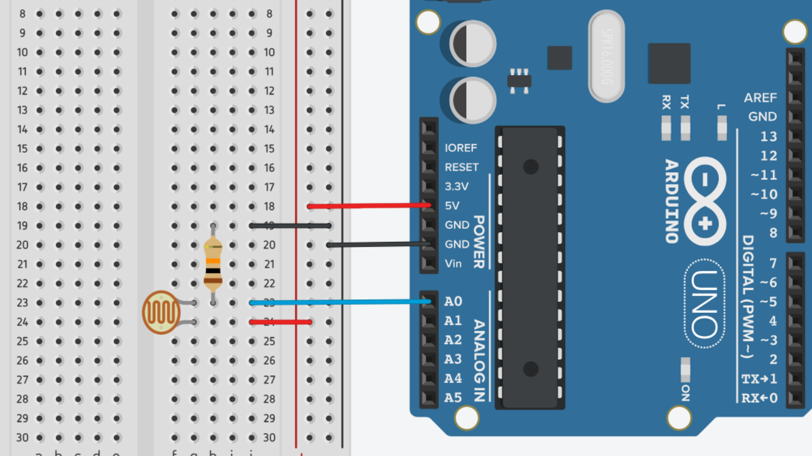

# Light-Dependent Resistors (LDRs)


## Contents
- [Introduction](#introduction)
- [How it Works](#how-it-works)
- [Usage](#usage)
    - [Wiring](#wiring)
    - [Code](#code)

## Introduction
Light-Dependent Resistors (LDRs, aka photoresistors) are commonly used with Arduino to detect and respond to changes in light intensity.

LDRs change their resistance depending on how light it is exposed to. We can then detect this change in resistance using the analog input pins on the Arduino.

This information can be used to create light-triggered projects, such as automatic lighting systems, brightness control, or even crude touch sensing.

## How it Works
LDRs can be thought of as a variable resistor - similar to a [potentiometer](/examples/Input-Devices/Potentiometers/README.md) - that can restrict the amount of electrical current that flows through a circuit.

Instead of turning a dial or moving a slider to change the resistance, LDRs change their resistance depending on the amount of light they receive - hence "light-dependent resistors". The less light an LDR receives, the higher its resistance value becomes.


With Arduino, we can measure how much of a voltage drop is caused by an LDR to determine how much resistance the LDR is supplying to a circuit. 

## Usage
### Wiring
In order to read the resistance from an LDR using Arduino, we need to set it up in a voltage divider configuration. This requires wiring it in series with a 1kΩ resistor and running a read line in between them.

On a breadboard, this looks like this:



As you can see, one side of the LDR is connected to 5V, and the other is connected to GND via a 1kΩ resistor. This GND side is also connected to one of the analog input pins on the Arduino board.

### Code
For a full example sketch, [see here](LDR_Read/LDR_Read.ino).

In our sketch, we first need to initialize the pin as an input using the <code>pinMode()</code> function.

``` cpp
// Store pin number as variable
int ldrPin = A0;

// Initialize as input
pinMode(ldrPin, INPUT);
```

We can then read the input voltage using the <code>analogRead()</code> function.

``` cpp
int readValue = analogRead(ldrPin);
```
