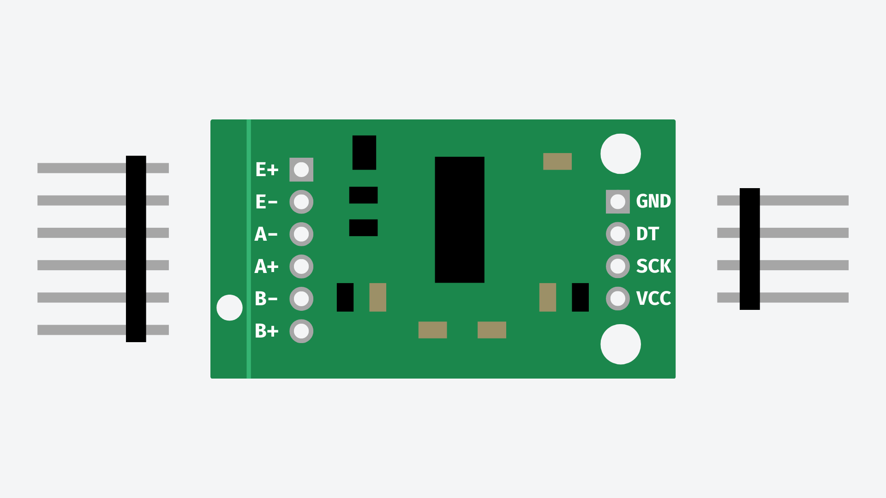
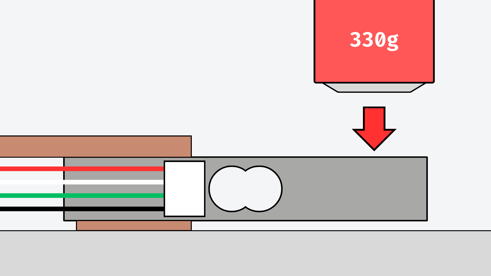

# Load Cells


## Contents

- [Introduction](#introduction)
- [Setup](#setup)
    - [Solder HX711](#solder-hx711)
    - [Install Library](#install-the-hx711-library)
    - [Load Cell Setup](#setup-the-load-cell)
- [Usage](#usage)
    - [Wiring](#wiring)
    - [Code](#code)
        - [Calibration](#calibrate)
        - [Weighing](#weighing)


## Introduction
Load cells are transducers that convert force or weight into an electrical signal. They are used in a wide range of applications to measure force or weight, such as in industrial scales, material testing machines, and force measurement devices.

Load cells typically consist of a metal structure that deforms when a force is applied. This in turn causes a change in resistance that can be measured to determine the amount of force being applied to the load cell.

There are several different types of load cell, however for this tutorial we will be looking at strain gauge load cells. These are composed of a strain gauge attached to a metal bar. We will also need to use a HX711 amplifier board in conjunction with the load cell to read the load cell more easily.

## Setup
### Solder HX711
If you have purchased your own load cell and HX711 amplifier, you may need to solder header pins to the HX711 in order to use it on a breadboard. If you have not soldered through-hole components before, please contact DigiDevECA@ed.ac.uk to arrange for a technician to do this for you.



You may also choose to solder the wires from the load cell straight onto the HX711. You will need to make sure you solder the wires from the load cell to the correct hole on the HX711. Again, if you have not done this before, please contact DigiDevECA@ed.ac.uk to arrange for a technician to do this for you.

| HX711 | Load Cell  |
| ----- | ---------- |
| E+    | Red Wire   |
| E-    | Black Wire |
| A-	| White Wire |
| A+    | Green Wire |


### Install the HX711 Library
To make use of the HX711 more easily, we can use the HX711 Arduino Library by Bogdan Necula and Andreas Motl. This will give us access to function for calibrating and using the HX711 to read the force applied to our load cell. You will need to install this in the Arduino IDE's library manager.


If you are unsure how to install a library, you can read more on [this page](/examples/Code/7-Libraries/README.md).
 
### Setup the Load Cell
A typical bar strain gauge load cell will produce the best results when force is applied from either side in opposite directions. You will need to take this into account when setting up your load cell. Typically, you should fix one side of the bar while downward pressure to the opposite side, like so:



## Usage
### Wiring
We will need to wire the load cell and HX711 board with the following connections.

| Load Cell  | HX711 | Arduino     |
| ---------- | ----- | ----------- |
| Red Wire	 | E+	 | -           |
| Black Wire | E-	 | -           |
| White Wire | A-	 | -           |
| Green Wire | A+	 | -           |
| -	         | GND	 | GND         |
| -	         | VCC	 | 5V          |
| -	         | DT	 | Digital I/O |
| -	         | SCK	 | Digital I/O |

You can use any of the digital I/0 pins on your Arduino board for the DT and SCK connections.


### Code
For all sketches using a HX711 to gather load cell data, you will need to first include the HX711 Arduino library and store the pin values for the pins connected to DT and SCK on the HX711 board.

``` cpp
#include <HX711.h>

int dtPin = 2;
int sckPin = 3; 
```

#### Calibrate
Before using the load cell to weigh objects, it is worth calibrating the setup to get more accurate results. To do this we will need to take some measurements to calculate a "calibration factor" which can then be applied to future sketches.

You will need a known reference weight to calculate the calibration factor. For example, a small drinks can usually weighs around 330g and is a useful size for this.

You can find the full sketch for this [here](LoadCell_Calibrate/LoadCell_Calibrate.ino).

After uploading the sketch, open the serial monitor. It will ask you to:

1. Remove the weight from the load cell.
2. Place the weight on the load cell.
3. Calculate the calibration factor.

Make sure to follow these instructions as they appear.

The formula to calculate your calibration faction will be:

```
calibration factor = reading ÷ weight of object
```

For example, if you are using a 330g weight and get a reading of -52721, your calibration factor would be:

```
calibration factor = -52721 ÷ 330
calibration factor = -159.76
```

**Make sure to make a note of your calibration factor for the next step!**

#### Weighing
Once you have calculated the calibration factor for your setup, you can start weighing objects with the load cell. For the full example sketch, [click here](LoadCell_Weighing/LoadCell_Weighing.ino).