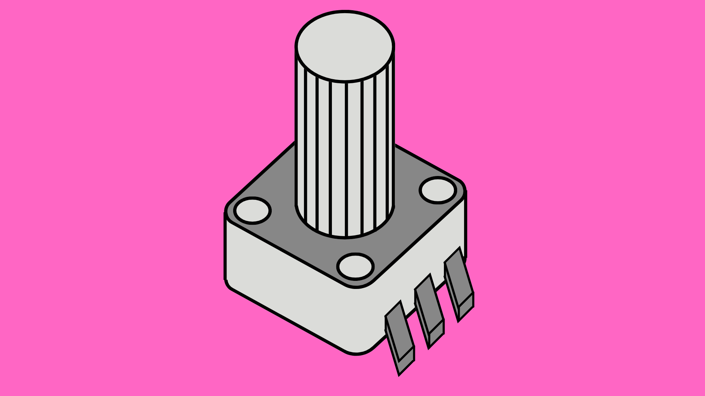
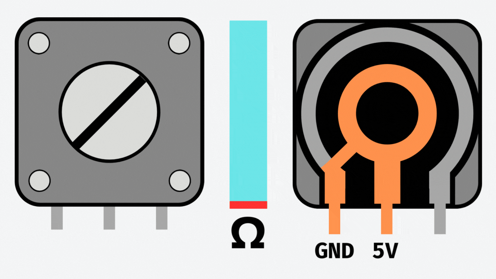
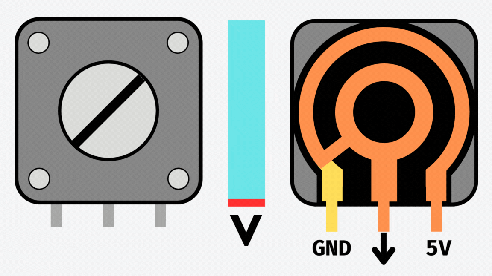
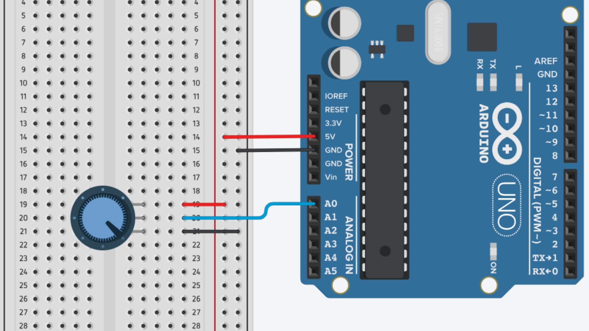

# Potentiometers



## Contents
- [Introduction](#introduction)
- [How it works](#how-it-works)
- [Usage](#usage)
    - [Wiring](#wiring)
    - [Code](#code)
    - [Precision](#precision)

## Introduction
Potentiometers are variable resistors that come in different shapes and sizes. Most of the time when we are talking about potentiometers we are referring to rotary potentiometers, which can be adjusted using a dial, although you can get them in the form of sliders.

A potentiometer has three terminals/pins. When a voltage is applied across the two outer terminals of the potentiometer, the voltage output of the middle terminal varies depending on the position of the dial. This voltage can then be measured by one of the analog input pins on the Arduino. 

This analog input can be used to control parameters like volume, brightness, or speed, allowing users to interact with Arduino-based projects and adjust settings in a smooth and continuous manner, unlike buttons or switches that have fixed states.

## How it Works
A potentiometer has three pin connections (terminals) that we can connect to. The outer two pins are connected via an internal bridge made of a resistant material. 

The exact resistance of this bridge depends on the potentiometer. Due to the operating voltage of most Arduino boards being 5V, we generally use 10kΩ resistors, meaning this bridge provides 10kΩ of resistance.

The inner terminal is connected to the outer terminals via a "wiper" which can be positioned at different points on the resistant bridge using the dial/slider of the potentiometer. This means that the resistance between an outer terminal and the inner "wiper" terminal can be adjusted.



The above configuration is known as a current limiter, as we can increase the resistance in our circuit to limit the flow of electrical current. However, in Arduino projects, we generally want to use potentiometers to read the voltage of the circuit when the wiper is at any given position. For this, we use a voltage divider configuration.

This requires applying a voltage across the potentiometer and reading the voltage from the wiper terminal (as shown below). By connecting the wiper terminal to an analog input on an Arduino board, we can read the voltage and determine the approximate position of the potentiometer dial. 



## Usage
### Wiring
As mentioned previously, to get a variable voltage reading from a potentiometer, we should apply a constant voltage across the potentiometers outer terminals. We can then run a connection from the wiper terminal to an analog input on the Arduino board.



### Code
Unlike when using the Arduinos' [digital input](/examples/Input-Devices/Input-Types/Digital/README.md) pins, we do not need to use `pinMode()` function to set the [analog pins](/examples/Input-Devices/Input-Types/Analog/README.md) to work as inputs. They are set to `INPUT` by default.

We can read the input voltage using the <code>analogRead()</code> function.

``` cpp
int readValue = analogRead(A0); // Read value at pin A0
```

This will - for most boards - return a value between 0 and 1023 which we can use later on in our code.