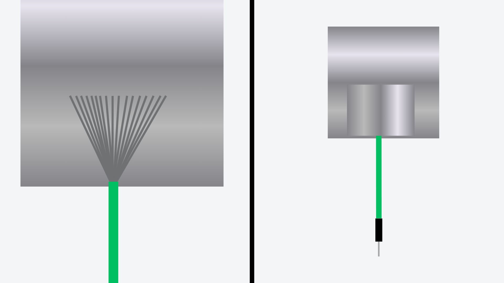
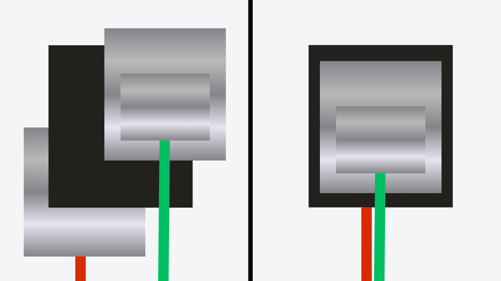
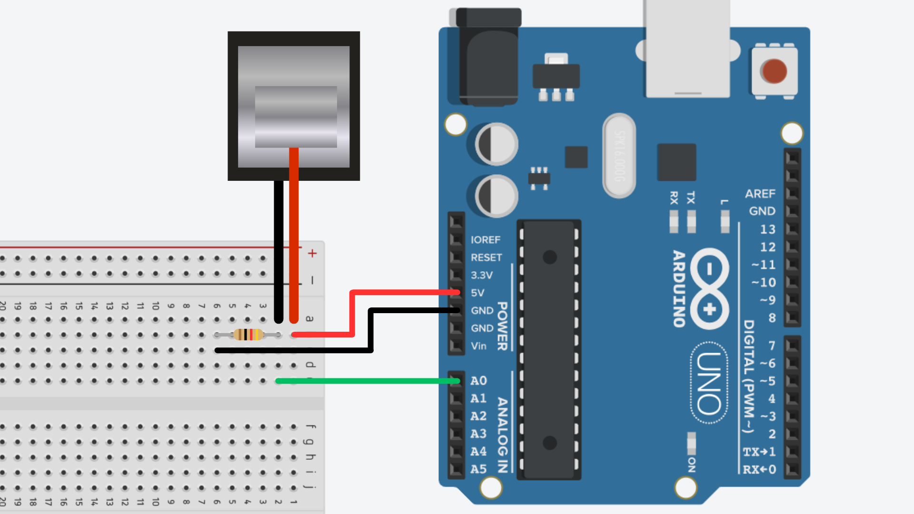

# Velostat


## Contents

- [Introduction](#introduction)
- [Setup](#setup)
- [Usage](#usage)
  - [Wiring](#wiring)
  - [Code](#code)

## Introduction

Velostat is a pressure-sensitive material that changes its electrical resistance when force or pressure is applied. This unique property makes Velostat ideal for creating simple force, pressure, or flex sensors. When Velostat is deformed, the conductive particles within the material move closer together, reducing the electrical resistance. This change can then be measured to determine how much pressure/flex is being applied to the material.

Initially created as a packing material, Velostat is inexpensive and able to be cut into essentially any required shape or size. This allows us to create our own pressure and flex sensors to the exact size we need.

## Setup

Before we can connect our Velostat to Arduino, we need to create the sensor and attach wires to connect to it. You will need the following materials:

- Velostat sheet.
- Copper or aluminium foil/foil tape.
- Two jumper wires.

#### 1. Prepare the Material

Cut the Velostat to your desired size and shape. Then cut two pieces of your foil just slightly smaller than the Velostat.

It is important that the foil pieces do not extend over the edge of the Velostat peice.


#### 2. Attach Jumper Wire

Strip one end of each jumper wire and secure one to each of your foil pieces. This can be done using another smaller peice of foil tape, however you can also secure it using non-conductive tape.



#### 3. Sandwich Pieces Together

You can now complete the sensor by creating a Velostat "sandwich" with the two foil peices on either side of the Velostat. You will probably need to secure the pieces together with some non-conductive tape to hold the sensor together.

Again, make sure the foil pieces are not touching eachother as this will create a short and the sensor won't work.



## Usage

### Wiring

To use your Velostat sensor with an Arduino, you typically wire it as part of a voltage divider circuit - the same way you would with a [LDR](/examples/Input-Devices/LDRs/) or [FSR](/examples/Input-Devices/FSRs/). The sensor will be one part of the divider, and a fixed resistor (typically 10kΩ) will be the other part. This allows the Arduino's analog read pins to read changes in the voltage caused by the sensor's changing resistance.

How to wire it:

1. Connect one leg of the sensor to 5V on the Arduino.
2. Connect the other leg of the sensor to an analog input pin on the Arduino (e.g., A0).
3. Connect a 10kΩ resistor from the same analog input pin to ground (GND).



### Code

To read the force applied to the Velostat, we can use the `analogRead()` function to read the voltage being applied to the analog read pins on the Arduino. The rise and fall in this voltage should correspond to the pressure being applied to the Velostat.

```cpp
int sensorPin = A0;  // connect sensor to pin A0

void setup() {
  Serial.begin(9600);  // start serial comms
}

void loop() {
  int sensorValue = analogRead(sensorPin);  // read analog input pin
  Serial.println(sensorValue);              // print result to serial monitor

  delay(100);  // short delay
}
```

After uploading this sketch, open the [Serial Monitor](/examples/Getting-Started/Serial-Monitor/README.md) in the IDE and you should see a live read-out of the sensor values. This number should change depending on how much force is being applied to the Velostat.
