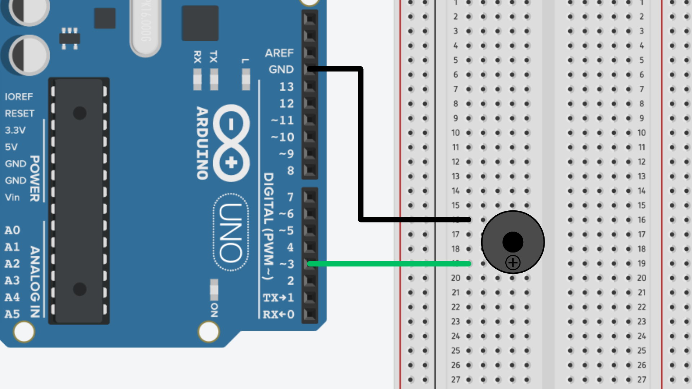

# Buzzers


## Contents
- [Introduction](#introduction)
- [Usage](#usage)
    - [Wiring](#wiring)
    - [Code (Active Buzzer)](#code-active-buzzer)
    - [Code (Passive Buzzer)](#code-passive-buzzer)

## Introduction
Buzzers are a popular output device in Arduino projects, commonly used to produce sound or alerts. They are typically used in alarm systems, notifications, or other scenarios where you need an sonic cue. Buzzers come in two primary types: **active** and **passive**, each with unique features and ways of being controlled. 

Active buzzers have a built-in oscillator, meaning it can make sound as soon as it receives a power signal. It only requires a simple <code>HIGH</code> or <code>LOW</code> signal to turn on or off. 

A passive buzzer does not have an internal oscillator. It needs an external signal, typically a [PWM signal](/examples/Output-Devices/Output-Types/Analog-PWM/README.md), to create a sound. This allows for more flexibility, as you can control the pitch of the tone being generated.

It isn't always visually obvious to tell if a buzzer is passive or active. Instead, you can test the buzzer by running [code for a passive buzzer](#code-passive-buzzer) and see if it can produce different pitches.

## Usage
### Wiring
For both active and passive buzzers, we need to connect the positive leg - which is usually longer and marked with a **+** symbol - to one of the digital pins on the Arduino, and the negative leg - usually shorter - to GND.

For passive buzzers, we need to make sure that we use a [PWM enabled pin](/examples/Output-Devices/Output-Types/Analog-PWM/README.md#configuring-pwm-output-pins). Typically, on the Arduino UNO, pins 3, 5, 6, 9, 10, and 11 are PWM-capable. For smaller boards, you may need to find a pinout diagram from the [Arduino Docs](https://docs.arduino.cc/hardware/) to tell you which pins are PWM enabled.



### Code (Active Buzzer)
For an active buzzer, we just use the `digitalWrite()` function to turn the buzzer on and off.

```cpp
int buzzerPin = 3; // Connect buzzer to pin 3

void setup() {
    pinMode(buzzerPin, OUTPUT); // initialise buzzer as output
}

void loop() {
    digitalWrite(buzzerPin, HIGH);  // Turn on the buzzer
    delay(1000);                    // Wait for 1 second
    digitalWrite(buzzerPin, LOW);   // Turn off the buzzer
    delay(1000);                    // Wait for 1 second
}
```

### Code (Passive Buzzer)
To create a sound with a passive buzzer, we can use the `tone()` function to specify the frequency of the sound.

```cpp
int buzzerPin = 3; // Connect buzzer to pin 3 (~)

void setup() {
    pinMode(buzzerPin, OUTPUT); // initialise buzzer as an output
}

void loop() {
    tone(buzzerPin, 1000);  // Play 1000 Hz tone
    delay(1000);            // Wait for 1 second
    noTone(buzzerPin);      // Stop the tone
    delay(1000);            // Wait for 1 second
}
```