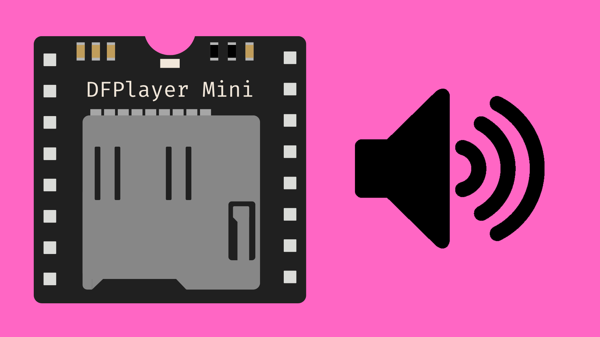
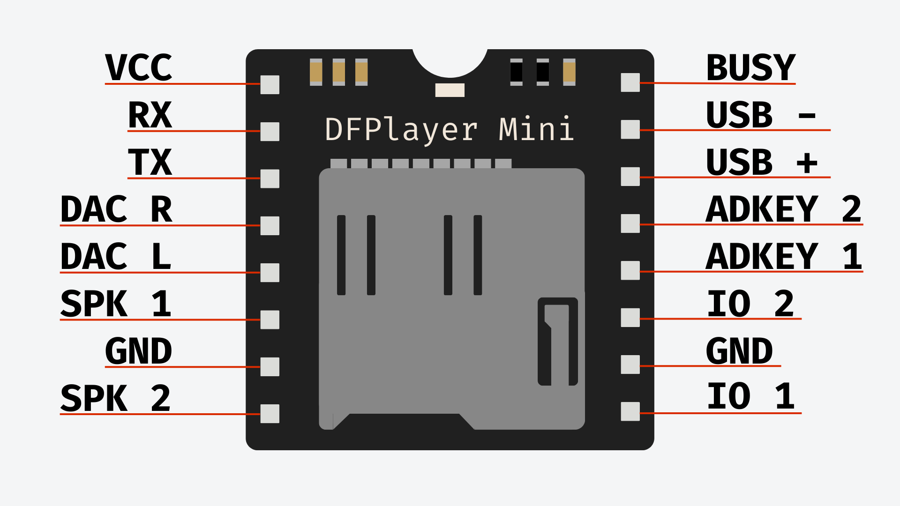
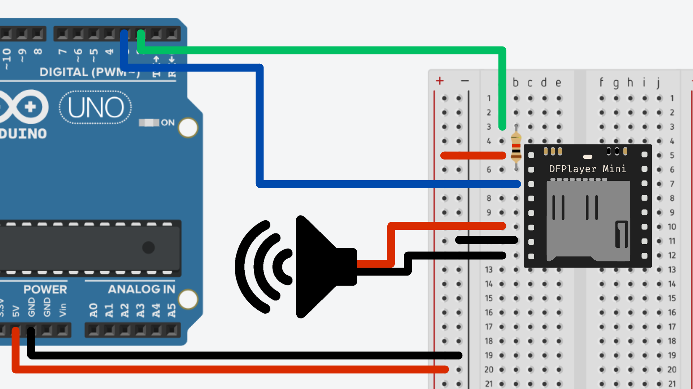

# DFPlayer MP3 Module



## Contents

- [Introduction](#introduction)
- [Hardware](#hardware)
    - [Prepare SD Card](#preparing-an-sd-card)
    - [Pinout](#pinout)
    - [Wiring](#wiring)
- [Code](#code)
    - [DFPlayer Library](#dfplayer-library)
    - [Setup](#setup)
    - [Basic Functions](#basic-functions)


## Introduction

DFPlayer MP3 modules are a popular audio output solution in Arduino projects, commonly used to play sound effects, music, or voice prompts. They are often found in projects such as interactive displays, alarm systems, or assistive devices where recorded audio samples are needed instead of simple tones.

The DFPlayer Mini is a compact MP3 player module with a built-in audio decoder and amplifier. It plays audio files stored on a microSD card and can output sound directly to a small speaker. This means we will need to prepare pre-recorded audio samples as `.mp3` files for the DFPlayer to play.

By using UART (serial) communication, we can send messages from an Arduino to the DFPlayer to tell it what audio file to play and when.


## Hardware

### Preparing an SD Card

Before we can start using the DFPlayer, we need to store the audio files we want it to play on a microSD card. Ideally, we will want to use a microSD with between 2GB-16GB. This will be large enough to store plenty of audio files.

You may need to format your microSD to ensure it will be recognised by the DFPlayer module. Follow these links to find out how to do this on [Windows](https://support-en.sandisk.com/app/answers/detailweb/a_id/9063/~/instructions-to-format-a-memory-card-on-windows) and [macOS](https://support-en.sandisk.com/app/answers/detailweb/a_id/35101/~/steps-to-format-a-memory-card-on-macos) machines.

We can then copy our `.mp3` files to the microSD card using a microSD reader. Make sure that your audio files are definitely `.mp3` and not another format like `.aac`, `.aiff`, `.m4a`, `.flac` etc. We will also need to name the files as three-digit numbers, e.g.:

``` yaml
001.mp3
002.mp3
003.mp3
```

The code we will be using only allows us to find files based on where they are in alphabetical order, so this is the easiest way to order our audio files.

The microSD card should now be ready to go. Make sure to eject it safely to avoid corrupting any data.


### Pinout




### Wiring

| DFPlayer | Arduino |
| -------- | ------- |
| VCC      | 5V      |
| GND      | GND     |
| RX       | 2 (via 1K resistor) |
| TX       | 3       |

| DFPlayer | Speaker   |
| -------- | --------- |
| SPK_1    | + (red)   |
| SPK_2    | - (black) |




## Code

### DFPlayer Library

You will need to install the [DFRobotDFPlayerMini Arduino library](https://github.com/DFRobot/DFRobotDFPlayerMini) from the library manager. You can read about how to install libraries from the library manager [here](/examples/Code/07-Libraries/README.md#installing-libraries).

After installing the library, you can find example sketches by navigating to *File > Examples > DFRobotDFPlayerMini*.

### Setup

``` cpp
#include <DFRobotDFPlayerMini.h>
#include <SoftwareSerial.h>

SoftwareSerial softwareSerial(3, 2);
DFRobotDFPlayerMini dfplayer;

void setup() {
    // Start software serial communication
  softwareSerial.begin(9600);
  
  // Initialise DFPlayer
  if (!dfplayer.begin(softwareSerial, true, true)) { 
      while (true) {} // Do not continue if init fails
  } 
}
```
      

### Basic Functions

``` cpp
dfplayer.volume(10);    // Set volume value (0-30).
dfplayer.volumeUp();    // Volume Up
dfplayer.volumeDown();  // Volume Down
dfplayer.next();        // Play next file
dfplayer.previous();    // Play previous file
dfplayer.play(1);       // Play the 1st mp3 file 
dfplayer.loop(2);       // Loop the 2nd mp3 file
dfplayer.pause();       // Pause
dfplayer.start();       // Start from pause
```

Example loop:

``` cpp
void loop() {
  static unsigned long timer = millis();

  if (millis() - timer > 3000) {
    timer = millis();
    dfplayer.next();  // Play next file every 3 second
  }
}
```