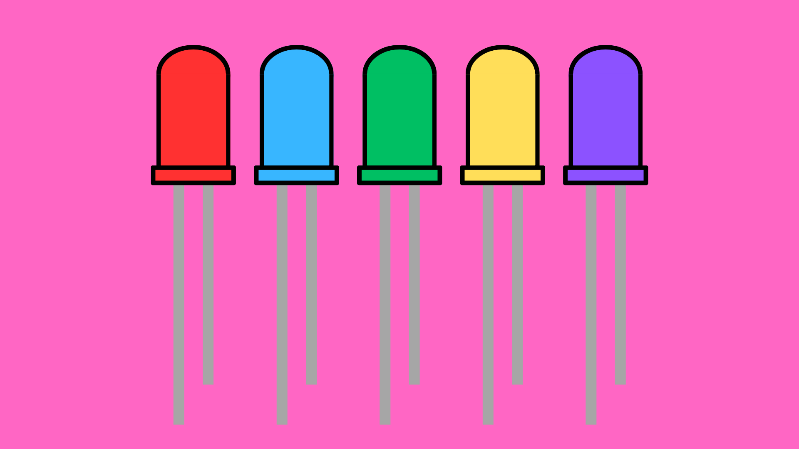
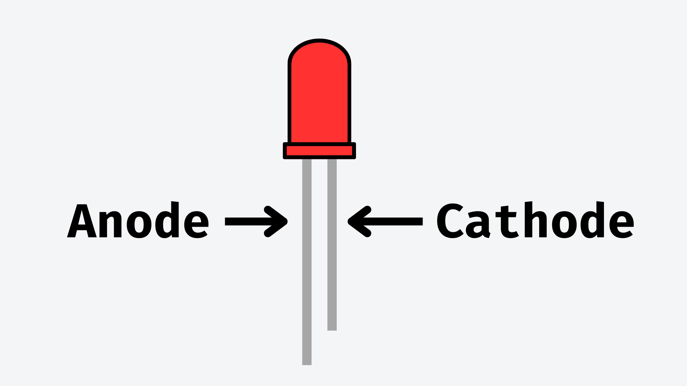
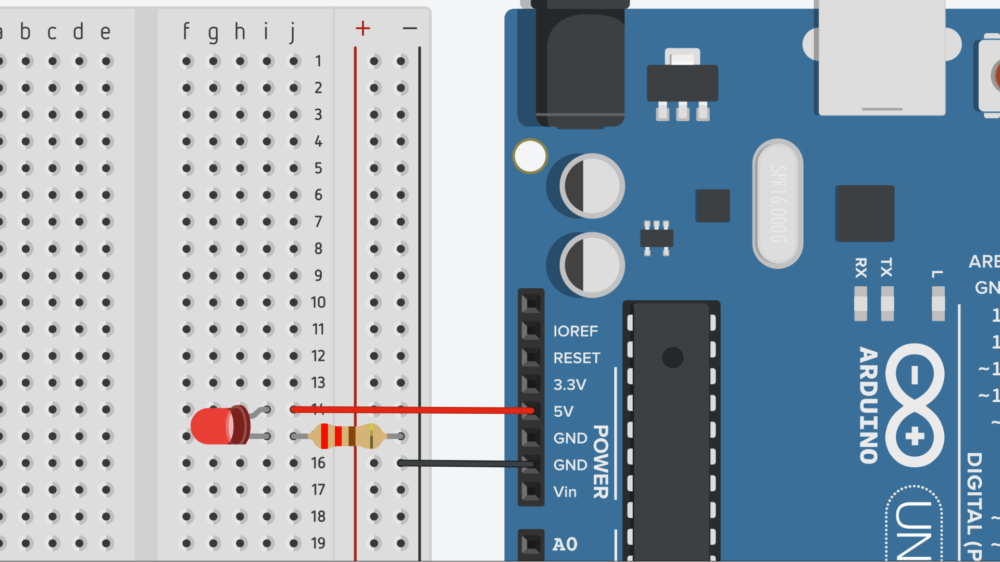
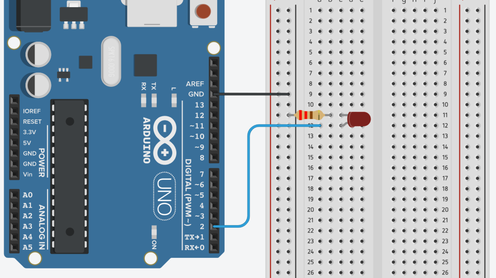
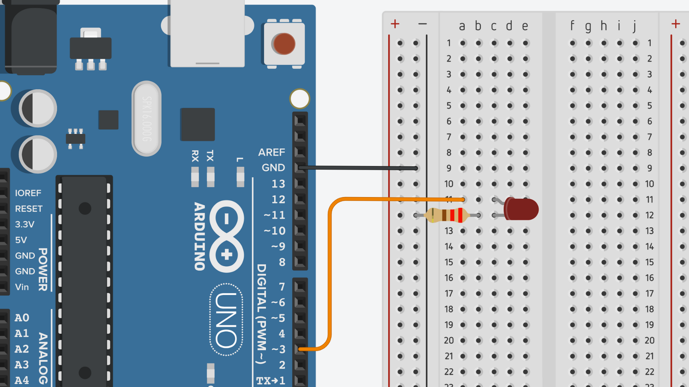

# LEDs: Dual In-Line Package (DIP)



## Contents
- [Introduction](#introduction)
    - [LED Orientation](#led-orientation)
- [Usage](#usage)
    - [Constantly On](#constantly-on)
    - [Turn On/Off](#turn-onoff)
        - [Wiring](#wiring)
        - [Code](#code)
    - [Adjust Brightness](#adjust-brightness)
        - [Wiring](#wiring-1)
        - [Code](#code-1)

## Introduction
Dual In-line Package (DIP) Light-Emitting Diodes (LEDs) are a very common component in beginner Arduino projects. Comprising a diode encased in transparent, rigid plastic, DIP LEDs feature two parallel connection pins protruding from it. The colour of the housing usually indicates what colour of light the LED emits, however, you can get clear LEDs that emit non-white light.

DIP LEDs can come in a variety of colours and generally come in 5mm bulbs - although other sizes are also available. Generally, DIP LEDs are useful for indicator lights, small displays and low-power applications.


### LED Orientation
Before using a DIP LED, it is important to identify which direction it should be placed in a circuit. As with all diodes, LEDs only allow electrical current to flow through them one way. Placing an LED in a circuit the wrong way around would cause it to not light up - but not break.

As such,wou will need to identify which leg on the LED is the Anode and which one is the Cathode. 

- The **Anode** leg is the longer leg on the LED. This will need to be connected to the positive side of the circuit.
- The **Cathode** leg is the shorter leg on the LED. This will need to be connected to the ground side of the circuit.



## Usage
### Constantly On
We can use an Arduino board to power an LED if we want to. We will just need:

- a breadboard.
- a 220Ω resistor.
- some jumper wires.

The resistor is required to lower the voltage to an appropriate level. Without it, the LED would simply burn out and would not work after that.

Simply connect the LED in series with the resistor to the 5V and GND pins on your Arduino board. Make sure that the anode leg is on the positive side of the circuit (closest to 5V) and that the cathode is on the negative side of the circuit (closest to GND).



As this supplies the LED with a constant voltage, the LED will remain on until the connection is broken or Arduino stops supplying power.

### Turn ON/OFF 
To control an LED using Arduino, we need to find a way to control when it receives voltage and when it doesn't. With Arduino, we can do that using the digital I/O pins on most boards.

#### Wiring
To set up the circuit, simply connect the anode end of the LED circuit to one of the digital I/O pins on your Arduino board. Make sure the other side is still connected to GND.



#### Code
For a full example sketch, [click here](LED_Blink/LED_Blink.ino).

In your sketch, you will first need to initialise the LED pin as an output, so we can send electrical signals via that pin. You can do this in the <code>setup()</code> function.

``` cpp
int ledPin = 2;

void setup() {
    pinMode(ledPin, OUTPUT);
}
```

After this, you can turn the LED on and off using <code>digitalWrite()</code>. You will need to pass the pin number as one argument and a signal setting as the other. The signal can either be:

- **HIGH** - sends a 5V (3.3V for some boards) signal out of the defined pin.
- **LOW** - sends a 0V (off) signal out of the defined pin.

If we put two of these statements in the <code>loop()</code> function with a short delay in between each, we can cause the LED to turn on and off repeatedly.

``` cpp
void loop() {
    digitalWrite(ledPin, HIGH);
    delay(1000);

    digitalWrite(ledPin, LOW);
    delay(1000);
}
```

### Adjust Brightness
To adjust the brightness of an LED, you will need to connect it to a PWM pin on your Arduino board. These are marked using a tilde symbol (~). These pins can output (an approximation of) voltages between 0 and the operating voltage of the Arduino board (usually 5V but sometimes 3.3V).

Here are the PWM pins on some common Arduino boards:

|            |                                                   |
| ---------- | ------------------------------------------------- |
|UNO         | 3, 5, 6, 9, 10, 11                                |
|Nano        | 3, 5, 6, 9, 10, 11                                |
|Nano 33 IoT | 	2, 3, 5, 6, 9, 10, 11, 12, A2, A3, A5            |
|Mega        | 2, 3, 4, 5, 6, 7, 8, 9, 10, 11, 12, 13, 44, 45, 46|

#### Wiring
As with the previous examples, you will need to connect the anode end of the circuit to a digital pin on your Arduino board. This time it will also need to be a PWM pin.

Again, make sure that the opposite side of the circuit is connected to GND.



#### Code
For a full example sketch, [click here](LED_Dim/LED_Dim.ino).

In your sketch, you will first need to initialise the LED pin as an output, so we can send electrical signals via that pin. You can do this in the <code>setup()</code> function.

``` cpp
int ledPin = 3;

void setup() {
    pinMode(ledPin, OUTPUT);
}
```

After this, you can change the brightness of the LED using the <code>analogWrite()</code> function. This function requires two input arguments:

- the pin number of the pin connected to the LED (must be a PWM pin).
- a value between 0 and 255 - where 0 is 0V and 255 is 5V (or 3.3.V for some boards).

``` cpp
analogWrite(ledPin, 100);
```