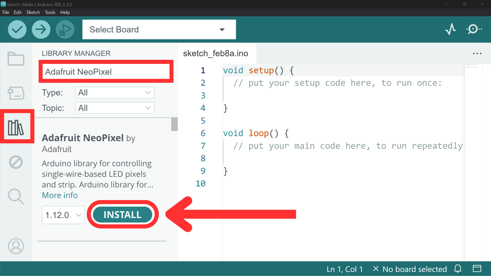

# LEDs: NeoPixel


## Contents
- [Introduction](#introduction)
- [Wiring](#wiring)
- [Library](#adafruit-neopixel-library)
    - [Install](#installing)
    - [Adafruit_NeoPixel class](#class-methods)
        - [Setup](#setup)
        - [Display Changes](#displaying-changes)
        - [Change Colour](#changing-colours)
        - [Set Brightness](#setting-brightness)

## Introduction
"NeoPixel" refers to a line of LED products from the hardware manufacturer [Adafruit](https://www.adafruit.com/) that utilize the WS2812 programmable RGB LED. These LEDs consist of a red, green and blue components as well as integrated circuitry for mixing colours.

The integrated control circuitry on each “pixel” allows each individual pixel to be independently controlled for precise color and brightness adjustments. This allows you to create animations and colour patterns whilst only utilising one digital pin on the Arduino.

NeoPixels come in various forms including individual pixel modules, strips, rings, matrices, sticks, bars, and panels to suit different project requirements and applications. For these examples we will look at NeoPixel rings, but the code and wiring should apply to any NeoPixel product.

## Wiring
Wires will need to be soldered to the pins on the NeoPixel in order to use it with Arduino. If you have a NeoPixel that requires wires to be soldered to it, please contact DigiDevECA@ed.ac.uk to arrange a technician to do this for you.

On any NeoPixel product, you will find 4 pins: 

- **PWR/5V**
- **GND**
- **Data In**
- **Data Out**
 
**PWR** and **GND** are for powering the NeoPixel can be connected to 5V and GND on the Arduino respectively. 

**Data In** is where the NeoPixel receives the signal from the Arduino telling it what colour and brightness each pixel should be. This can be connected to any of the PWM pins on your Arduino. These are the pins marked with a tilde (~).

**Data out** is where you can connected multiple NeoPixel products together. By connecting the Data out of one NeoPixel to the Data in of another, you can effectively combine them into one device, controllable using one Arduino pin. For most cases however, you shouldn't need to do this.

For example, you may choose to connect your NeoPixel to your Arduino board using the following connections:

| NeoPixel | Arduino           |
| -------- | ----------------- |
| GND      | GND               |
| PWR      | 5V                |
| Data In  | PWM Pin (e.g. D3) |
| Data Out | -                 |

## Adafruit NeoPixel Library
### Installing


To use NeoPixel with Arduino, you must first install the [Adafruit NeoPixel Arduino library](https://github.com/adafruit/Adafruit_NeoPixel). This will give us all of the objects and functions we need to operate a NeoPixel using code.

The NeoPixel library also provides example sketches that we can use straight away. If you navigate to *File → Examples → Adafruit NeoPixel* you should find some useful sketches to try. You can also find a [blink example](NeoPixel_Blink/NeoPixel_Blink.ino) and a [moving pixel](NeoPixel_Moving/NeoPixel_Moving.ino) example in this repo.

If you are unsure how to install a library, you can read more on [this page](/examples/Code/07-Libraries/README.md).

### Class Methods
Installing and including the Adafruit NeoPixel library provides us with a class definition called <code>Adafruit_NeoPixel</code>. This class contains all the methods we will need for controlling NeoPixel LEDs from our code.

#### Setup
To use the <code>Adafruit_NeoPixel</code> class - and methods within it - we first need to include the NeoPixel library and create an instance of the class. We can give this instance a name of our choosing. For simplicity and readability, we will refer to it as <code>pixels</code> for the rest of this page, but bear in mind this can be called anything you want.

When setting up this object, we need to give it some constructor arguments:

- **pixel count** - the number of pixels on your NeoPixel.
- **pixel pin** - the PWM pin on the Arduino board that the NeoPixel is connected to.
- **pixel “mode”** - this in practically all cases will be  <code>NEO_GRB + NEO_KHZ800</code>.

``` cpp
#include <Adafruit_NeoPixel.h>

int numberOfPixels = 12;
int dataPin = 6;
Adafruit_NeoPixel pixels(numberOfPixels, dataPin, NEO_GRB + NEO_KHZ800);
```

We will also *always* need to use the <code>pixels.begin()</code> method in the <code>setup()</code> function to initialise the NeoPixel class.

``` cpp
void setup() {
    pixels.begin();
}
```

#### Displaying Changes
We will look at methods for setting the colour shortly, however, it is very important to understand that no matter what changes we make to the colour(s) of the NeoPixel LEDs, they will not be displayed until we call the <code>pixels.show()</code> method.

This method will display any changes we have made since it was last called. This allows us to make multiple changes to the colour of one or multiple LEDs in our code before finally displaying them.

``` cpp
pixels.show();
```

#### Changing Colour(s)
We have two main options for changing the colour of NeoPixel LEDs:

- <code>pixels.setPixelColor()</code> - sets the colour of one pixel at a time.
- <code>pixels.fill()</code> - allows us to change multiple LEDs at once.

The <code>pixels.setPixelColor()</code> option is useful for when we want finer control of each individual pixel's colour. To use it, we simply need to pass th following parameters and input arguments:

- **index** - the index of the pixel you want to address.
- **red amount** - amount of red light (0-255).
- **green amount** - amount of green light (0-255).
- **blue amount** - amount of blue light (0-255).

It is important to note that the indexing starts from 0. This means the first pixel will have the index 0, the second pixel will have the index 1, and so forth.

You will also need to remember to call <code>pixels.show()</code> to display the changes.

``` cpp
// index, red, green, blue
pixels.setPixelColor(0, 255, 0, 0); // set the first pixel red
pixels.show();
```

The second option for changing the pixels' colours is <code>pixels.fill()</code>. This will change the colour of multiple pixels at once. You will need to pass the following parameters as input arguments:

- **colour** - the hex value of the colour you would like to use. 
- **start index** - the index of the pixel you want to start from. 
- **count** - the number of pixels you want to address. 

The **colour** argument needs to be input as a hex value of the colour you want the pixels to emit. This can be calculated using the class method <code>pixels.Color()</code> and stored as a variable of type <code>uint32_t</code>. For example:

``` cpp
// Get hex value of red = 50, green = 120, blue = 75
uint32_t colourValue = pixels.Color(50, 120, 75);
​
// Change the first 12 pixels to the colour value
pixels.fill(colourValue, 0, 12);
pixels.show();
```

Lastly, we can choose to erase any colour data from the pixels using <code>pixels.clear()</code>. This will set all of the LEDs on the NeoPixel to "off". Agai we will need to call <code>pixels.show()</code> to display this change.

``` cpp
pixels.clear(); // turn all pixels off
pixels.show();
```

#### Setting Brightness
Once we have set a colour, we can set the brightness of the LEDs on the NeoPixel using <code>pixels.setBrightness()</code>. We simply need to pass a value between 0 and 255 as an input argument. 

Here, 0 is equivalent to no brightness and 255 is equivalent to full brightness.

``` cpp
// Set first 12 pixels to cyan
pixels.fill(pixels.Color(0, 255, 255), 0, 12);
​
// Set brightness to 150
pixels.setBrightness(150);
​
// Display changes
pixels.show();
```