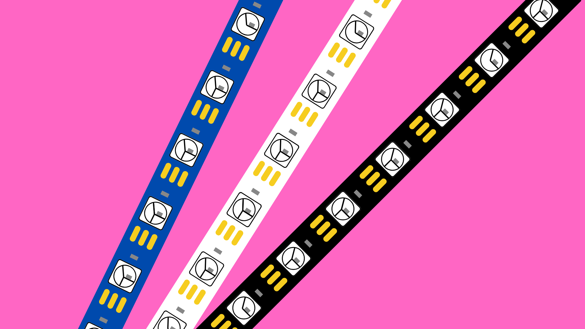
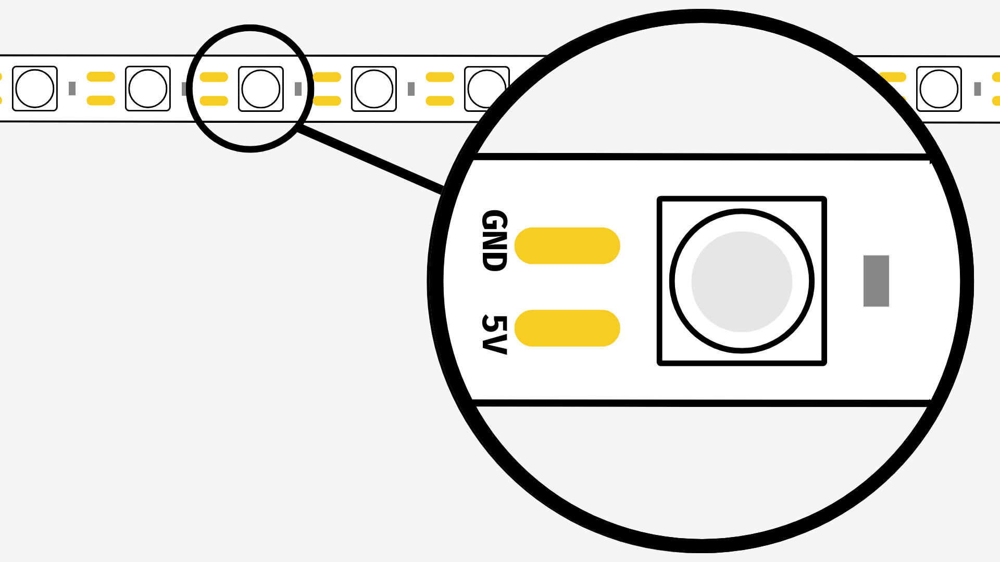
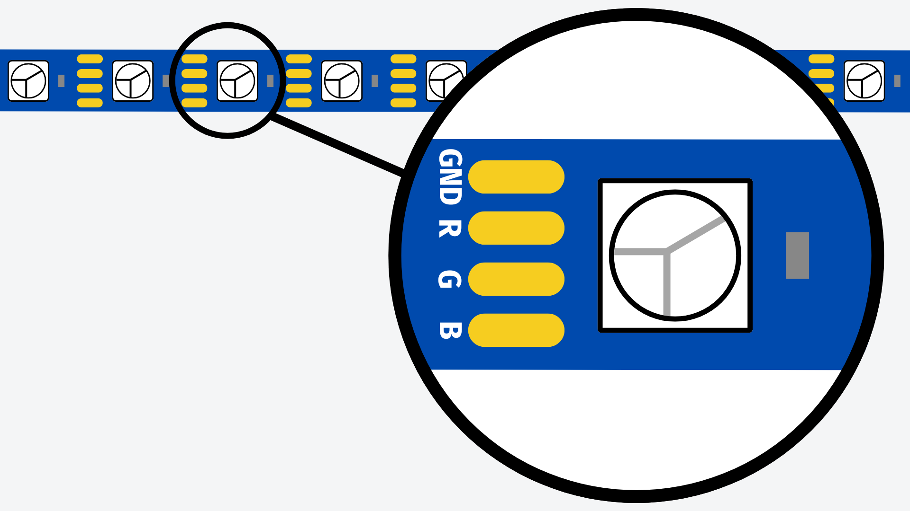
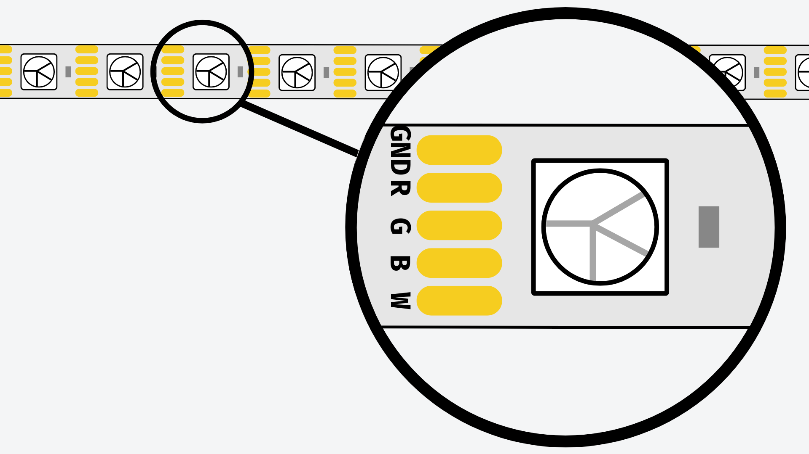
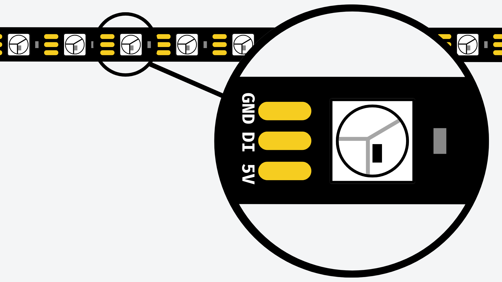
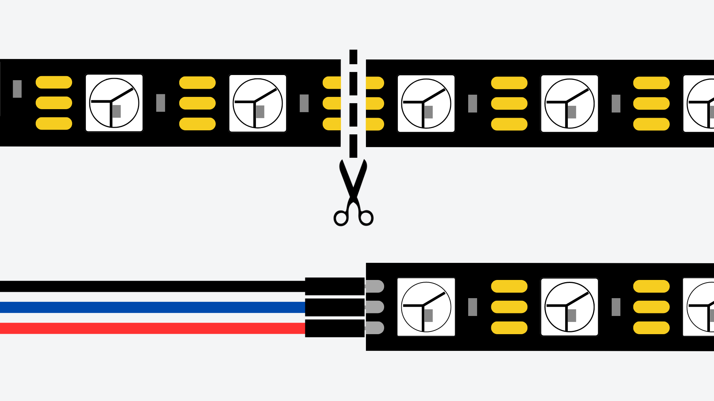
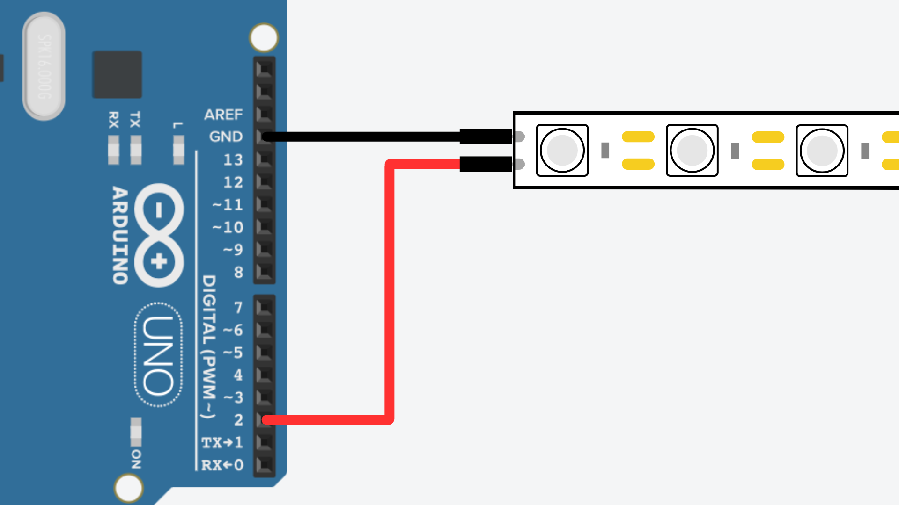
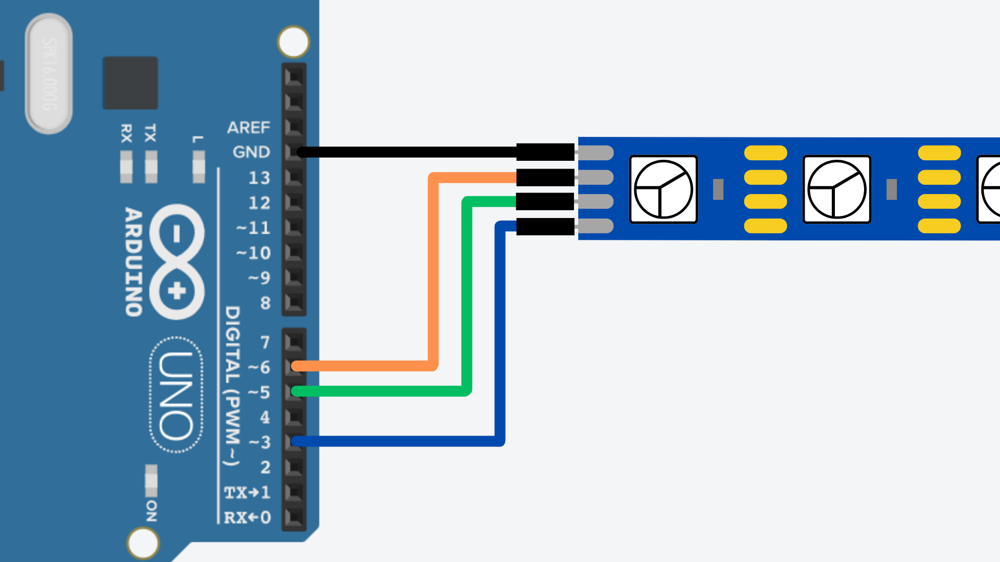
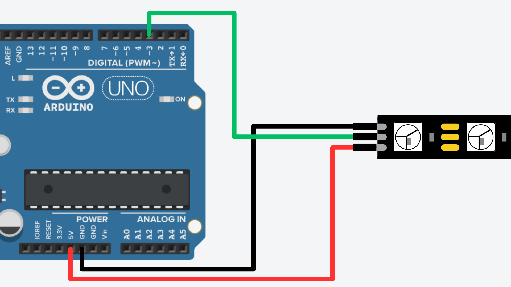
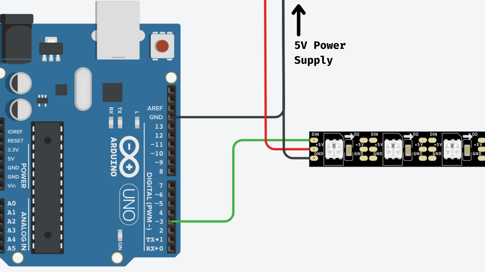

# LEDs: Strip LEDs

## Contents
- [Introduction](#introduction)
- [Types](#types)
    - [Single Colour](#single-colour-led-strips)
    - [RGB](#rgb-led-strips)
    - [RGBW](#rgbw)
    - [Addressable](#addressable-led-strips)
- [Controlling LED Strips](#controlling-led-strips-with-arduino)
    - [Preparation](#preparing-the-led-strip)
    - [Single Colour](#single-colour-strips)
    - [RGB/RGBW](#rgbrgbw-strips)
    - [Addressable](#addressable-strips)
- [Powering LED Strips](#powering-led-strips)
    - [Power Supplies](#what-power-supply-do-i-need)
    - [Wiring](#wiring)

## Introduction
An LED strip is essentially just multiple small LEDs mounted on a flexible circuit board, commonly referred to as a "strip". LED strips also quite often come with a peelable sticker back to easily mount them to surfaces.

These strips have become a popular choice for electronics projects requiring lighting solutions due to their physical flexibility. This allows them to be easily mounted onto surfaces that might otherwise pose challenges for traditional lighting fixtures.

LED strips are available in various types, sizes, colors, pixel densities, and voltage ratings. Understanding the different types of LED strips available is essential for selecting the most suitable option for your project.

In this guide, we will explore the diverse range of LED strips available and provide insights into how to wire and control them using an Arduino board.

## Types
As previously mentioned, LED strips can come in a variety of different types for a variety of different uses. When you are looking into acquiring an LED strip for a project, you should take note of three things:

- **Voltage Rating** - this should be 5V when working with most Arduino boards*.
- **Pixels per Meter** - this will tell you the density of LEDs on the strip.
- **LED Type**.

**Some Arduino boards have an operating voltage of 3.3V. Be aware of this when choosing your LEDs.* 

The LED type will determine what you can do with the strip and how to control it. Here is an overview of some of the main types of LED strip lighting that you will likely see.

### Single-Colour LED Strips 

Single-colour LED strips - as the name suggests - can emit a single colour of light when powered.

You can tell a single-colour LED strip apart from other types by the number of solder pads it has on it. Single colour LED strips will have two solder pads: 

- **GND** - for the ground connection. 
- **+5V** - for 5V power connection.

This type of LED strip works almost exactly the same way as DIP LEDs, except that the resistor required for a DIP LED is usually already soldered onto the LED strip, so you don't need to include one in your circuit.

Single-colour LEDs offer quite limited functionality; however, they are usually the cheapest option for strip lighting and very easy to use. 

### RGB LED Strips

RGB (red-green-blue) LED strips can emit a mixture of red, green, and blue light. 

Each pixel on the LED strip contains a small red, green, and blue LED within it. By controlling the brightness of each colour, you can mix them to create a range of different colours.

Non-addressable RGB LED strips (we will discuss addressable LEDs later) can be identified by their four solder pads on each section of strip. These solder pads generally correspond to:

- **GND** - for the ground connection.
- **R** - to send voltage to the red component.
- **G** - to send voltage to the green component.
- **B** - to send voltage to the blue component.

This particular RGB configuration is known as “common cathode” as all three LEDs share a ground connection. RGB LEDs can also come in “common anode” varieties, where they share the same power connection. It is recommended that you use common cathode RGB LEDs as they are easier to program using Arduino.

### RGBW

RGBW (red-green-blue-white) LED strips can emit a mixture of red, green, blue and white light.

As with RGB LEDs, each pixel on the LED strip contains a red, green, and blue LED. RGBW LED pixels also contain a white LED component - often a “warm” white light.

The addition of a warm white LED allows the strip to display more precise colours and a fuller lighting effect. The trade off is that they are usually more expensive than standard RGB LEDs.

Non-addressable RGBW LED strips (we will discuss addressable LEDs in the next section) can be identified by their five solder pads on each section of strip. These solder pads correspond to:

- **GND** - for the ground connection.
- **R** - to send voltage to the red component.
- **G** - to send voltage to the green component.
- **B** - to send voltage to the blue component.
- **W** - to send voltage to the white component.

### Addressable LED Strips

All of the previous LED types we have looked at can be controlled with an Arduino in the same way as when using DIP LEDs. You can connect the GND solder pad to GND on the Arduino and connect the red, green, blue or white solder pads to the Arduino's digital pins.

One disadvantage of these LED strips is that you can only illuminate or turn off all the LEDs/pixels on the strip simultaneously. The RGB and RGBW strips also require 3 and 4 pins on the Arduino to control them properly, and getting the exact mixture of colours that you want can be tricky to do in code.

Addressable LED strips usually emit red, green, and blue light - although they can also come in RGBW varieties. Each pixel on the LED strip contains a red, green, and blue LED as well as a small microcontroller to individually control each pixel's colour and brightness.

This means we can control each individual pixel on the LED strip independently from the other pixels on the strip. They can do this by receiving a control signal from the Arduino, rather than a on/off signal used for standard LEDs.

You can identify addressable LED strips by their three solder pads on each section of strip. These solder pads correspond to:

- **GND** - for the ground connection.
- **5V** - for the power connection.
- **Data In** - for the control signal.

Common addressable LED strips you might come across include ws2812 and ws2811 LED strips. You may also be aware of Adafruit's range of [NeoPixel](/examples/Output-Devices/LED-NeoPixel/README.md) products which also use type of LED.

## Controlling LED Strips with Arduino
How you control your LED strip will depend on the type of LED strip you have (see the [previous section](#types) for an overview of LED strip types). 

Most Arduino boards can generally power up to about 20 RGB pixels. If your LED strip contains more than this, you will need to use some sort of external power supply to provide enough current to power the LEDs. We will look at power options in the [next section](#powering-led-strips).

For this section, we will look at how to use an Arduino to control an LED strip - i.e. change its colour or brightness.

### Preparing the LED Strip
The first thing you will need to do is prepare the LED strip for use with an Arduino board. 

LED strips can be cut to the desired size with scissors. Make sure to cut the strip across the solder pads. 

After this, you will need to solder jumper wires to the solder pads so you can connect them to the pins on your Arduino. If you do not have any soldering experience, please contact a technician to do this for you. 

You can contact a technician by emailing DigiDevECA@ed.ac.uk.

There are usually small arrows on addressable LED strips that tell you the direction of the input signal. We want the input signal to flow from the Arduino, into the LED strip. As such, make sure the jumper wires are soldered to the input side of the LED strip.

### Single Colour Strips
Single-colour LED strips can be controlled in the same way as standard DIP LEDs. Simply connect the GND pad on the strip to GND on the Arduino, and the 5V pad on the strip to one of the Arduino's digital pins.

We don't need to use a resistor in this circuit as there are resistors already soldered to the LED strip. For an explanation and examples of how to control single-colour LEDs see the page on [DIP LEDs](/examples/Output-Devices/LED-DIP/README.md).

### RGB/RGBW Strips
RGB and RGBW LED strips can be thought of as three (four for RGBW) individual single-colour LED strips in one. As such, when wiring an RGB LED strip, you should connect the common GND pad to GND on the Arduino, and the red, green, and blue (and white if using RGBW) pads to separate PWM pins.

It is important to connect the power pads PWM pins on the Arduino, as this allows us to control the brightness of each colour. As a reminder, PWM pins are marked with a tilde ~ symbol on the Arduino board or pinout diagram.

From here, you can control the brightness of each LED colour using the <code>analogWrite()</code> function in your code. For an explanation and examples of how to do this, see the page on [DIP LEDs - in particular the section on Dimming an LED](/examples/Output-Devices/LED-DIP/README.md#adjust-brightness).

By changing the brightnesses of the red, green, and blue LED components, you can create a range of different colours. You can even find the RGB values of a specific colour by using an online RGB colour picker - like [this one](https://htmlcolorcodes.com/color-picker/).

### Addressable Strips
Addressable LED strips work slightly differently to non-addressable LEDs - like the previous examples. As mentioned in the previous section, addressable LEDs can be controlled by sending them a data signal to change the RGB values of each individual pixel.

The exact mechanism for how this works can be quite complex. Luckily, we can use pre-written libraries that can abstract away the more technical operations, leaving us with simple functions for controlling colour and brightness. 

When wiring an addressable LED strip, you should connect the pads like this:

- GND pad → GND pin
- 5V pad → 5V pin
- Data In pad → any PWM pin on the Arduino

It is important that the data input pad on the LED strip is connected to a PWM pin on the Arduino. As a reminder, PWM pins are marked with a tilde ~ symbol on the Arduino board or pinout diagram.

Once you have wired your LED strip, you can use the Adafruit NeoPixel library to control the LEDs in your code. For an explanation of how the library works, and for code examples, see the page on [Adafruit NeoPixels](/examples/Output-Devices/LED-NeoPixel/README.md).

## Powering LED Strips
In this section we will look at how to power addressable LED strips using an external power supply. 

If you are looking to use an external power supply to power non-addressable LEDs, this may require the use of some other electrical components. If need advice on powering large non-addressable LED strips, please contact a technician by emailing DigiDevECA@ed.ac.uk.

### Do I Need an External Power Supply?
Most Arduino boards (although not all) have an operating voltage of 5V. This means that the digital pins on these Arduino boards can output a 5V electrical signal. Although the LED strips we use with Arduino are rated for 5V, they also require an amount of electrical current that depends on the number of LEDs we want to use. 

An Arduino is not a reliable power supply and should not be used to power components that draw a large amount of electrical current - like lots of LEDs. The Arduino board should be thought of as the controller; to be used to control the brightness and colour of the LEDs. Power should ideally come from an external power supply if possible.

That being said, an Arduino UNO board can usually handle around 20 RGB LEDs at full brightness. Beyond this, you will most likely need a power supply to get your LED strip working reliably. 

### What Power Supply Do I Need?
To decide which power supply you will need for your LED strip, you will need to calculate how much current it requires. A useful rule of thumb is to account for about 50mA per RGB pixel on an LED strip. This means that 30 RGB LEDs at full brightness can draw a current of about 1.5A. 

Bear in mind that this number represents the current needed to power 30 RGB LEDs at full brightness. If you don't run them all at full brightness, they will not draw this much current. 

When it comes to choosing a power supply, make sure it:

- is a DC power supply.
- has an output of 5V (DC).
- it can provide a high enough current to power all of the pixels on your LED strip (i.e. 0.05A per pixel). 
 
### Wiring
Once you have sourced a suitable power supply, you can connect your LED strip to the Arduino and power supply like so:

Connect the 5V and ground connections on the power supply to the 5V and GND connections on the LED strip. You can then connect the Data In connection to one of the PWM pins on your Arduino board.

It is important to also connect the ground connection on the power supply to a GND pin on the Arduino. This establishes a common reference voltage between the two devices. The LED strip will get its voltage from the power supply so you do not need to connect the 5V on the Arduino.

The connections should be as follows:

| Arduino |	LED Strip |	Power Supply |
| ------- | --------- | ------------ |
| GND	  | GND       |	GND          |
| -	      | 5V        | 5V           |
| PWM pin | Data In   |	-            |

Once you have wired your circuit, you can use the Adafruit NeoPixel library to control the colours and brightnesses of each pixel on the LED strip. For examples of how to do this, see the [page on Adafruit NeoPixel](/examples/Output-Devices/LED-NeoPixel/README.md).