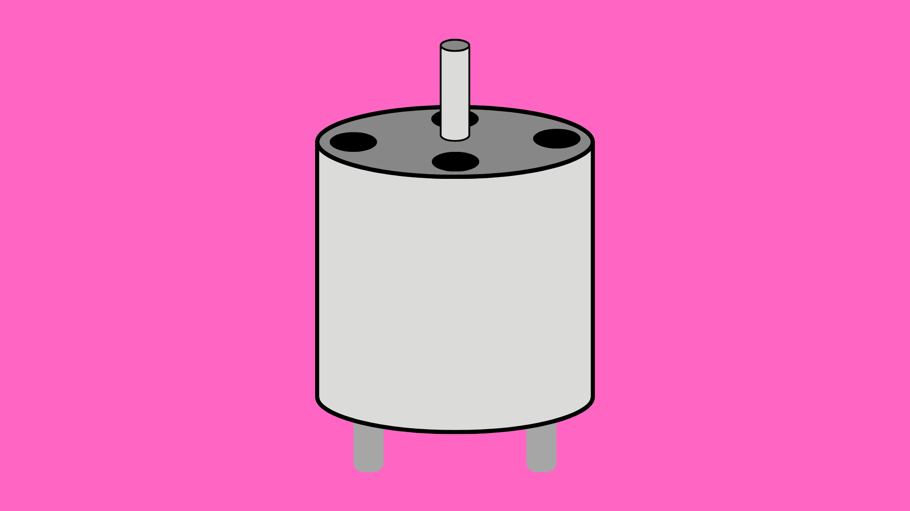
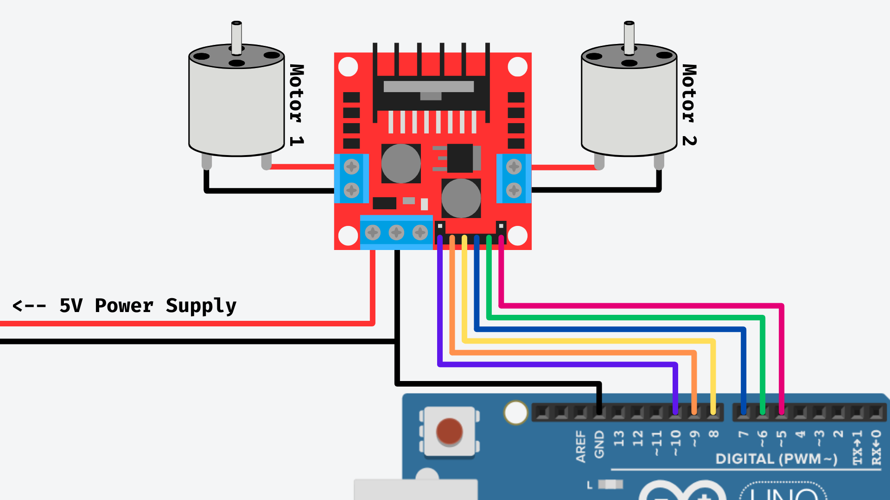

# DC Motors



## Contents
- [Introduction](#introduction)
- [Usage](#usage)
    - [Wiring](#wiring)
    - [Code](#code)

## Introduction
A DC motor uses direct current to generate rotational motion. Unlike [servo](/examples/Output-Devices/Motor-Servo/README.md) and [stepper](/examples/Output-Devices/Motor-Stepper/README.md) motors, DC motors rotate continuously when powered, and when the polarity of the power supply is flipped (i.e. we swap the positive and negative wires) the motor will spin in the opposite direction. The speed of a DC motor can also be controlled by varying the amount of voltage it receives. 

For controlling a DC motor with Arduino, we typically use an H-bridge motor driver, which allows us to control both the amount of voltage (using pulse-width modulation) and the polarity of the power being supplied to the motor. This allows the Arduino to control both the speed and direction of the motor. The driver we will look at here is the L298N dual H-Bridge motor driver, which can control two DC motors independently.

**Important:** Most DC motors will draw more current than the pins on the Arduino can handle. Connecting a DC motor to one of the pins on an Arduino can burn out the pin, and potentially the whole Arduino. Make sure that you use a separate power supply to power the motor(s).

## Usage
### Wiring

You will need:

- Arduino Uno.
- L298N Motor Driver.
- 5V DC Motors (1 or 2).
- 5V Power Supply (min 1A).
- Jumper Wires (approx. 8-10).

To connect a DC motor to an Arduino using the L298N motor driver, you need to make the following connections:

- **ENA** - controls the speed of Motor 1 using a PWM pin on the Arduino.
- **ENB** - controls the speed of Motor 2 using a PWM pin on the Arduino.
- **IN1** & **IN2** - control the direction of Motor 1.
- **IN3** & **IN4** - control the direction of Motor 2.

If you only want to control one motor, you can ignore the ENB, IN3 and IN4 connections.

**Important:** You will need a 5V power supply that can supply enough current for the two motors you are using. 5V motors typically consume 0.4A of current, so for two motors you will need at least 0.8A (ideally 1A). 

**Very Important:** DO NOT connect the motors directly to the Arduino, this will damage the Arduino and potentially break it completely.


| L298N | Arduino | 5V Power Supply | Motor 1    | Motor 2 (Optional) |
| ----- | ------- | --------------- | ---------- | ------------------ |
| ENA   | 10 ~    | -               | -          | -                  |
| IN1   | 9 ~     | -               | -          | -                  |
| IN2   | 8       | -               | -          | -                  |
| IN3   | 7       | -               | -          | -                  |
| IN4   | 6 ~     | -               | -          | -                  |
| ENB   | 5  ~    | -               | -          | -                  |
| GND   | GND     | GND (-)         |  -         | -                  |
| VS    | -       | 5V (+)          |  -         |  -                 |
| OUT1  | -       | -               | Terminal 1 | -                  |
| OUT2  | -       | -               | Terminal 2 | -                  |
| OUT3  | -       | -               | -          | Terminal 1         |
| OUT4  | -       | -               | -          | Terminal 2         |



### Code

See the full sketch [here](./L298N_DriverDC_Example/L298N_DriverDC_Example.ino).

The first thing we will need to do is initialise all of the pins as outputs. This will allow the Arduino to send control signals to the L298N driver board:

```cpp
// Motor 1 Pins
int enA = 10;  // PWM pin for speed control
int in1 = 9;
int in2 = 8;

// Motor 2 Pins
int enB = 7;  // PWM pin for speed control
int in3 = 6;
int in4 = 5;

void setup() {
  // Set the motor control pins as outputs
  pinMode(enA, OUTPUT);
  pinMode(in1, OUTPUT);
  pinMode(in2, OUTPUT);
  
  pinMode(enB, OUTPUT);
  pinMode(in3, OUTPUT);
  pinMode(in4, OUTPUT);
}
```

We can then control the direction of Motor 1 using <code>in1</code> and <code>in2</code>. By setting <code>in1</code> to <code>HIGH</code> and <code>in2</code> to <code>LOW</code>, we are setting the direction of Motor 1 to its forward position.

Similarly, by setting <code>in3</code> to <code>HIGH</code> and <code>in4</code> to <code>LOW</code>, we can set the direction of Motor 2 to its forward position.

``` cpp
// Motor 1 - forward position
digitalWrite(in1, HIGH);
digitalWrite(in2, LOW);

// Motor 2 - forward position
digitalWrite(in3, HIGH);
digitalWrite(in4, LOW);
```

To set the motors to go backwards, we simply have to reverse these settings:

``` cpp
// Motor 1 - backward position
digitalWrite(in1, LOW);
digitalWrite(in2, HIGH);

// Motor 2 - backward position
digitalWrite(in3, LOW);
digitalWrite(in4, HIGH);
```

**Note**: the motor will not move at all yet as we have not set the speed.

To set the speed of each motor, we can use <code>analogWrite()</code> to send a PWM signal to ENA and ENB. Sending a value of <code>0</code> will cause the motor to stop, and a value of <code>255</code> will cause the motor to move at full-speed. We can use the values between 0-255 to set the speed in between full-speed and off.

``` cpp
analogWrite(enA, 255); // Motor 1 full-speed ahead!
analogWrite(enB, 112); // Motor 2 approx. half-speed

delay(2000); // Will keep the motors on for 2 seconds

// Stop both motors
analogWrite(enA, 0);
analogWrite(enB, 0);
```


