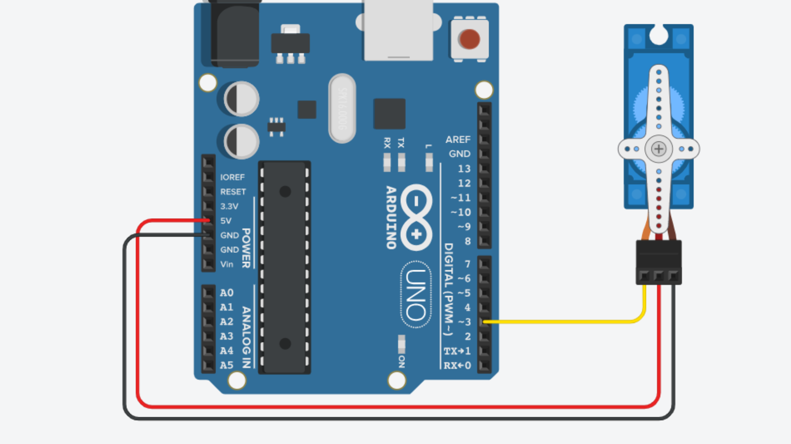

# Motors: Servo


## Contents
- [Introduction](#introduction)
- [Usage](#usage)
    - [Wiring](#wiring)
    - [Code](#code)

## Introduction
Servo motors are a type of motor that use internal electronics and mechanical engineers to precise control. This mean that they are often used in applications such as robotics and automation.

Unlike standard DC motors, servos don't rotate constantly. Instead signals are sent to tell the motor exactly how far to rotate. Typically, servos can only rotate 180°, although ‘open-loop’ servos do exist which allow for 360° of rotation.

To control a servo using Arduino, we need to send a pulse-width modulation signal from one of the PWM pins on the Arduino. The exact value we need to send to the motor can be calculated by functions given to us in the Servo Arduino library, which comes preinstalled with Arduino.

## Usage
### Wiring
To connect a servo motor to an Arduino board, you will need to know which wire on the servo is what.

There will almost always be three wires on a servo motor:

- **GND** - usually black or brown wire.
- **PWR** - usually red wire.
- **Data** - usually orange or yellow wire.

We can then connect these wires to our Arduino board, ensuring the following connections:

| Servo | Arduino |
| ----- | ------- |
| GND   | GND     |
| PWR   | 5V      |
| Data  | PWM Pin |



### Code
For a full example sketch, [click here](Servo_Sweep/Servo_Sweep.ino).

To control a servo from the project code, you will first need to include the servo library at the top of your sketch. You can also store the data pin number as a variable to use later.

Lastly, we will also need to create an instance of the <code>Servo</code> class provided to us by the servo library. This will contain the methods needed for controlling the servo. You can call this instance anything you want to, but for simplicity and readability, We will call it <code>myServo</code> for the rest of this page.  

``` cpp
#include <Servo.h>

int servoPin = 3;

Servo myServo;
```

Inside the <code>setup()</code> function, we can tell the servo class instance what pin we are using to communicate with the servo.

``` cpp
void setup() {
    myServo.attach(servoPin);
}
```

Now all we need to do to move the servo is call the method <code>myServo.write()</code>. This will move the servo to a defined position - usually between 0 and 180 degrees.

``` cpp
// 0 degrees 
myServo.write(0); 
delay(1000);
  
// 90 degrees 
myServo.write(90); 
delay(1000); 
```