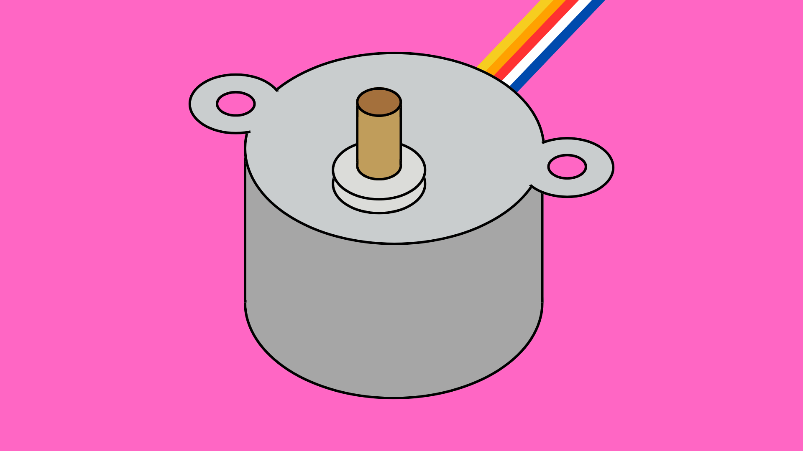
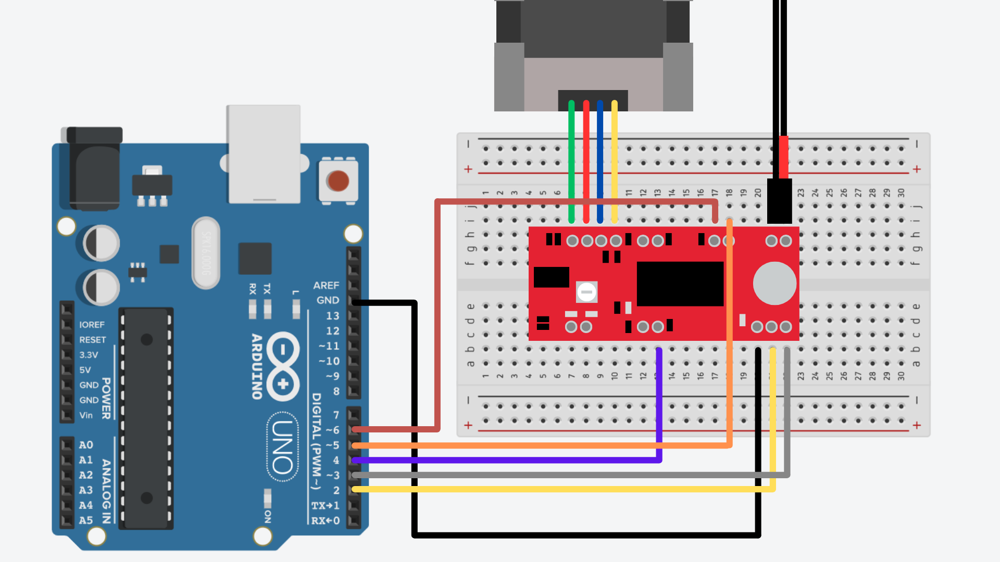

# Motors: Stepper



## Contents

- [Introduction](#introduction)
- [Sparkfun EasyDriver](#sparkfun-easydriver)
    - [Wiring](#wiring)
    - [Code](#code)

## Introduction
Stepper motors are a type of brushless DC motor that are used for operations that require precise control of when/where the motor starts and stops.  

Unlike a standard DC motor, stepper motors do not only rotate continuously in the forward or reverse direction. As the name implies, the stepper motor moves in steps. The motor can even stop at a specific step and hold its position. For these reasons, stepper motors are used more high precision applications, such as 3D printers and scanning equipment. 

Stepper motors all require a driver that translates instructions from an Arduino (or other controller) into electrical pulses that control the motor.  ‘Hybrid’ stepper motors are the most commonly used type of stepper motor and require a separate stepper motor driver board to operate. Be aware however, not all drivers are compatible with all motors. Refer to the manufacturer's instructions before buying a driver board.

## Sparkfun EasyDriver
Stepper motor kits are available through [Bookit](https://bookit.eca.ed.ac.uk/av/wizard/resourcedetail.aspx?id=10689) that include a stepper motor, 12V power supply and a Sparkfun EasyDriver. For this example, we will look at how to set up this kit and control the stepper motor using an Arduino.

We will be following the instructions laid out in this [Sparkfun guide](https://learn.sparkfun.com/tutorials/easy-driver-hook-up-guide/all), so feel free to look at this guide for some more background information on the EasyDriver.

If you are using a different motor and driver board, this wiring and code may not work for you and you may need to consult a separate guide for your specific driver.

### Wiring
You should wire your Arduino, motor, and driver as shown below. 

**Important:** Do not connect or disconnect the stepper motor while the power supply is connected. This may damage or break the driver and/or motor.



The connections should be as follows:

| Arduino	| Sparkfun EasyDriver	| Stepper Motor	| Power Supply |
| --------- | --------------------- | ------------- | ------------ |
| GND   	| GND (Next to STEP)    | -             | -            |
| D2        | STEP	                | -	            | -            |
| D3        | DIR	                | -	            | -            |
| D4        | MS1	                | -	            | -            |
| D5        | MS2	                | -	            | -            |
| D6        | ENABLE	            | -	            | -            |
| -         | A+	                | Green Wire	| -            |
| -         | A-	                | Red Wire	    | -            |
| -         | B+	                | Blue Wire	    | -            |
| -         | B-                    | Yellow Wire	| -            |
| -         | GND (PWR IN)	        | -	            | GND (Black)  |
| -         | M+ (PWR IN)	        | -	            | PWR (Red)    |

### Code
For a full example sketch, [click here](Stepper_SparkfunEasyDriver/Stepper_SparkfunEasyDriver.ino).

To control the EasyDriver board, we need to send it specific signals from the Arduino board. Again, you can find out more specifics on the [Sparkfun website](https://learn.sparkfun.com/tutorials/easy-driver-hook-up-guide/all).

In your code, you will first need to define the pin numbers of the pins connected to the driver.

``` cpp
// Define pin locations
int STEP = 2;
int DIR = 3;
int MS1 = 4;
int MS2 = 5;
int EN = 6;
```

Then inside the <code>setup()</code> function, we need to declare these pins as outputs and set the pins to their default states before starting. This will ensure the starting conditions are consistent each time we upload the code and should prevent any unexpected behaviour.

``` cpp
pinMode(STEP, OUTPUT);
pinMode(DIR, OUTPUT);
pinMode(MS1, OUTPUT);
pinMode(MS2, OUTPUT);
pinMode(EN, OUTPUT);

digitalWrite(STEP, LOW);
digitalWrite(DIR, LOW);
digitalWrite(MS1, LOW);
digitalWrite(MS2, LOW);
digitalWrite(EN, HIGH);
```

The DIR pin controls the direction in which the motor will turn. If the pin connected to DIR is set to LOW, then any subsequent steps will be turned in the “forward” direction. If it is set to HIGH, any subsequent steps will turn in the opposite direction. 

To move the motor one step this, simply set the pin connected to STEP to HIGH briefly and then back to LOW  so it can be triggered again.

``` cpp
//Trigger one step forward
digitalWrite(STEP, HIGH);  
delay(1);
  
// Pull step pin low so it can be triggered again
digitalWrite(STEP, LOW);  
delay(1);
```

Doing this repeatedly will cause the motor to step forward over and over, as many times as you define.