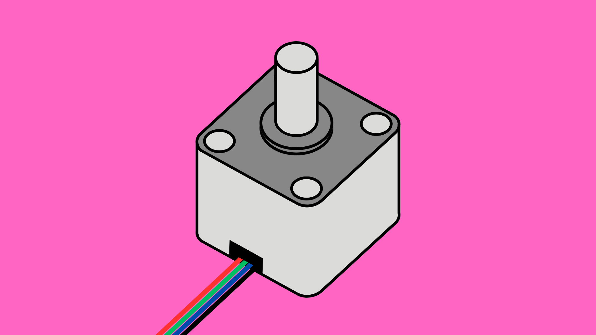

# Motors: Stepper



## Contents

- [Introduction](#introduction)
- [Wiring](#wiring)
- [Code](#code)


## Introduction

Stepper motors are a type of brushless DC motor that are used for operations that require precise control of when/where the motor starts and stops.  

Unlike a standard DC motor, stepper motors do not only rotate continuously in the forward or reverse direction. As the name implies, the stepper motor moves in steps and can even stop at a specific step and hold its position. For these reasons, stepper motors are used more high precision applications, such as 3D printers and scanning equipment. 

Stepper motors all require a driver that translates instructions from an Arduino (or other controller) into electrical pulses that control the motor.  ‘Hybrid’ stepper motors are the most commonly used type of stepper motor and require a separate stepper motor driver board to operate. Be aware however, not all drivers are compatible with all motors. Refer to the manufacturer's instructions before buying a driver board.

We will be looking at how to use the 28BYJ-48 stepper motor (a miniature 5V motor) with the ULN2003 driver board.


## Wiring


| Arduino | ULN2003 |
| ------- | ------- |
| GND     | -       |
| 5V      | +       |
| D2      | IN1     |
| D4      | IN2     |
| D3      | IN3     |
| D5      | IN4     |


## Code

For a full example sketch, [click here](./Stepper_Mini_Example/Stepper_Mini_Example.ino).

### Setup

``` cpp
// Include Stepper library
#include <Stepper.h> 

// Define pin numbers
#define PIN_IN1 2
#define PIN_IN2 4
#define PIN_IN3 3
#define PIN_IN4 5

// Define number of steps per full revolution
#define STEPS_PER_REV = 2048;  

// Create stepper object
Stepper stepper(STEPS_PER_REV, PIN_IN1, PIN_IN2, PIN_IN3, PIN_IN4);

void setup() {} // Don't need anything in setup()
```

### Basic Functions

``` cpp
void loop() {
  stepper.setSpeed(5);          // set speed to 5RPM
  stepper.step(STEPS_PER_REV);  // move positive number of steps = clockwise
  delay(1000);
}
```