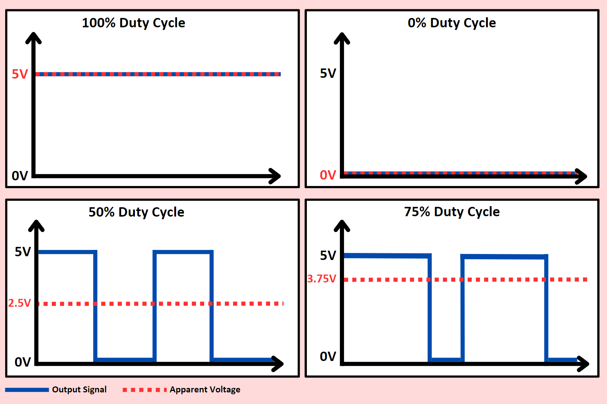

# Analog Output - Pulse-Width Modulation (PWM)


## Contents
- [Introduction](#introduction)
- [Usage](#usage)
    - [Configuring PWM Output Pins](#configuring-pwm-output-pins)
    - [Writing a PWM Output](#writing-a-pwm-output)

## Introduction
PWM (Pulse Width Modulation) is a technique used to simulate an analog output using digital signals. It rapidly switches the output between <code>HIGH</code> and <code>LOW</code> states, controlling the duty cycle (the amount of time the signal stays <code>HIGH</code>). By adjusting the duty cycle, you can simulate various voltage levels between 0V and 5V (or 0V and 3.3V depending on your Arduino board). This makes PWM very useful for controlling devices such as [dimming LEDs](/examples/Output-Devices/LED-DIP/README.md#adjust-brightness), [controlling motors](/examples/Output-Devices/Motor-Servo/README.md), and other components that require a variable level of power.



On most Arduino boards, PWM is supported on specific digital pins (usually labeled with a '~' symbol next to the pin number). These pins can generate a square wave with a frequency of around 490 Hz to 1 kHz, depending on the board. Keep in mind that not all digital pins on the Arduino support PWM. Typically, on the Arduino UNO, pins 3, 5, 6, 9, 10, and 11 are PWM-capable. For smaller boards, you may need to find a pinout diagram from the [Arduino Docs](https://docs.arduino.cc/hardware/) to tell you which pins are PWM enabled.

## Usage
### Configuring PWM Output Pins
To use a pin as a PWM output, you don’t need to configure it differently from a standard digital output pin. We can use the <code>pinMode()</code> function to set the PWM pin as an output. 

``` cpp
pinMode(9, OUTPUT); // Set pin 9 as a PWM output (on a board like UNO)
```
### Writing a PWM Output
To write a PWM value to a pin, use the <code>analogWrite()</code> function. This function accepts two arguments: the pin number and a value between <code>0</code> and <code>255</code>. The value <code>0</code> represents <code>LOW</code> (0V), while <code>255</code> represents <code>HIGH</code> (5V). Values in between represent various levels of brightness or speed, depending on the connected component.

``` cpp
int pwmPin = 9;     // Pin connected to the LED or motor
int pwmValue = 128; // Value between 0 (off) and 255 (full power)

void setup() {
  pinMode(pwmPin, OUTPUT);       // Set the PWM pin as an output
  analogWrite(pwmPin, pwmValue); // Set the PWM value to control brightness or speed
}

void loop() { }
```